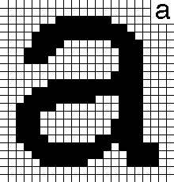

*Presented as a lightning talk at PyConAU 2017: [Omnicode!](/talk/pycon2017/omnicode/)*

Unicode
=======

a

Unicode is pretty cool. All languages in the world, and [a few
others](https://en.wikipedia.org/wiki/Tengwar#Unicode), all in one place
and living together in peace and harmony. But ... is it enough? There's
always *new* stuff coming up. There's a whole
[Consortium](http://unicode.org/consortium/consort.html) required just
to keep track of the stuff which didn't make the original cut or 6.

Unicode seems pretty simple: lots and lots of glyphs, stick them end on
end, hurrah, you're multilingual. Of course, there's some details there
around [*which* end is
which](https://en.wikipedia.org/wiki/Right-to-left_mark) for example,
and there's [Combining
Characters](https://en.wikipedia.org/wiki/Combining_character) and
[normalization](http://unicode.org/faq/normalization.html#7) ... it's
not as simple as it appears.

�

And there's [something like 100,000 unicode
codepoints.](https://en.wikipedia.org/wiki/Unicode#Versions). You
probably have several nice fonts available covering ASCII. Most of those
probably cover [Latin-1](https://en.wikipedia.org/wiki/ISO/IEC_8859-1).
Most of those don't cover much else. Including, for example, [Turkish
dotless i](https://en.wikipedia.org/wiki/Dotted_and_dotless_I). If
you've typeset a nice looking paragraph which just happens to have one
of those in it, it's going to stıck out like a sore thumb.

(I'm haven't mentioned Emoji, and I'm not going to again.)

OMNICODE! {#omnicode-1}
=========

Omnicode says: let's do away with all of that. A glyph is a glyph: a
series of strokes within a bounding box. Worrying about what that glyph
*means* is not the job of a rendering system. So instead, Omnicode
documents are just a series of glyphs, each of which contains all the
information required to render it. There's no need for a big standard
mapping of code points to glyphs: if you want a new glyph, just make it
up.

j

Each Omnicode glyph consists of a series of strokes. For example, an
English 'j' would be represented by a straight line, a curved line and a
dot. These wouldn't be stored as bitmaps, but rather as points
constructing splines in a very simple encoding scheme.

纖

A typical ASCII
letter might need a dozen or so bytes to encode, while more intricate
characters such as '纖' require a finer grid and more strokes and will
end up with a much longer encoding. But then again they encode more
information too. A standard translation table from ASCII (and swathes of
Unicode) to Omnicode makes it possible to translate documents between
the two.

Compressing Omnicode
--------------------

To a first approximation, Unicode is a mapping of code points to glyphs.
If you consider a page of text as an image, this is a good way to
compress that image: look for the repeating glyphs and factor them out.
Give the most common ones the shortest representations, don't worry too
much about the less common ones. It's a great way to compress things,
but to be efficient it relies on a *dictionary* to translate your
encoded symbols back into their source: in the case of text that
dictionary is the Unicode standard, plus a font or two to turn the
logical characters back into pixels.

The compression algorithms used by 'Zip' and so on don't need a
dictionary though, and can compress Omnicode text just fine by detecting
the frequently used patterns such as the standard ASCII characters.

Omnicode Fonts
--------------

Omnicode standard characters are childish and blocky, because they seek
to express the minimal representation of what a letter *is*. To make
them look nice, we need fonts.

Old 'bitmap' fonts were translation tables from code points to grids of
pixels. Newer font standards such as True Type and Open Type are instead
translation tables from code points to groups of strokes which can be
used to draw the character. That's why they look nice even when expanded
a thousandfold.

In Omnicode, a font isn't a lookup table from code point to strokes: it
is instead a transformer from ugly 'standard' strokes to nicer looking
ones. Extra strokes can be added at this point for serifs, alternative
forms, etc. For example, a font might look for a standard Omnicode
circle-and-stick 'a' and replace it with a classic Helvetica 'a', and so
on for all the other letters it knows about, using a simple [Finite
State Machine](https://en.wikipedia.org/wiki/Finite-state_machine) to
replace bytes in a stream. Glyphs it doesn't recognise get left alone,
so that if you do try to typeset an unknown character, at least it still
appears instead of getting a � or similar placeholder.

A more sophisticated font would apply a series of transformations to the
original glyphs: tweaking
[x-heights](https://en.wikipedia.org/wiki/X-height) and descenders,
adding serifs programmatically, looking for opportunities for
[ligatures](https://en.wikipedia.org/wiki/Typographic_ligature).
Substituing characters might still be *part* of the pipeline, but by
using a pipeline of transformations means the font can work well even on
unknown characters, so that letters from all languages can be presented,
even if they're made up by the author.

Surely this isn't serious ...
=============================

I wasn't when I started, ǝɹns os ʇou ɯ,I ʍou ʇnq

UPDATE
======

Stumbled upon some prior art, sort of:
I already knew about [Chinese Typewriters](https://en.wikipedia.org/wiki/Chinese_typewriter)
and keyboards which combine strokes to make characters but here's
[Livermore’s Permutation Typograph](https://www.langustefonts.com/history/livermore.html)
which does the same thing for western languages.

([also](https://oztypewriter.blogspot.com/2011/08/on-this-day-in-typewriter-history-cii.html))

