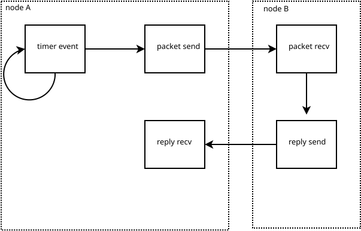

I was looking at publications recently and realized it's been 20 years since
[RFC4429](https://www.rfc-editor.org/info/rfc4429) and [Virtual Localization](/art/virtual-localization) and the other stuff I was working on at Monash.
The centre I worked for [no longer really exists](https://www.ctie.monash.edu.au/) and
while some of the [technical reports and stuff we wrote](https://ctie.monash.edu.au/ipv6/index.html) have survived, a lot has disappeared which is a shame really.

So this is work from 2003 or so but since I don't know if it exists anywhere any
more I figured I should write it up from memory.

## Event Driven Simulation

What is an event-driven simulator?

An event-driven simulator is a program which simulates the behaviour of a system,
and uses an event queue to work out what to do next.

The event queue is a [priority queue](https://en.wikipedia.org/wiki/Priority_queue).
Events are pushed on to the queue with an associated 'time', and the simulator
pops the next event from the queue and runs it.
When an event runs, it can push more events onto the queue.

For example, an event-driven simulation of a node sending out periodic beacons 
might have a timer event generate a packet send event and also another timer event
for the next beacon.  The packet send event might then create a packet receive 
event which might cause a reply as well.  


*events in an event-driven simulator*

Events can be split into multiple 'nodes' which represent independent stateful 
parts within a larger system: for example individual computers in a network or
people in a city.
This fits well with object-oriented programming.

When the queue is empty, or some predetermined time has elapsed or number of events
have occurred, the simulation stops.
In the above example, after node A has received 50 replies, the reply receive
event could set a flag which prevents further timers being set, causing the simulation
to halt.

Rather than calculate the state of the simulation at the ticking of a fixed
clock, event driven simulators calculate the state at the conclusion of each event.

### Network Simulators

Event driven simulators are particularly well suited to simulating communications
networks.
The main network simulator we were using was [OmNet++](https://omnetpp.org/)
although some projects used [opnet](https://opnetprojects.com/opnet-network-simulator/)

### Avoiding Anachronism

Some checks can be added to ensure correctness of the simulation and allow
a little parallelization:

* splitting state into independent nodes
* only allowing one event per node per time
  (events can cause multiple other events though)
* only allowing events to be added in the future (`event.time > current.time`)

### Time Quantization & Parallel Programming

Time is generally represented as a fixed point value.
Because the speed of light is finite, about a foot per nanosecond, we can be 
assured that an event can't cause an event any sooner than the time it takes
for light to get between nodes.

Generally there's only one event which can be run at a time, since if you were
running two events wih different times the earlier one could interpose an event
before the later one, causing anachronisms.

In a lot of simulations, the CPU time required to process a single event is
so small that it doesn't really matter, but what if we're trying to model 
a process that requires more computation on every event, or run a really big
simulation?
Our single event queue severely limits our ability to parallelize across 
multiple CPU cores.

### Partitioning

If you know that an event at time `T` can't cause another event until time
`T+N` then you can allow several
events to be processed in parallel so long as they are on different nodes
and are within time `N` of each other.

If our simulation spans large distances, we can partition the problem into 
multiple queues. 

For example, Melbourne and Sydney are 713km apart which at the speed of light
is over 2ms or to put it another way 2,000,000ns.
So we can run multiple partitions, one for each city, each with its own nodes
and queue, and allow the clocks to get up to 2ms out of sync before one has
to wait for other other.

If one CPU is processing a Melbourne queue event at time 1,000,000,000 we 
can safely process Sydney queue events up to time 1,002,000,000 before stalling
the queue.

If there's a lot of partitions, we can use a lot of queues and thus a lot of cores.
But there's an organizational overhead to working out which nodes belong to
which queues.

## Optimistic Event Driven Simulation

Imagine we have a simulation of a complex network.

We'd like to use several CPU cores for the simulation, in parallel,
but our nodes are too close together or too mobile to geographically partition.
If we have a mechanism to *rewind* events, we can still run
successive events in parallel and just rewind if an anachronism occurs.

We go ahead and optimistically process events from the queue as processors
become available.
Each node has its own state, and we keep a backlog of old states and events.
If an event causes a new event to be scheduled before an event which has already
been processed, we can use this information to rewind the
nodes' state to before the new event and replay.
The backlog of states and events can be trimmed as the oldest clock passes.

A maximum 'window' time can be tuned to get a good amount of parallelization
without too much retrying: this could be implemented as a sliding window where retrying
causes the window to reduce.

## Mixed Mode Simulation

Parallelization matters more when the simulation events are "heavy", which brings us to
another thing I spent some time looking at: "Mixed Mode Simulation".

We were using [User Mode Linux](https://en.wikipedia.org/wiki/User-mode_Linux)
to work on [HMIPv6](https://www.rfc-editor.org/rfc/rfc4140) and
[Optimistic DAD](https://www.rfc-editor.org/rfc/rfc4429) ...
basically because it let us do network development without having to restart the
whole machine, instead the linux kernel and its network stack all ran as a user-mode
process. 
Or processes!  You could run several kernels and have them talk to each other,
thus simulating the several nodes involved in a HMIPv6 handover.

The problem with this was that it ran in real time. 
Simulating ten minutes of network traffic took ... ten wall-clock minutes.
During which time the computer was mostly idle.
Unless you were trying to run a really big simulation in which case your
simulated machines maybe couldn't keep up, giving incorrect results.
Simulating the behaviour of the network between the machines was also very limited:
packets are routed between nodes reliably and instantly, unlike in the real world.

On the other hand, network simulators like OmNet++ only implement very simple nodes,
rather than something as complicated as, for example, a video stream or a web
request over a TCP/IP stack in a whole Linux kernel.  We didn't really want to
implement our protocols twice, either, once in Linux and again in simulation.

So what I wanted to do was to run some User Mode Linux instances to model real network
devices, and connect them via a event-driven network simulation.
The User Mode Linux clocks would be synced to the network simulator clock and
the UML kernel timer "tick" would be an event in the simulator event queue.

This would require a few changes to the UML kernel timers, real time clock and network stack.

### Gone without a trace

The only trace I can find of any of this work is from 2002 in this thread about
[using SIGHUP to ctrl-alt-del the UML process](https://sourceforge.net/p/user-mode-linux/mailman/user-mode-linux-devel/thread/20020221180223.F6398%40dwerryhouse.com.au/#msg9365841).

```
I've been playing with virtual networks of UML hosts, and
one thing that's been annoying me is that it's difficult to shut
the network down cleanly. Here's a patch which catches a SIGHUP
to the tracing thread and calls the kernel ctrl_alt_del() procedure.
```
[...]
```
Hopefully something useful should come out of all this mucking around:
I'm setting up IPv6 virtual networks & trying to do simulation and
conformance testing using UML. There's probably a paper in it :-)
```

### Virtual Time

Technology has moved on a bit, but it'd be interesting to consider if this
sort of thing would fit well into the world of QEMU or Docker or Wine.

Docker is quite often used to test software before rollout but it'd be nice
to be able to answer the question: would our tests still pass if network latency
was increased, or if packet loss became an issue?
At what point do network issues make your Internet service unusable?

* [QEMU Internals: A deep dive into QEMU: a Brief History of Time](https://airbus-seclab.github.io/qemu_blog/timers.html) discusses virtual clocks in QEMU.
