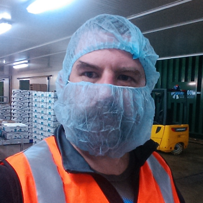

I'm in Hobart in for OSDC 2015 ... [last
year](../osdc-2014-gold-coast/) was a hoot and while I'm not going to
be quite so omnipresent, I've got one 'proper' presentation to do and I
might have had a part to play in a Lightning talk ...

Talking with Leviathan: Interfacing Open Source to SAP
======================================================

SAP ERP is a leviathan of the computer industry: ancient and weird, with
its own way of doing pretty much everything. Recently SAP have embraced
oData as an interface to their internal software stack, opening up a
world of possibilities for open source development at the edge of the
SAP system.

This talk reports on a successful project interfacing an HTML5
application to the oData interface of SAP ERP to simplify stock control
and logistics within one of Australia's largest agricultural companies.

I'll look at user experience design for refrigerated environments, how
to get stuff done in a development environment without concurrent
version control and what it is like to be a programmer in a hi-vis vest.

I'll also compare to some previous projects I've worked on in a similar
space, including some recommendations on how I'd do it over if I got to
do it over.

UPDATE
======

[Slides are here](../../talk/osdc2015/leviathan.html).
