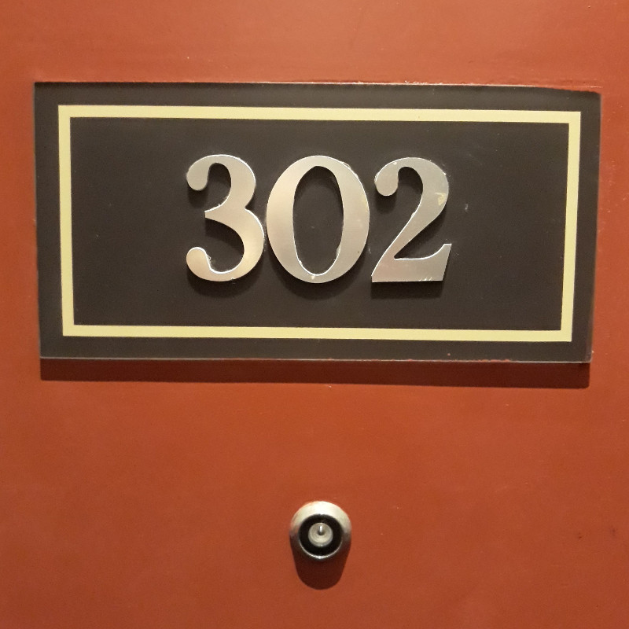
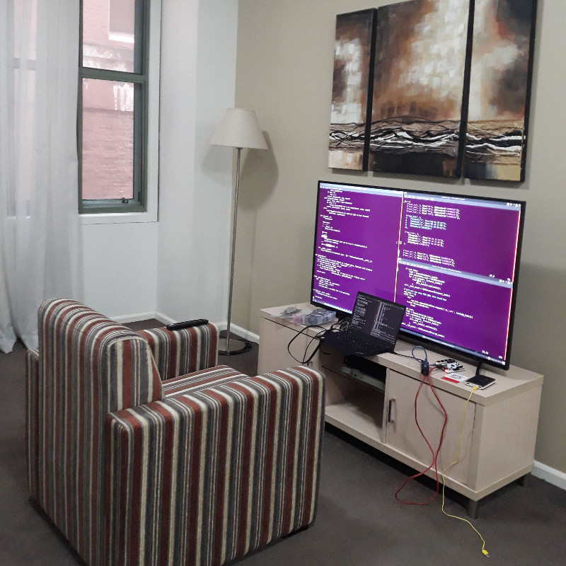

Earlier this year I was in Sydney at [LinuxConf](../linuxconf-2018-sydney) and I've just 
returned from another trip to Sydney for [PyCon2018](https://2018.pycon-au.org) ...
and, as a bonus, when I got back I popped in to
[Compose Melbourne](http://www.composeconference.org/2018-melbourne/) for the day.

I decided to take it pretty easy this year, things were very rushed during the CfP period
for both of those conferences and I decided not to submit anything and just go along as a 
'tourist'.

*Room 302: Found*

Thursday
========

I flew up on Thursday morning and headed up to Google's weirdly
[Roguelike](https://en.wikipedia.org/wiki/Roguelike) offices to meet with
[Tim](https://github.com/mithro) and Ewen to learn a bit about
[FuPy](https://fupy.github.io/).

FuPy is a port of MicroPython running on softcores within a [FPGA](https://en.wikipedia.org/wiki/Field-programmable_gate_array),
with a set of libraries to make the custom FPGA gateware available to Python programs.
After a certain amount of stuffing around with toolchains and a quite nice lunch at
the cafeteria, I finally got my LEDs blinking and could make a start on modifying
the FuPy code to blink *more* LEDs.

Like a lot of hardware projects, even just doing the most basic things always seems
like a challenge but a lot of fun too.  After dinner I ended up plugging my laptop into
the hotel TV and doing some more hacking on my newfound 55" monitor.

*Travel Tip: Always bring an HDMI cable*

Friday
======

The [first day of the actual conference](https://2018.pycon-au.org/schedule/friday),
and after a little more messing with FuPy I headed in to the IoT Specialist Track.

Two technical talks from my usual co-conspirators:

* Damien George [Writing fast and efficient MicroPython](https://2018.pycon-au.org/talks/45358-writing-fast-and-efficient-micropython/) 
* Matt Trentini [Asyncio in (Micro)Python](https://2018.pycon-au.org/talks/45338-asyncio-in-micropython/)

Three interesting applications of embedded controllers:

* Andreas Moll [How Python saved a rescue dog - a foster fail story](https://2018.pycon-au.org/talks/45067-how-python-saved-a-rescue-dog-a-foster-fail-story/)
* Stacey Morse [Lighting Macro Photographs with CircuitPython](https://2018.pycon-au.org/talks/45177-lighting-macro-photographs-with-circuitpython/)
* Michelle Erica Lo [Internet of Human Connectedness](https://2018.pycon-au.org/talks/44085-internet-of-human-connectedness-how-my-iot-project-increased-my-connectedness-with-the-world/)

The IoT Specialist track wasn't the only one on Friday, here's some other talks
worth checking out:

* Digital K [Python all the subjects!](https://2018.pycon-au.org/talks/45316-python-all-the-subjects/)
* Tim Bell [Dynamic web pages without Javascript](https://2018.pycon-au.org/talks/45351-dynamic-web-pages-without-javascript/)
* Curtis Maloney [PostgreSQL Indexing: How, why, and when](https://2018.pycon-au.org/talks/42913-postgresql-indexing-how-why-and-when/)
* Tracy Osborn [Design for Non-Designers](https://2018.pycon-au.org/talks/43052-design-for-nondesigners/)
* Lilly Ryan [Django Against the Dark Arts](https://2018.pycon-au.org/talks/45196-django-against-the-dark-arts/)

Tim's 'Intercooler' is in a lot of ways similar to [Zombie](../zombie-remote-control-of-the-dom/),
we spoke briefly at the conference but I have to follow up with him and compare notes.

Saturday
========

The [first day of the conference proper](https://2018.pycon-au.org/schedule/saturday) saw us 
getting some good hallway track happening on MicroPython / FuPy topics, plus:

* Tisham Dhar [End-to-end Energy Monitoring in Python](https://2018.pycon-au.org/talks/45073-endtoend-energy-monitoring-in-python/)
* J. Rosenbaum [Creepy, frivolous and beautiful art made with machines](https://2018.pycon-au.org/talks/45247-creepy-frivolous-and-beautiful-art-made-with-machines/)
* Zac Hatfield-Dodds [Escape from auto-manual testing with Hypothesis!](https://2018.pycon-au.org/talks/44889-escape-from-automanual-testing-with-hypothesis/)
* Tom Eastman [Learning, and how we avoid it](https://2018.pycon-au.org/talks/tom)

... and of course, [lightning talks](https://2018.pycon-au.org/talks/997a-lightning-talks/)!
I couldn't resist the temptation to get up and talk about
[Rocket Surgery](../rocket-surgery-airborne-iot-telemetry-buzzconf/) ...
I get started at [38:30](https://youtu.be/BmWLhVMWC9I?t=2317) but you really should watch
[Felicity Robson at 33:00](https://youtu.be/BmWLhVMWC9I?t=1962) as well.

I'm particularly interested in getting [Hypothesis](https://hypothesis.works/)
to work on (or, rather, against) MicroPython ... we've got a heap (forgive the pun)
of new code in each port and fuzzing that code could help us find bugs.

One interesting feature of this year was the
[Self-organised Dinner](https://2018.pycon-au.org/talks/601-selforganiseddinner/) 
which I thought was quite a good idea ... I've never been that keen on the kind
of venues which can accomodate 750 conference-goers but with a whole city to choose
from there's a lot of options all of a sudden!

Sunday
======

And [one more day](https://2018.pycon-au.org/schedule/sunday):

* Tracy Osborn [Clueless](https://2018.pycon-au.org/talks/tracy) 
* Russell Keith-Magee [A Web without JavaScript](https://2018.pycon-au.org/talks/43077-a-web-without-javascript/)
* Elissa Shevinsky [Secret Histories: The Women of Python](https://2018.pycon-au.org/talks/41951-secret-histories-the-women-of-python/)
* Caleb Hattingh [Multiplayer 2D games with Python Arcade](https://2018.pycon-au.org/talks/45332-multiplayer-2d-games-with-python-arcade/)
* Sylvia Yap [Pact in Python](https://2018.pycon-au.org/talks/44811-pact-in-python/)
* Christopher Swenson [Colossal Cave Adventure in Python... in the browser!](https://2018.pycon-au.org/talks/45228-colossal-cave-adventure-in-python-in-the-browser/)
* [Sunday Lightning Talks](https://2018.pycon-au.org/lightning-talks)

Interesting how much work us Python people are willing to put into
[avoiding JavaScript](https://nick.zoic.org/art/python-in-the-browser/),
when in a lot of ways they are similar languages.

After a pleasant dinner I flew home Sunday night ... 

Monday
======

On Monday, nursing my post-PyConAU blues, I headed off to [Compose Melbourne](http://www.composeconference.org/2018-melbourne/) for a day of powerful compilers, strict functions and strong types.
Very different to the Python world!

Videos aren't up yet, but hopefully they'll end up linked from these summary pages.
Highlights for me were:

* Julie Moronuki [The Unreasonable Effectiveness of Metaphor](http://www.composeconference.org/2018-melbourne/speakers/#julie_moronuki)
* Paul Bone [AST to WebAssembly: writing a code generator](http://www.composeconference.org/2018-melbourne/speakers/#dr_paul_bone)
* George Wilson [Laws!](http://www.composeconference.org/2018-melbourne/speakers/#george_wilson)
* Andrew McCluskey [Appetite for dysfunction](http://www.composeconference.org/2018-melbourne/speakers/#andrew_mccluskey)

... and at the end of Compose, after a quiet pint with friends and co-conspirators, it was off
home to actually see my family and get some sleep!  Back to work on Tuesday!
