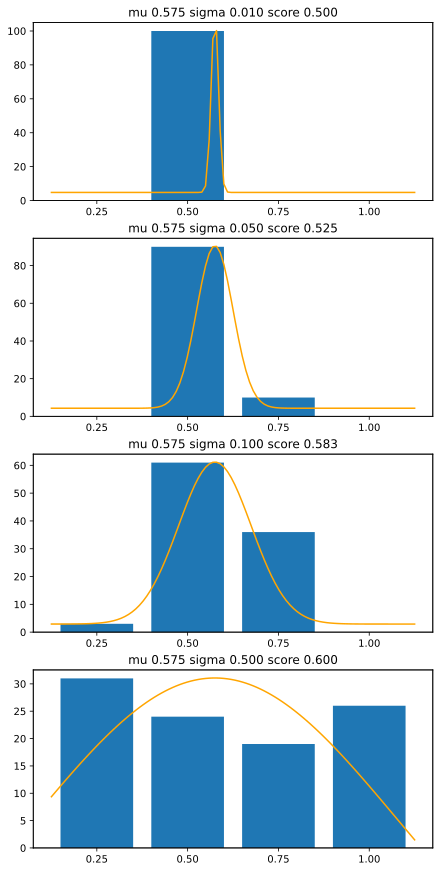
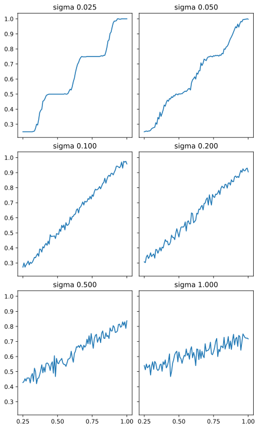
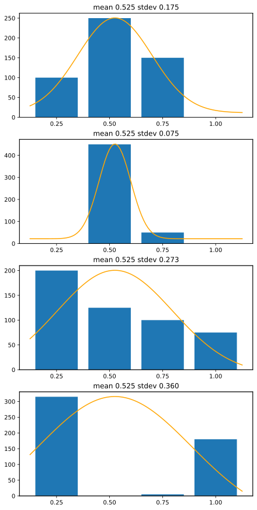
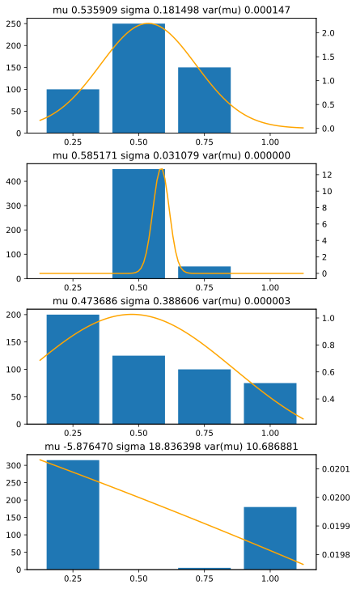

## VAMP-seq

Recently I've worked with a bunch of experimental data[^popp][^geck] from VAMP-seq[^vamp]
experiments and while I'm a big fan of
[glowing jellyfish](https://en.wikipedia.org/wiki/Green_fluorescent_protein)
and the
[sorting machine](https://www.bdbiosciences.com/en-au/products/instruments/flow-cytometers/research-cell-sorters/bd-facsaria-iii)
looks like an espresso machine made by [SGI](https://en.wikipedia.org/wiki/SGI_O2),
there's one thing which always bothered me about this technique: Scoring.

[^popp]: Popp NA, Powell RL, Wheelock MK, Holmes KJ, Zapp BD, Sheldon KM, Fletcher SN, Wu X, Fayer S, Rubin AF, Lannert KW, Chang AT, Sheehan JP, Johnsen JM, Fowler DM.
    Multiplex and multimodal mapping of variant effects in secreted proteins via MultiSTEP.
    Nat Struct Mol Biol. 2025 Jun 13:10.1038/s41594-025-01582-w.
    doi: [10.1038/s41594-025-01582-w](https://doi.org/10.1038/s41594-025-01582-w).
    biorxiv: [10.1101/2024.04.01.587474](https://doi.org/10.1101/2024.04.01.587474).
    Epub ahead of print. PMID: 40514537; PMCID: PMC12373428.

[^geck]: Functional evidence for G6PD variant classification from mutational scanning
    Renee C. Geck, Melinda K. Wheelock, Rachel L. Powell, Ziyu R. Wang, Daniel L. Holmes, Shawn Fayer, Gabriel E. Boyle, Allyssa J. Vandi, Abby V. McGee, Clara J. Amorosi, Nick Moore, Alan F. Rubin, Douglas M. Fowler, Maitreya J. Dunham
    [bioRxiv 2025.08.11.669723](https://www.biorxiv.org/content/10.1101/2025.08.11.669723v2);
    doi: [10.1101/2025.08.11.669723](https://doi.org/10.1101/2025.08.11.669723)
 
[^vamp]: Matreyek, K.A., Starita, L.M., Stephany, J.J. et al.
    Multiplex assessment of protein variant abundance by massively parallel sequencing.
    Nat Genet 50, 874–882 (2018).
    doi: [10.1038/s41588-018-0122-z](https://doi.org/10.1038/s41588-018-0122-z)

To very briefly summarize how VAMP-seq works:

1. To see how much different cells are expressing a gene, you fuse that gene with
   a gene for EGFP or similar, so the cells glow more the more the gene is expressed.
2. Then you measure the cells' brightness, working out quartile thresholds to divide them
   into four "bins" of roughly the same size.
3. Then you sort the cells into four output tubes, literally four little test tubes at 
   the end of the machine. 
4. Then you sequence each of the four tubes and count up variants present in each bin.
5. Variants are scored by combining the counts from each bin (we'll get to that)
6. Scores are normalized, assuming nonsense types should be 0 and wild type should be 1.
7. Additional replicates are performed to confirm results.

<!-- 
*BD FACSAria™ III Sorter (detail from [brochure](https://www.bdbiosciences.com/en-au/products/instruments/flow-cytometers/research-cell-sorters/bd-facsaria-iii))* -->

There are several things which can go wrong here with the experimental process:

* Thresholds can be set incorrectly or inaccurately.
* Output tubes can get contaminated, sequenced differently
* Output tubes can get lost or swapped[^hallway].

[^hallway]: Discussion with [UW-GS](https://www.gs.washington.edu/) wet-lab people
    and hallway discussions at [MSS 2025 Barcelona](https://www.varianteffect.org/mss2025/).

Some of these problems are probably avoidable using careful lab techniques
and practices but human error is inevitable.
The question is: how can we *detect* these sort of problems?
The sooner we detect them the sooner they can be corrected.

I'll come back to that later, but in the mean time let's talk scoring.

### VAMP-seq Scoring

From the VAMP-seq paper:
> VAMP-seq scores are calculated from the scaled,
> weighted average of variants across *N* bins. 

Thresholds between bins are chosen to make the bins *approximately* the same
size, but to reduce the effect of bin size differences, first the counts are
scaled to find frequencies of each variant within each bin, eg:

`$$ F_{v,i} = C_{v,i} / \sum_{v \in V} C_{v,i} $$`

The scaled, weighted averages are calculated like this:

`$$ W_{v} = \frac{\sum_{i=0}^{N}w_i F_{v,i}}{\sum_{i=0}^{N}F_{v,i}} $$`

### VAMP-seq Weights

Weights per bin `$w_i$` are generally given by:

`$$ w_i = i / N $$`

... where `$ 0 < i \leq N $`.

So for example (ignoring scaling for clarity), if 500 cells of a particular variant
go into the sorter, they might end up with 100 in bin 1, 250 in bin 2,
150 in bin 3, and none in bin 4.

The score for this variant would be:

`$$ s = (0.25 \cdot 100 + 0.50 \cdot 250 + 0.75 \cdot 150 + 1.00 \cdot 0 ) / 500 = 0.525 $$`

This makes sense: the majority of counts are in bin 2 (weight 0.5) with some 
hanging over each side, and there's slightly more counts in bin 3 than bin 1 so
the histogram is a little overbalanced to the right, so the result is a little
bit higher than 0.5.
 
## Quantization

A cell's brightness is a continuous variable, so when the cells are sorted into
four bins this brightness gets
[*quantized*](https://en.wikipedia.org/wiki/Quantization_(signal_processing)).
Any cell whose brightness is between the thresholds for bin 2 will get sorted
into bin 2, and there will be no way to tell where a cell falls within that range.

Thankfully there's some noise in the system.
When a cell's brightness is measured, a cell which is close to the edge of a bin
sometimes ends up in a neighbouring bin.
The closer to the edge of the bin the more often this happens, giving us a
signal to work with.
This is a well known technique in signal processing called
[dithering](https://en.wikipedia.org/wiki/Dither).
The noise actually helps us!

Similar techniques are used in all sorts of signal processing tasks.
In fact, this technique is so powerful that we could get away with having 
only 2 bins and still end up with a continuous range of scores[^trippe].

[^trippe]: Trippe BL, Huang B, DeBenedictis EA, Coventry B, Bhattacharya N, Yang KK, Baker D, Crawford L.
    Randomized gates eliminate bias in sort‐seq assays.
    Protein Sci. 2022 Sep;31(9):e4401. doi: [10.1002/pro.4401](https://doi.org/10.1002/pro.4401).
    Epub 2022 Aug 30. PMCID: [PMC9601873](https://pmc.ncbi.nlm.nih.gov/articles/PMC9601873/).

### Characterizing Noise

Where the noise comes from in our cell sorting procedure, and how it can be
characterized, requires further investigation.

Noise might be introduced by sensor
[shot noise](https://en.wikipedia.org/wiki/Shot_noise)
or by cell geometry (if cells glow more on one side than another then as they
rotate their apparent brightness will vary) or by 
[cell cycle](https://en.wikipedia.org/wiki/Cell_cycle) 
or it might even be introduced intentionally by the sorting software.

This discussion assumes noise is
[gaussian ("normal")](https://en.wikipedia.org/wiki/Normal_distribution)
for simplicity and because it's a pretty common distribution due to the
[central limit theorem](https://en.wikipedia.org/wiki/Central_limit_theorem).
But because we have a fixed limit on our distribution (a cell can't emit less than
zero light) another good candidate would be a
[log-normal distribution](https://en.wikipedia.org/wiki/Log-normal_distribution).

### Modeling Quantization Effects

These graphs show how a cell might appear in bins 1 .. 4 if it had 
a mean score of 0.575 plus gaussian error with standard deviation
varying from 0.01 up to 0.5:

*quantization effects on bin distribution*
*[python source code](src/fwd.py)*

|mean|stddev|bin1|bin2|bin3|bin4|score|
|---:|---:|---:|---:|---:|---:|---:|
|0.575|0.010|0|100|0|0|0.5|
|0.575|0.050|0|90|10|0|0.525|
|0.575|0.100|3|61|36|0|0.583|
|0.575|0.500|31|24|19|26|0.600|

With too little noise, all the counts end up in a single bin, and there's no 
way to work out where the cell's score lies between the thresholds.
With too much noise, the counts end up spread across all four bins, and noise
becomes an issue.

These graphs illustrate the effect of quantization of scores across four bins
with varying standard deviation (sigma):

*Quantization effects on binned counts*
*[python source code](src/quant.py)*

With too little noise, many variants have 100% of counts in a single bin, and
end up with a score of exactly 0.25, 0.50, 0.75 or 1.00.  With too much noise,
the signal starts to get overwhelmed.

Quantization isn't necessarily a huge problem for a lot of studies as we're 
mostly looking to classify variants into broad categories of benign and pathological.
But it may also lead to strange correlation artifacts and misleading 
correlation statistics.

## Interpreting Experimental Data

Actual experimental data contains quite a lot of noise, so we're unlikely to
get clean results like the above.
Scores are based on bin counts which are only a *sample* of the actual organism
being experimented on, so we can also consider how precise that estimate is.

For example, here are four different sets of bin counts, with different distributions
but all of which end up with a score of 0.525:

*Four ways to get the same score*
*[python source code](src/bins.py)*

### Score Standard Deviation

We can calculate a standard deviation for each set of counts, and this might usefully
indicate how certain we are of the score and whether the experimental noise is 
helping or hindering our measurements.

First up we can convert our bin frequencies into probabilities by scaling them to 
add up to 1, and we can use our bin weights `$w_i$` as before:

`$$ p_i = F_i / \sum_{i=1}^{N}F_i $$`

`$$ w_i = i/N $$`

Then we can [calculate average and standard deviation](https://en.wikipedia.org/wiki/Standard_deviation#Discrete_random_variable):

`$$ \mu = \sum_{i=1}^{N}w_{i}p_i $$`

`$$ \sigma = \sqrt{\sum_{i=1}^{N}p_{i}(w_i-\mu)^2 } $$`

|bin1|bin2|bin3|bin4|score|stdev|comment|
|---:|---:|---:|---:|---:|---:|:---:|
|100|250|150|0|0.525|0.175|typical|
|0|450|50|0|0.525|0.075|low sd|
|200|125|100|75|0.525|0.273|high sd. skew?|
|315|0|5|180|0.525|0.360|experimental error?|

The average provides our score and the standard deviation provides an estimate of 
the precision of our score.

### Error Detection

In the process of combining four bin counts into one score, we've lost
quite a lot of information.
As the above example illustrates, there are many different ways to get the same score.

The last example seems likely to indicate a problem as it doesn't resemble a normal
curve at all.  This might indicate swapped or contaminated bins, especially if
similar issues affect many variants.

How can we detect this issue?  The formulae above give us a way to estimate `$\mu$`
and `$\sigma$` from bin counts, but the answers are only valid if 
our assumption that this is a normal distribution is true.

### Distribution Fitting

How about we go back in the other direction and predict what
bin counts we should see for a given `$\mu$` and `$\sigma$`?

We can do this using a
[Cumulative Distribution Function (CDF)](https://en.wikipedia.org/wiki/Cumulative_distribution_function)
of the probability distribution we're expecting.  The CDF is a function `$ F(x) $` such that for a randomly chosen value `$X$` from
our distribution, we can find the probabilities of `$X$` falling within a range:

`$$ p_{X \leq a} = F(a) $$`
`$$ p_{a < X \leq b} = F(b) - F(a) $$`
`$$ p_{X > b} = 1 - F(b) $$`

For example, within the range of one of our bins!

In this case we're assuming a normal distribution, so we'll use the
[CDF of the normal distribution](https://en.wikipedia.org/wiki/Normal_distribution#Cumulative_distribution_function):

`$$ \Phi(x) = \frac{1}{\sqrt{2\pi}}\int_{-\infty}^{x}e^{-t^2/2}\,dt $$`

... which involves some tricky maths but thankfully this 
is implemented in the python
[scipy.stats.norm.cdf](https://docs.scipy.org/doc/scipy/reference/generated/scipy.stats.norm.html)
function so we don't have to deal with the details.

So we can use the CDF to estimate what our bin probabilities `$p_i$` should be for
a given `$\mu$` and `$\sigma$`, picking thresholds between our bin scores and 
baking in all sorts of probably unwarranted assumptions about boundary conditions:

`$$ p_1 = \Phi(\frac{\frac{3}{8} - \mu}{\sigma}) $$`
`$$ p_2 = \Phi(\frac{\frac{5}{8} - \mu}{\sigma}) - p_1 $$`
`$$ p_3 = \Phi(\frac{\frac{7}{8} - \mu}{\sigma}) - p_1 - p_2 $$`
`$$ p_4 = 1 - p_1 - p_2 - p_3 $$`

We now have four equations and two unknowns, so we can use any number of numerical
techniques to find the most plausible values of `$\mu$` and `$\sigma$` for an
observed set of `$(p_1, p_2, p_3, p_4)$`.
In this case I'm using a least squares fit:

*estimating score and score variance from CDF*
*[python source code](src/cdf.py)*

This gives us an alternative way of estimating score and stdev of score, but it
also gives us another useful piece of information, which is *the variance of our
estimate of the score* (written `var(mu)` in the above graphs) ... which is an
estimate of how well it has been able to fit to our expected distribution.

In the first three cases we've been able to fit quite nicely despite the varying
stdev.  In the last case, the outputs of our attempt to fit the data to our expected 
distribution indicate that something is seriously wrong: the score is out of bounds,
the stddev is very large and the variance of the estimate is also very large.
This particular sample's score cannot be accurately estimated.

## Further Work

There's lots more to do on this general concept, including applying to to real
experimental data.

### Characterizing Noise

What are the sources and characteristics of noise in the measurement apparatus?
Is our noise actually normally distributed?
What is the "ideal" amount of noise to prevent quantization artifacts without
losing too much information?
Can we incorporate measurement error estimates into our curve fit?

### Error Heuristics

Using least-squares fitting to quite a complicated function might well be overkill
for detecting issues which could be determined from a simpler heuristic, but it at
least provides a baseline to compare potential heuristics against.
For example, specific heuristics could be implemented to detect contaminated or swapped bins.

### Beyond Scoring

In the above discussion we're still using the arbitrary score weights, but it
might make more sense to incorporate the actual thresholds we set on the sorting
machine.
This would mean our output would be in actual units, and we could combine outputs
from multiple replicates more meaningfully.

**I hope to return to this soon!**
