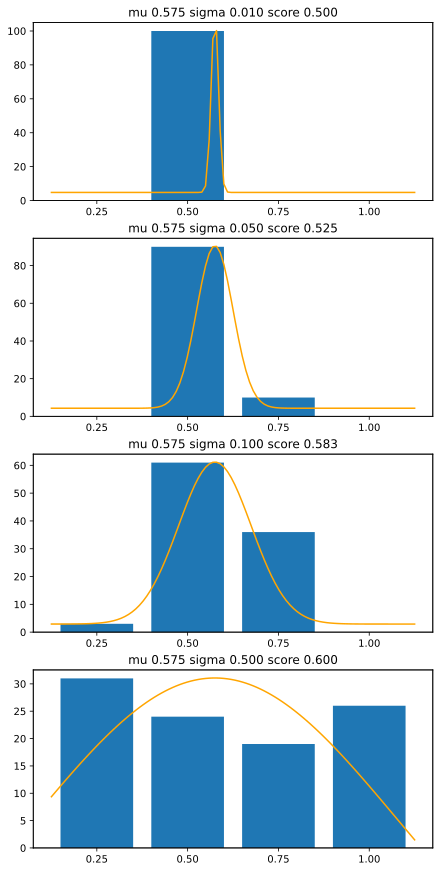

## VAMP-seq

Recently I've worked with a bunch of experimental data from VAMP-seq[^1]
and while I'm a big fan of
[glowing jellyfish](https://en.wikipedia.org/wiki/Green_fluorescent_protein)
and the
[sorting machine](https://www.bdbiosciences.com/en-au/products/instruments/flow-cytometers/research-cell-sorters/bd-facsaria-iii)
looks like an espresso machine made by [SGI](https://en.wikipedia.org/wiki/SGI_O2),
there's one thing which always bothered me about this paper.

[^1]: Matreyek, K.A., Starita, L.M., Stephany, J.J. et al.
    Multiplex assessment of protein variant abundance by massively parallel sequencing.
    Nat Genet 50, 874–882 (2018).
    doi: [10.1038/s41588-018-0122-z](https://doi.org/10.1038/s41588-018-0122-z)

So to very briefly summarize how VAMP-seq works:

1. To see how much different cells are expressing a gene, you fuse that gene with
   a gene for EGFP or similar, so the cells glow more the more the gene is expressed.
2. Then you set up the cell sorting machine to sort the cells into four "bins".
   First a sample is measured to establish quartile thresholds for the sorter, 
   so that cells get sorted into four groups, with roughly the same population
   in each group.
3. Then you sort the cells into four output tubes ("bins").
4. Then you sequence each of the four tubes and count up variants per "bin".
5. Variants are scored by combining counts from each bin.
6. Scores are normalized, assuming nonsense types should be 0 and wild type should be 1.
7. Addiional replicates are performed to confirm results.

There are several things which can go wrong here. 
Thresholds can be set incorrectly or inaccurately.
Output tubes can get contaminated, sequenced differently,
lost or swapped[^2] into the wrong bin.

[^2]: Discussion with [UW-GS](https://www.gs.washington.edu/) wet-lab people
    and hallway discussions at [MSS 2025 Barcelona](https://www.varianteffect.org/mss2025/).

Some of these problems are probably avoidable using careful lab techniques
but human error is inevitable.
I'll come back to that later, but in the mean time let's talk scoring.

## VAMP-seq Scoring

> VAMP-seq scores are calculated from the scaled,
> weighted average of variants across *N* bins. 

Thresholds between bins are chosen to make the bins *approximately* the same
size, but to reduce the effect of bin size differences, first the counts are
scaled to find frequencies of each variant within each bin, eg:

`$ F_{v,i} = C_{v,i} / \sum_{i} C_{v,i} $`

The scaled, weighted averages are calculated like this:

`$ \displaystyle W_{v} = \frac{\sum_{i=1}^{N}{w_i F_{v,i}}}{\sum_{i=1}^{N}{F_{v,i}}} $`

where the weights per bin `$w_i$` are generally given by

`$ w_i = i/N $`

So for example (ignoring scaling for clarity), if 500 cells of a particular variant
go into the sorter, they might end up with 100 in bin 1, 250 in bin 2,
150 in bin 3, and none in bin 4.

The score for this variant would be:
`$$ s = (0.25 \cdot 100 + 0.50 \cdot 250 + 0.75 \cdot 150 + 1.00 \cdot 0 ) / 500 = 0.525 $$`

This makes sense: the majority of counts are in bin 2 (score 0.5) with some 
hanging over each side, and there's slightly more counts in bin 3 than bin 1 so
the histogram is a little overbalanced to the right, so the result a little bit higher than 0.5.

|bin1|bin2|bin3|bin4|score|analysis|
|---|---|---|---|---|---|
|100|250|150|0|0.525|typical|
|200|125|100|75|0.525|high sd|
|0|450|50|0|0.525|low sd|
|315|0|5|180|0.525|experimental error?|

However as illustrated above there are many different ways to get the same
score.
In the process of combining the four bin counts, we've lost quite a lot of information.
 
## Quantization

A cell's brightness is a continuous variable, so when the cells are sorted into
four bins this brightness  gets
[*quantized*](https://en.wikipedia.org/wiki/Quantization_(signal_processing))
Any cell between the thresholds for bin 2 will get sorted into bin 2,
and there will be no way to tell where a cell falls within that range.

Thankfully biological systems are inherently noisy.  This noise actually helps
with our scoring process, as a cell which is closer to the edge of a bin "overlaps"
a little into that bin, giving us a signal to work with.

This discussion assumes noise is gaussian, which it possibly isn't, but it's 
a good start.
These graphs show a cell with a mean score 0.575 and standard deviation varying
from 0.01 up to 0.5:

*fwd*

With too little noise, all the counts end up in a single bin, and there's no 
way to work out where the cell's score lies between the thresholds.
With too much noise, the counts end up spread across all four bins, and noise
becomes an issue.

These graphs illustrate the quantization of scores across four bins:

*quant*

Quantization isn't necessarily a huge problem for a lot of studies as we're 
mostly looking to classify variants into broad categories of benign and pathological.
But it may also lead to strange correlation artifacts:

## Standard Deviation

## Error Detection

*bins*

