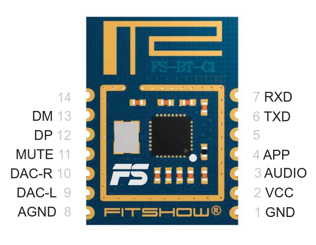
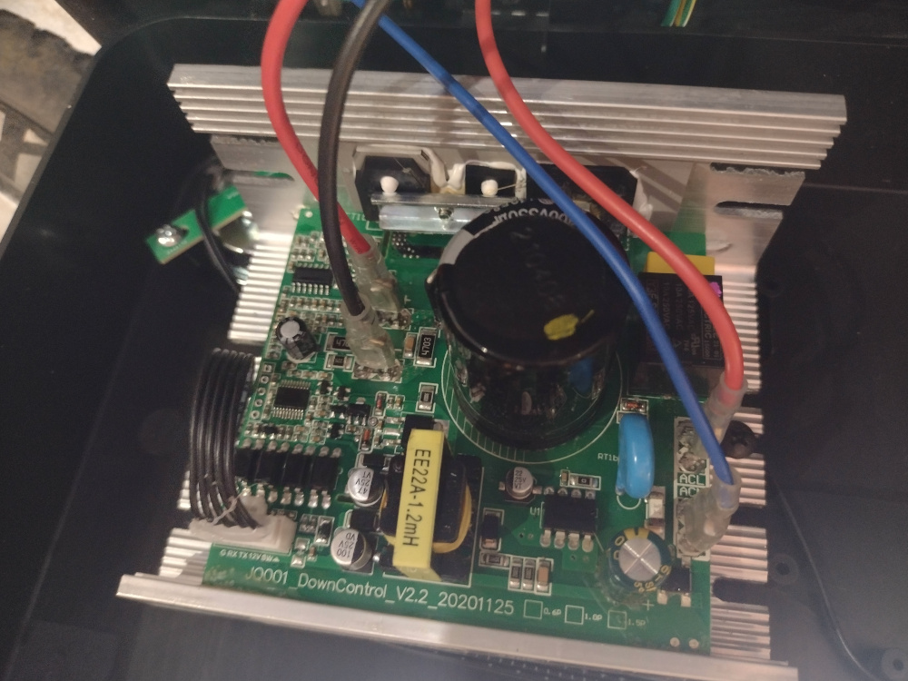
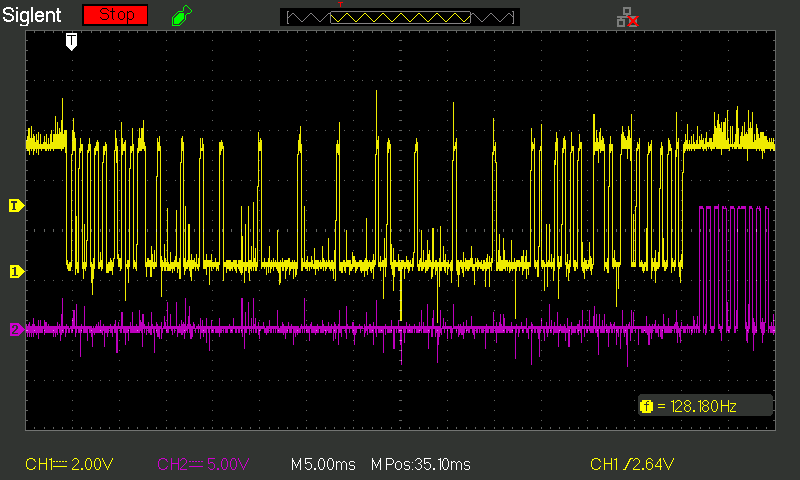
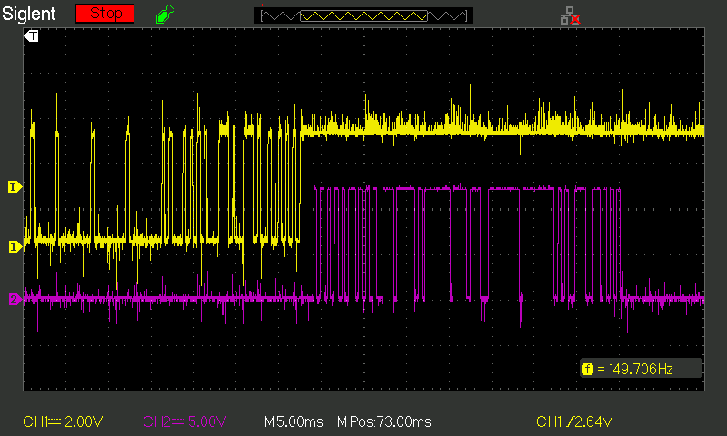
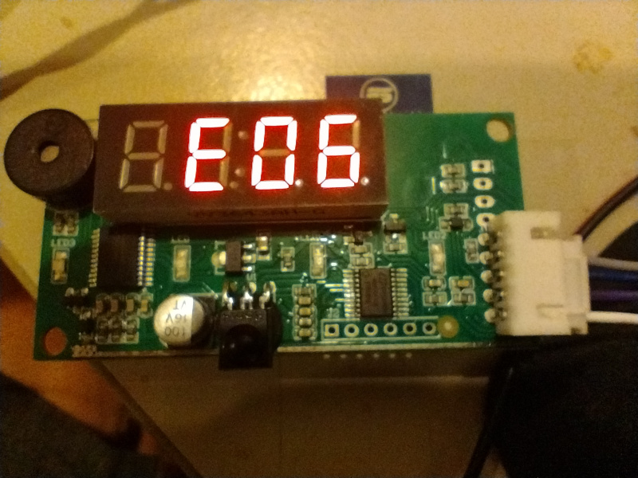

## Found Objects

I found this thing on the footpath, it looked pretty clean and tidy so I
figured if nothing else I could maybe get a nice motor out of it.  If it
was dead as a doornail, well, we have a free e-waste disposal coming up
anyway so I could just dispose of it responsibly.

There's no obvious branding on it other than a label `380X-BLACK` on
the bottom, so I opened it up.  Inside are two boards, a tiny speaker
and a 0.6HP DC motor.

## The boards

There's a main board labelled `JQ001_DownControl_V2.2_20201125` in the
silkscreen and `LF380-0.6-NS-NR-1.0` on a sticky label.

There's also a little communications board labelled `LF380-6-DT-FS-PW-1.3`
on a sticky label, and sporting a Fitshow bluetooth board `FS-BT-C1` as
well as an IR receiver, a four digit seven segment display and a few LEDs.  I didn't
see an IR transmitter anywhere, unfortunately.

The two are connected by a five wire loom marked `SW 12V TXD RXD GND`.
This is a little odd as I was kind of expecting a more primitive 
connection between them (eg: PWM and tach) but so as we like to say: 
*why simple when complicated works*.

## Fitshow Module

I couldn't find any references to the other boards, but the Fitshow
module has an FCC report `2AUIE-FSBTC1` from which we can 
[learn a lot](https://fccid.io/2AUIE-FSBTC1/User-Manual/User-Manual-4480052.pdf)

There's a "Fitshow" app but reviews are poor and it wants me to
agree to a bunch of stuff and make an account before proceeding,
which I don't really want to do.

Let's see if we can get away without it.

## The motor

The motor is marked:

    PERMANENT MAGNET D.C. MOTOR
    POWER: 0.6HP
    VOLTAGE: DC180V
    MAX SPEED: 3500 RPM

There wasn't much point continuing if the motor didn't work, so I put
60VDC across it with a benchtop power supply and lo and behold it gently
trundled along slowly but smoothly at 60VDC / 0.8A.

There's a small belt reduction drive (about 23:70) and the roller
for the treadmill is 30mm, so 3500RPM translates to 108 meters/min
or 6.5 km/h which seems about right for a "walking" treadmill.

It's definitely a walker rather than a running treadmill, but with no safety
rail or stop switch that's probably for the best.  On the upside, it is 
quite flat so you could easily store it under a bed or couch when not in use.

At 180VDC, 0.6HP would work out to 2.5A, so this is all making sense so far.
There seem to be a few 240VAC to 180VDC PWM controllers out there, it's a 
pretty simple circuit, so if worst comes to worst we could just scrap the 
controller entirely and use a new one.

## Controller Board

But I'd rather use the existing controller board if possible.
It's not just a PWM controller though, there's lots of other stuff in there.

* ARM Cortex M0 [HC32F005C6PA](https://jlcpcb.com/partdetail/XHSC-HC32F005C6PATSSOP20/C235578)
* UC3813 Current-mode PWM Controller
* Ginormous Capacitor
* Relay

The connections to the communications board appear to be protected by four
optoisolators.  Why four, though, when there's only RX, TX and maybe SW?

There's five unpopulated header pins right next to the MCU which are 
maybe a JTAG or similar.

## Protocol

That 5-wire interface between the two boards seems like the easiest place to
start.  To be careful of the ridiculously high voltages on the control board, 
I soldered some wires to the GND, RX and TX pins and put my faith in the 
oscilloscope's isolation ...

*first part of signal*

*second part of signal*

The signals are quite bad because the long wires picked up lots of noise from surrounding circuitry.
But you can clearly see a conversation happening here: a message on the RX line (yellow) is followed
by a reply on the TX line (purple) and then a long pause.

*expanded view of signal*

Looking at the RX line on the 'scope, there are 9 pulse widths in about
3.75ms, so this is 2400 bps.

* The RX line is usually high (5V) and drops low (0V).
* The TX line is usually low (0V) and goes high (12V).

I'm not entirely clear on which board is sending RX and which is sending TX.
You don't see 12V logic much any more ... I'll need a couple of resistors to shift the level down to
where I can read it with a UART.

The SW wire is probably there to attach a hardware kill switch but on this device
it is probably either hardwired 'on' or wired to one of the communications board's
outputs.

## Communications Board

Since the controller board has lots of scary voltages on it, let's 
look at the communications board in isolation.

* FitShow FS-BT-01 module
* [Megawin MG82F6D17](http://www.megawin.com.tw/en-global/product/productDetail/MG82F6D17)
  which is *drumroll please* an [8051](https://en.wikipedia.org/wiki/MCS-51) MCU.
* EUP9818 audio amplifier IC.
* [TM1668](https://www.sunrom.com/p/tm1668-soic24-led-displaykeypad-driver) display driver.

The MCU has several serial I/O peripherals.
Probably one of its UARTs is attached to the TXD and RXD wires, and the other 
interfaces connect to the bluetooth controller and the IR receiver and display
driver.

There's also an unpopulated 6-pin header right next to the MCU which is probably
a JTAG port or similar.

Let's hand this little board some power and see which pin is which.
The benchtop power supply comes out again and it turns out to draw about 110mA at 12V.

It starts up with the display saying `OFF` for a few seconds before changing to `E06`.  

## New Controller

I don't feel like there's any real need for this to be an
[Internet of Things](../the-internet-of-not-shit-things/) device, really.
It could easily be: once we crack the protocol we could just create a new
comms board out of an [ESP32](../../tag/esp32/).

Maybe the simplest control mechanism would be a distance sensor at chest 
height, which would increase speed as the walker got further forward,
and reduce speed as they fell back, effectively turning the entire 
system into a [servomechanism](https://en.wikipedia.org/wiki/Servomechanism)
for centering the user on the belt.

Or just have a [knob and a switch](https://www.aliexpress.com/item/32917539516.html)
to set the speed between 0 and maximum.  It doesn't need to be so complicated!

