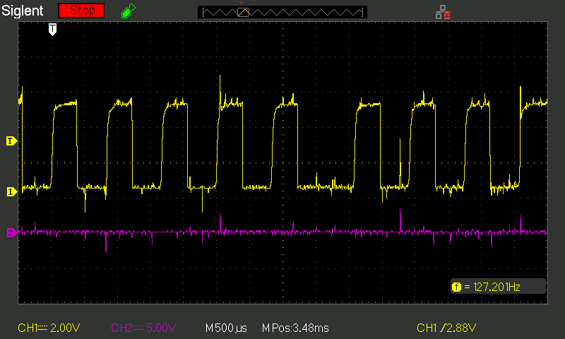

## Found Objects

I found this thing on the footpath, it looked pretty clean and tidy so I
figured if nothing else I could maybe get a nice motor out of it.  If it
was dead as a doornail, well, we have a free e-waste disposal coming up
anyway so I could just dispose of it responsibly.

There's no obvious branding on it other than a label `380X-BLACK` on
the bottom, so I opened it up.  Inside are two boards, a tiny speaker
and a 0.6HP DC motor.

## The boards

There's a main board labelled `JQ001_DownControl_V2.2_20201125` in the
silkscreen and `LF380-0.6-NS-NR-1.0` on a sticky label.

There's also a little communications board labelled `LF380-6-DT-FS-PW-1.3`
on a sticky label, and sporting a Fitshow bluetooth board `FS-BT-C1` as
well as an IR receiver, a four digit seven segment display and a few LEDs.  I didn't
see an IR transmitter anywhere, unfortunately.

The two are connected by a five wire loom marked `SW 12V TXD RXD GND`.
This is a little odd as I was kind of expecting a more primitive 
connection between them (eg: PWM and tach) but so as we like to say: 
*why simple when complicated works*.

## Fitshow Module

I couldn't find any references to the other boards, but the Fitshow
module has an FCC report `2AUIE-FSBTC1` from which we can 
[learn a lot](https://fccid.io/2AUIE-FSBTC1/User-Manual/User-Manual-4480052.pdf)

There's a "Fitshow" app but reviews are very poor and it wants me to
make an account before proceeding, which I don't really want to do.

Let's see if we can get away without it.

## The motor

The motor is marked:

    PERMANENT MAGNET D.C. MOTOR
    POWER: 0.6HP
    VOLTAGE: DC180V
    MAX SPEED: 3500 RPM

There wasn't much point continuing if the motor didn't work, so I put
60VDC across it with a benchtop power supply and lo and behold it gently
trundled along at 60VDC / 0.8A.

There's a small belt reduction drive (about 23:70) and the roller
for the treadmill is 30mm, so 3500RPM translates to 108 meters/min
or 6.5 km/h which seems about right for a "walking" treadmill.

At 180VDC, 0.6HP would work out to 2.5A, so this is all making sense so far.

It's definitely a walker rather than a running treadmill, but with no safety
rail or stop switch that's probably for the best.  On the upside, it is 
quite flat so you could easily store it under a bed or couch when not in use.

## Protocol

scoping the RX and TX lines:

Looking at the RX line on the 'scope, 9 pulse widths works out to about
3.75ms, so this is 2400 bps.  It's followed by a reply from the TX side, and a long gap.

