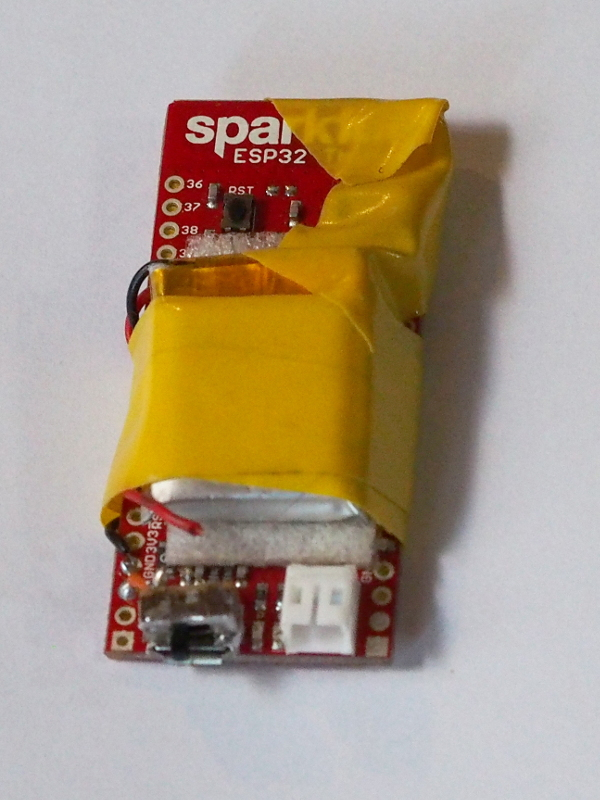
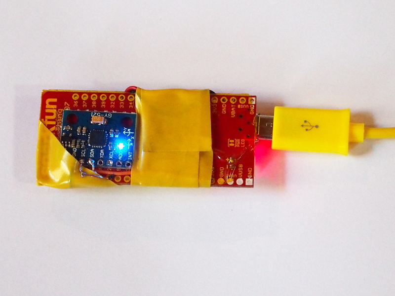
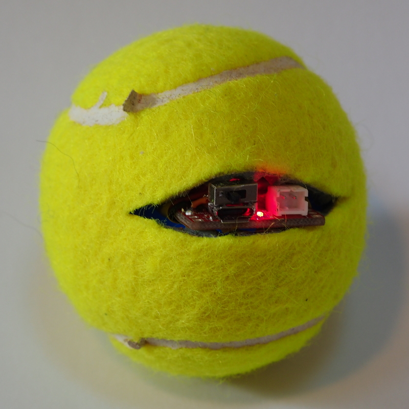
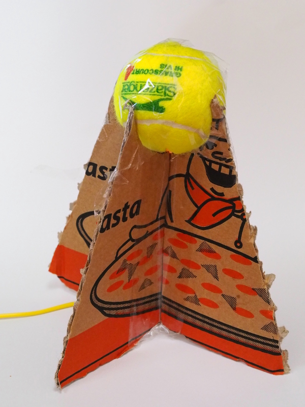
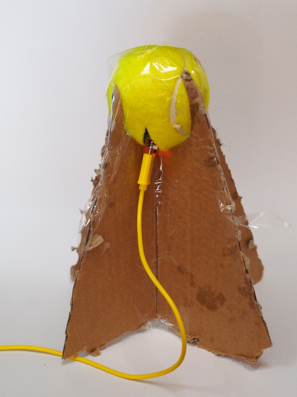
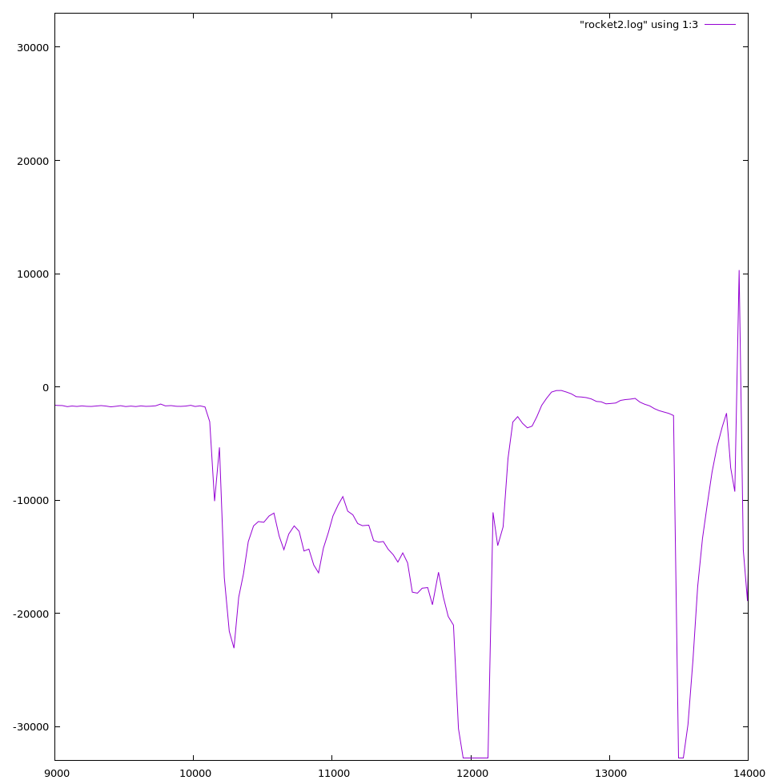

This article will slowly evolve as I make more progress on this project!
Follow [mnemote on Twitter](https://twitter.com/mnemote) for updates.

# Background

[Andrew Fisher](ajfisher.me), [Andy Gelme](geekscape.org) and I are
putting together a [Rocket Surgery Session](https://buzzconf.io/sessions/airborne-iot-build-a-rocket/)
for [BuzzConf 2017](https://buzzconf.io/).

We're using [Water Rockets](https://en.wikipedia.org/wiki/Water\_rocket) which are 
really just a soda water bottle using compressed air to expel water out the mouth
of the bottle, causing the bottle to fly upwards.

There are quite a few parameters to adjust here: fill pressure, water volume,
bottle size, fins, venturi diameter, nose cones, etc ... so there's lots of
useful experiments to do!

My part in this is to sort out the telemetry hardware and software.  By getting
real-time telemetry data from the rockets, we can get immediate feedback on 
acceleration profiles and modify the rockets in the field.

# First Prototype

The rockets aren't big: 1.25 or 2 liter soda water bottles.  And they don't have all that
much lift capacity.  So our telemetry computer has to be small and light.

There's many possible platforms, but I've been working a lot recently with the
[Espressif ESP32](http://espressif.com/en/products/hardware/esp32/overview),
a tiny chip which packs a reasonably powerful 32-bit CPU, RAM, Flash and a 2.4GHz
radio into a package the size of your thumbnail.  Even better, it can run
[MicroPython](https://micropython.org/).

I put together a quick prototype for
[BuzzConf Nights](https://www.meetup.com/BuzzConf/events/243244039/)
out of stuff I had lying around: there's a 
[Sparkfun ESP32 Thing](https://www.sparkfun.com/products/13907], 
a [GY521 / MPU-6050 6DOF Accelerometer / Gyrometer](https://playground.arduino.cc/Main/MPU-6050)
and a 180mAh RC heli LiPo cell.

Also some foam, tape, a tennis ball [new) and a pizza box [used).
The end result was this:

It's not pretty, but it is easy to throw and the fins cause it to flip
over nicely at apogee so it should behave quite a lot like the real thing.
A quick test run showed that the telemetry package ran for over an hour
on the battery, even with the LEDs which came with the modules still in place.

A small piece of MicroPython code is enough to connect the device to a
[public MQTT server](https://iot.eclipse.org/getting-started) and start logging data:

    # Set up the i2c bus, which is on pins 21 and 22.
    # Then wake up the acc/gyr module by writing to its status register.

    import machine
    i2c = machine.I2C[freq=400000,scl=machine.Pin[22),sda=machine.Pin[21))
    i2c.writeto_mem[104,107,bytes[[0]))

    import time

    # Read a single record from the acc/gyr and expand it into a tuple of
    # seven signed numbers: ax, ay, az, temperature, gx, gy and gz.

    import struct
    def read_acc[):
        return struct.unpack[">7h", i2c.readfrom_mem[104,0x3b,14))

    # Wait for the WLAN to be available.

    while not network.WLAN[).isconnected[):
        time.sleep[0.1)

    # Connect up to an MQTT server

    import umqtt.simple

    cli = umqtt.simple.MQTTClient['r0kk1t', 'iot.eclipse.org')
    cli.connect[)

    # Grab data and send timestamp plus data in an MQTT message.

    while True:
        zz = [ time.ticks_ms[) ) + list[read_acc[))
        msg = ' '.join["%d" % x for x in zz)
        cli.publish['r0kk1t', msg)
        time.sleep[0.1)

It's not much of a thing, but it's enough to see some interesting things about
the flight of our cardboard missile.  Here's some data I captured at home using the prototype,
although using my own local MQTT server ([Mosquitto](https://mosquitto.org/() instead of
transmitting all the data over the Internet and back, and a slightly higher capture rate ...

The graph isn't all that clear, but I think that's showing the rocket lying on its side on 
the floor (until 10 seconds), then getting picked up and thrown (around 12 seconds),
a brief free fall period around 13 seconds and then a landing and bounce.

After this not terribly auspicious start, one of the battery wires broke off. 
In any case, this is just raw data and I need to look at the more advanced supersampling features.

# Second Prototype

As it turns out, the board I used is just a bit too large to fit inside a tennis ball, 
so I'm going to use a slightly smaller board, the
[ESPea32](https://blog.aprbrother.com/product/espea32).  This doesn't have the battery
management on board, but I've got a small module to add that on.

I've also got on order a slightly more sophisticated
IMU, the [MPU-9250](https://www.invensense.com/products/motion-tracking/9-axis/mpu-9250/).

This is [available on a module](https://www.banggood.com/GY-91-MPU9250-BMP280-10DOF-Acceleration-Gyroscope-Compass-Nine-Shaft-Sensor-Module-p-1129541.html) along with a
[BMP280](https://www.bosch-sensortec.com/bst/products/all\_products/bmp280) Barometric Pressure Sensor, 
which should give us a pretty accurate altitude estimate as well.

Also, I'd like to explore the [ESPNow](http://espressif.com/en/products/software/esp-now/overview)
and [802.11 LR](http://esp-idf.readthedocs.io/en/latest/api-guides/wifi.html#wi-fi-protocol-mode) 
or even [Raw 802.11](https://github.com/Jeija/esp32free80211)
transports for better range and reliability for our telemetry data.

All these things will need MicroPython libraries wrapped around them, watch this space!

# Production Form

The aim is to produce about 10 of these telemetry devices: we want to have multiple rockets
to experiment with and some spares on hand, plus I think it'd be fun to dangle one off a kite
like a very low altitude [Statite](https://en.wikipedia.org/wiki/Statite)

It's very cheap to do a run of 10 small PCBs these days, so I'll have to get to grips with
PCB design software.  I'm going to avoid dealing with the tiny packages directly by soldering
modules to the PCB rather than trying to use the sensors directly.  This should mean I can 
get away with a fairly sparse 2 layer board.
