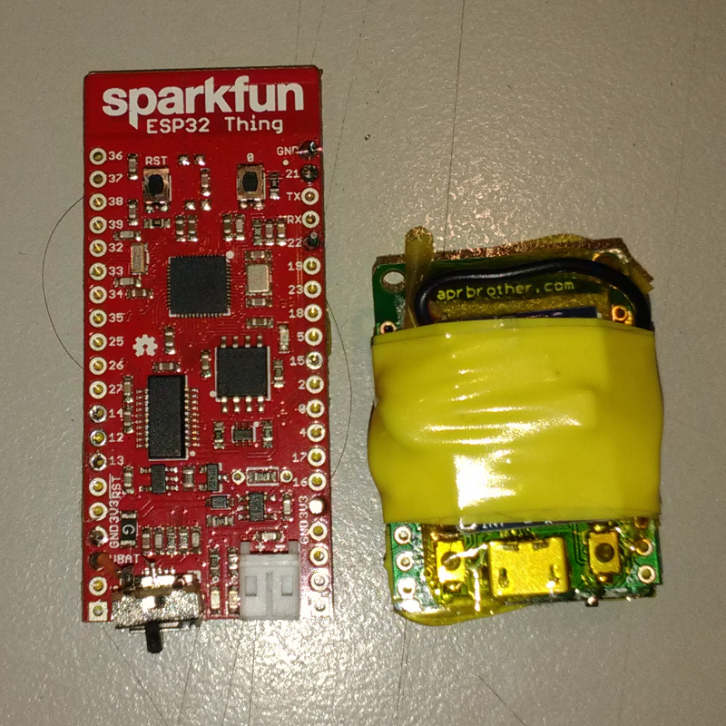

This article will slowly evolve as I make more progress on this project!
Follow [mnemote on Twitter](https://twitter.com/mnemote) for updates.

# Background

[Andrew Fisher](ajfisher.me), [Andy Gelme](geekscape.org) and I are
putting together a [Rocket Surgery Session](https://buzzconf.io/sessions/airborne-iot-build-a-rocket/)
for [BuzzConf 2017](https://buzzconf.io/).

We're using [Water Rockets](https://en.wikipedia.org/wiki/Water\_rocket) which are 
really just a soda water bottle using compressed air to expel water out the mouth
of the bottle, causing the bottle to fly upwards.

There are quite a few parameters to adjust here: fill pressure, water volume,
bottle size, fins, venturi diameter, nose cones, etc ... so there's lots of
useful experiments to do!

My part in this is to sort out the telemetry hardware and software.  By getting
real-time telemetry data from the rockets, we can get immediate feedback on 
acceleration profiles and modify the rockets in the field.

# First Prototype

The rockets aren't big: 1.25 or 2 liter soda water bottles.  And they don't have all that
much lift capacity.  So our telemetry computer has to be small and light.

There's many possible platforms, but I've been working a lot recently with the
[Espressif ESP32](http://espressif.com/en/products/hardware/esp32/overview),
a tiny chip which packs a reasonably powerful 32-bit CPU, RAM, Flash and a 2.4GHz
radio into a package the size of your thumbnail.  Even better, it can run
[MicroPython](https://micropython.org/).

I put together a quick prototype for
[BuzzConf Nights](https://www.meetup.com/BuzzConf/events/243244039/)
out of stuff I had lying around: there's a 
[Sparkfun ESP32 Thing](https://www.sparkfun.com/products/13907), 
a [GY521 / MPU-6050 6DOF Accelerometer / Gyrometer](https://playground.arduino.cc/Main/MPU-6050)
and a 180mAh RC heli LiPo cell.

Also some foam, tape, a tennis ball (new) and a pizza box (used).
The end result was this:

It's not pretty, but it is easy to throw and the fins cause it to flip
over nicely at apogee so it should behave quite a lot like the real thing.
A quick test run showed that the telemetry package ran for over an hour
on the battery, even with the LEDs which came with the modules still in place.

A small piece of MicroPython code is enough to connect the device to a
[public MQTT server](https://iot.eclipse.org/getting-started) and start logging data:

    # Set up the i2c bus, which is on pins 21 and 22.
    # Then wake up the acc/gyr module by writing to its status register.

    import machine
    i2c = machine.I2C(freq=400000,scl=machine.Pin(22),sda=machine.Pin(21))
    i2c.writeto_mem(104,107,bytes([0]))

    import time

    # Read a single record from the acc/gyr and expand it into a tuple of
    # seven signed numbers: ax, ay, az, temperature, gx, gy and gz.

    import struct
    def read_acc():
        return struct.unpack(">7h", i2c.readfrom_mem(104,0x3b,14))

    # Wait for the WLAN to be available.

    while not network.WLAN().isconnected():
        time.sleep(0.1)

    # Connect up to an MQTT server

    import umqtt.simple

    cli = umqtt.simple.MQTTClient('r0kk1t', 'iot.eclipse.org')
    cli.connect()

    # Grab data and send timestamp plus data in an MQTT message.

    while True:
        zz = [ time.ticks_ms() ] + list(read_acc())
        msg = ' '.join("%d" % x for x in zz)
        cli.publish('r0kk1t', msg)
        time.sleep(0.1)

It's not much of a thing, but it's enough to see some interesting things about
the flight of our cardboard missile.  Here's some data I captured at home using the prototype,
although using my own local MQTT server ([Mosquitto](https://mosquitto.org/)) instead of
transmitting all the data over the Internet and back, and a slightly higher capture rate ...

The graph isn't all that clear, but I think that's showing the rocket lying on its side on 
the floor (until 10 seconds), then getting picked up and thrown (around 12 seconds),
a brief free fall period around 13 seconds and then a landing and bounce.

After this not terribly auspicious start, one of the battery wires broke off. 
In any case, this is just raw data and I need to look at the more advanced supersampling features.

# Second Prototype

As it turns out, the board I used is just a bit too large to fit inside a tennis ball, 
so I'm going to use a slightly smaller board, the
[ESPea32](https://blog.aprbrother.com/product/espea32).  This doesn't have the battery
management on board, but there's a
matching [ESPea Battery Shield](https://blog.aprbrother.com/product/espea-battery-shield).
It feels weird to snap a brand new board in half, but here we go ...

As well as the main board and the battery shield, there's the same accelerometer module
and 180mAh battery as before, and some packing foam, kapton tape, electrical tape, double
sided tape ... all up it weighs about 15 grams, which is plenty light enough, and because
it is a compact little hamburger it will fit inside my tennis ball easily enough.

By replacing the existing 2.2k&#x2126; RPROG
resistor with a 10k&#x2126; one, the charge rate is dropped from about 450mA to 100mA.
Desoldering the tiny SMD resistor and replacing it with an enormous through-hole one was 
a bit hairy, but seems to have worked.  The resistor leg is soldered directly to pin 5 of the
regulator and to the original resistor pad to try and give it more mechanical strength.
With this modification, the charging temperature is much more sensible.

# Better Protocol

I've switched to sending [ESP-Now](http://espressif.com/en/products/software/esp-now/overview)
over [802.11 LR](http://esp-idf.readthedocs.io/en/latest/api-guides/wifi.html#wi-fi-protocol-mode) 
and it seems to be working really well ... running flat out it's transmitting a frame about every 
5.5 ms ... and the 180mAh battery manages about 17 minutes of that before
browning out and bouncing.

example rocket code:

    import network
    w = network.WLAN(network.STA_IF)
    w.active(True)
    w.config(protocol=network.MODE_LR)

    from esp import espnow
    espnow.init()

    espnow_bcast = b'\xFF' * 6
    espnow.add_peer(w, espnow_bcast)

    import machine
    i2c = machine.I2C(freq=400000,scl=machine.Pin(22),sda=machine.Pin(21))
    i2c.writeto_mem(104,107,bytes([0]))

    import time
    import struct

    seq = 0
    while True:
        msg = struct.pack(">ll", seq, time.ticks_ms()) + i2c.readfrom_mem(104,0x3b,14)
        espnow.send(espnow_bcast, msg)
        time.sleep(0.004)
        seq += 1

Another ESP32 can receive the ESP-Now datagrams over 802.11 LR and forward
them to the campsite MQTT server via regular 802.11 or even
[wired Ethernet](https://github.com/micropython/micropython-esp32/pull/187)

At the moment, this just grabs the broadcast packets and prints them.
At 115200 baud the UART can just barely keep up with the data rate, so we
end up losing ~15% of frames but that's okay, this is not the long term solution:

    import network
    w = network.WLAN()
    w.active(True)
    w.config(protocol=network.MODE_LR)

    from esp import espnow
    espnow.init()

    import struct
    pfmt = "%12d %12d" + " %6d" * 7

    while True:
        msg = espnow.recv()
        if msg:
            print(pfmt % struct.unpack(">LL7h", msg[1]))

I'm working on pull requests to add these features to MicroPython so watch this space!

(There's also [Raw 802.11](https://github.com/Jeija/esp32free80211) ... so I could still skip
the ground control bit if it's too much of a pain in the butt ... but I think having the extra
range from the LR will make it worthwhile ...)

# Better IMU

I've also got on order a slightly more sophisticated
IMU, the [MPU-9250](https://www.invensense.com/products/motion-tracking/9-axis/mpu-9250/).

Mark put me onto these articles:
[LSM9DS1 vs. MPU-9250 vs. BMX055](https://github.com/kriswiner/MPU6050/issues/6)
[AHRS for Adafruit's 9-DOF, 10-DOF, LSM9DS0 Breakouts](https://learn.adafruit.com/ahrs-for-adafruits-9-dof-10-dof-breakout) which look helpful.  

This is [available on a module](https://www.banggood.com/GY-91-MPU9250-BMP280-10DOF-Acceleration-Gyroscope-Compass-Nine-Shaft-Sensor-Module-p-1129541.html) along with a
[BMP280](https://www.bosch-sensortec.com/bst/products/all\_products/bmp280) Barometric Pressure Sensor, 
which should give us a pretty accurate altitude estimate as well.

# Production Form

Ideally, I'd like these devices to be based on an WROOM32 module soldered directly to a little
board, with the IMU module(s) soldered directly as well, and so on.  But I ran out of time to make
boards, so instead we have some hand soldering to do. Fortunately, there's a module
GY-91 which has both a MPU-9250 and a BMP280 on the same module, simplifying the soldering.

And the LoLin32-Lite is a nice little module which combines an ESP32 with battery management.
By a happy coincidence, they're a nice fit with just a four pin header between them.
Additionally, I found a
[Tiny LiPo at HobbyKing](https://hobbyking.com/en_us/turnigy-200mah-1s-20c.html)
which is just the right size to backpack onto a LoLin module (sadly it's battery
connector is backwards.  What? Why? Never mind, easily swapped). With a capacity of
200mAh and a max charge rate of 2C ... well, the charge controller is meant to charge
at around 500mAh but unlike with the previous LiPos nothing gets warm so I figure we're okay.

# Further Work

The aim is to produce about 10 of these telemetry devices: we want to have multiple rockets
to experiment with and some spares on hand, plus I think it'd be fun to dangle one off a kite
like a very low altitude [Statite](https://en.wikipedia.org/wiki/Statite)

It's very cheap to do a run of 10 small PCBs these days, so I'll have to get to grips with
PCB design software.  I'm going to avoid dealing with the tiny packages directly by soldering
modules to the PCB rather than trying to use the sensors directly.  This should mean I can 
get away with a fairly sparse 2 layer board.

I'm also a bit leery of LiPo batteries: I dunno, they seem a bit [explodey](img/explodey.jpg)
at the best of times,
and being fired into the air atop a jet of water may not agree with them.  I bought some
[AAAA cell batteries](https://en.wikipedia.org/wiki/AAAA_battery) on Ebay so I'll try them out.
Annoyingly, none of the 9V batteries I levered open contained LR61 cells.

# Update 2017-12-04

Well, BuzzConf time came and despite [really crappy weather](http://media.bom.gov.au/releases/407/severe-weather-update-heavy-rain-and-flooding-in-victoria-and-southeastern-new-south-wales/)
the rocket workshop was a pretty big success.  We got lots of engagement, several groups of rocket builders
and quite a few flights.  We learned a lot about our telemetry and our launch platform, and I think we're all eager
to have another go.

The software used is all [on github](https://github.com/nodebotsau/water-rocket)

My notes:

1. Experiment with "infrastructureless" mode: rocket as AP, serving up responsive web page with graph, and/or rocket as STA with MDNS and otherwise ditto.
2. 700 kPa sensor in top of pressure bottle: this was close to working but not quite in time for buzzconf, I think it'd be interesting though
3. custom board mounted directly to top of pressure bottle and taped in place, this could also have some downward-facing LEDs.
4. mount barometer sideways to prevent acceleration interfering with barometer reading on takeoff (or correct in software)
5. Move USB-\>serial converter and charge controller off board and use a soldered-on battery to avoid messing with connectors falling off.
6. Experiment with modifying nosecone to crumple on impact
