So we have an enormous, fake Christmas tree.  An
[eight foot tall monstrosity](https://en.wikipedia.org/wiki/Yeti)
in plastic and steel, which for 11 months lurks under the house in a giant bag,
waiting for December to come around so it can loom over our living room.

## Rotating Table

A couple of years ago I built a rotating table for the tree to sit on, out of a 
cheap lazy susan bearing and a couple of big circles of MDF.
This makes it really easy to wrap tinsel around the tree, and to decorate it
evenly all over, but one side always ends up getting left against the wall.

Which made me think: what if the tree could very slowly rotate on its own?

Like most silly ideas, it sat and fermented for a while until this year,
finally, I had a chance to put it into action.  Late last year I bought a
[cheap 3D printer](/art/aldi-cocoon-3d-printer/) and I have a bunch of 
random motors and [microcontrollers](/tag/microcontroller/) laying around so
I set out to make it work as much as possible with junkbox parts.

## Motor Drives

The first thing I needed was a way to drive the base.  I thought about belt drives
or adding some kind of gear right around the edge of the platform, but keeping things
aligned seemed like a challenge and I wanted to keep the side load on the
bearing to a minimum.

There's a 10mm gap between the base and the platform though, so there's a little
room in there for the gears.
The bearing has a nicely formed metal edge at 305mm OD, so it seemed natural
to use that as a guide and build the gear around it.

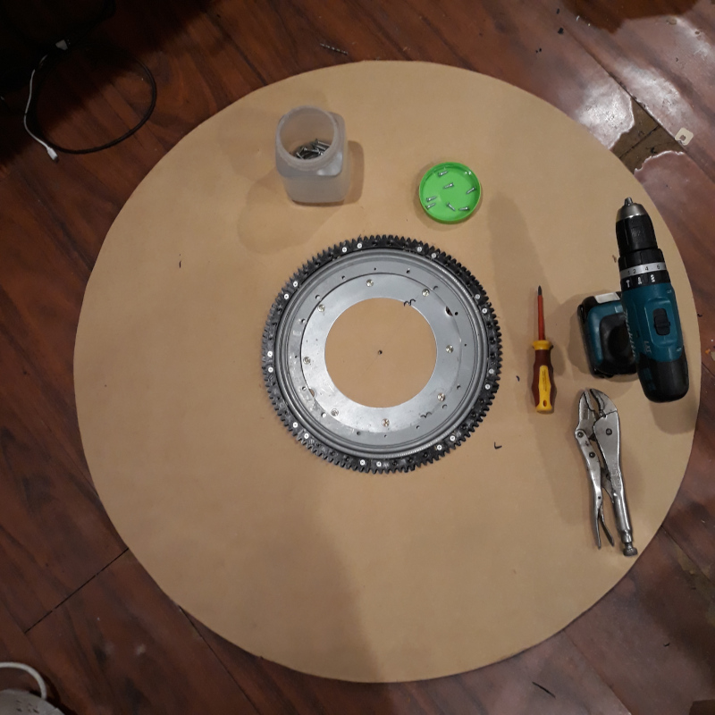
*The turntable platform*

I quite like working in [OpenSCAD](https://openscad.org/) so I grabbed the excellent
[openscad gears library](https://github.com/chrisspen/gears) and experimented a bit
with [involute gears](https://en.wikipedia.org/wiki/Involute_gear) to pick an 
appropriate [gear modulus](https://en.wikipedia.org/wiki/Gear#Standard_pitches_and_the_module_system)
and number of teeth.

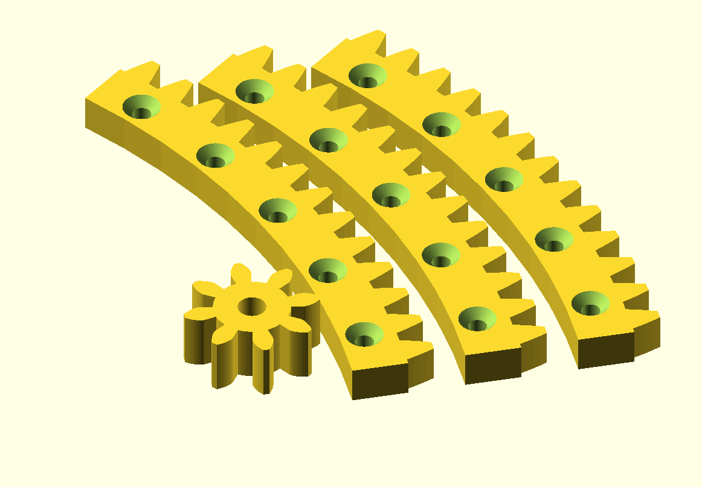
*Big Gear Segments*

After some fiddling around with the design, I ended up with a tooth diameter of 335.5mm 
and since the required gear is way bigger than the 120 x 135mm printable area of my printer,
I picked 9 segments of 13 teeth each for a total of 117 teeth.  I printed these 3 at 
a time, and after a couple of bad prints due to broken and jammed filaments I finally
had my full big gear.  There's a real thrill to lining up printed parts and discovering
that they fit perfectly!

*Printing big gear*

It fits exactly around the 305mm outer diameter of the lazy susan bearing, with 
three screws holding each segment in place.

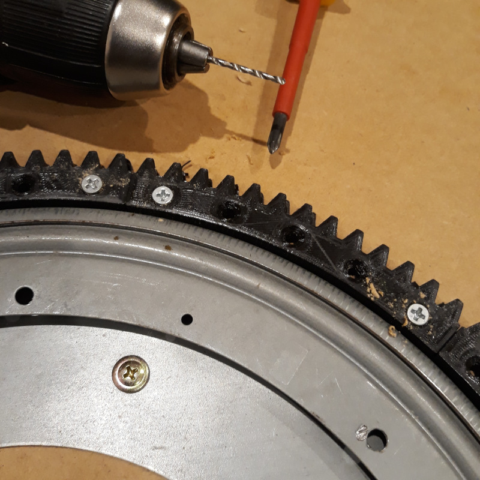
*Big gear on base*

*pictured: two screws per segment*

*not pictured: yet another trip to the hardware store*

I wanted to have the motor components all accessible from on top of the base in case I need
to fix anything.
So the big gear is actually attached to the stationary base and the motor is attached to
the rotating platform.
The motor mounts through a 51mm round hole in the platform, cut with a hole saw, which allows
the smaller gear to be on an eccentric so it can be moved in and out a little to adjust the
gear clearance.

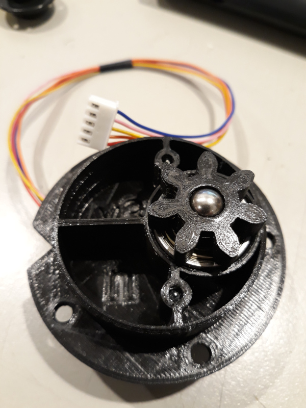
*Eccentric mount for 28BYJ-48 motor*

First I tried a [NEMA-23 stepper](http://www.piclist.com/techref/io/stepper/nemasizes.htm)
I happened to have in the junkbox, directly driving a 7 
tooth pinion.  This worked okay and had plenty of power, but the aim was to turn the tree
quite slowly and at low speeds it was jerky and not terribly effective.

I also tried out a small [28BYJ-48 stepper](https://web.archive.org/web/20180308144538/https://grahamwideman.wikispaces.com/Motors-+28BYJ-48+Stepper+motor+notes), which has a 1:64ish ratio gearbox built in.
While it did an okay job at very low speeds, it had barely enough torque to do the
job and stalled a lot once the platform was weighed down a bit.  It would probably have been
fine for a more modest tree though.

So with yet more OpenSCAD work I ended up with the following:

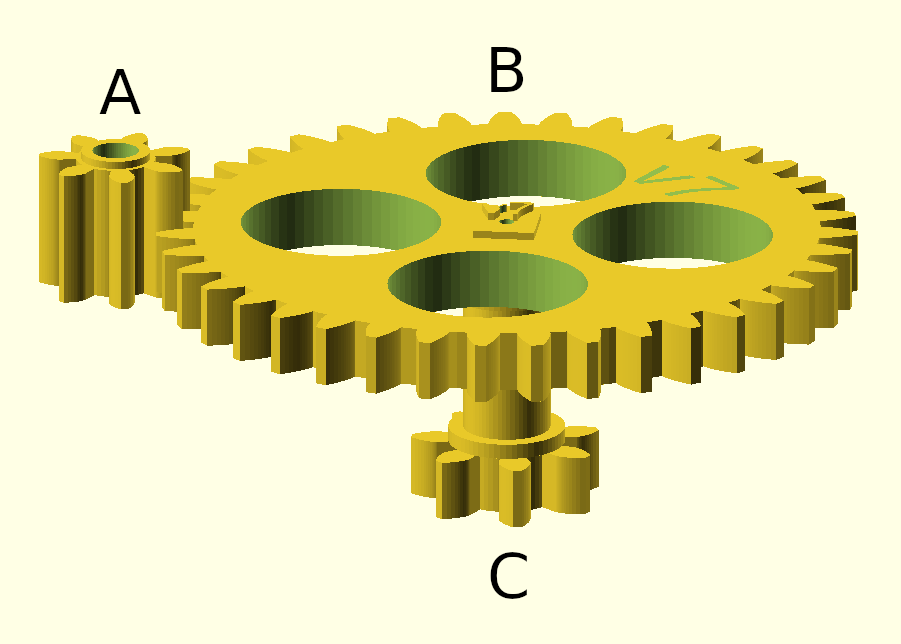
*Gear Train*

The NEMA-23 motor turns a 7 tooth pinion ('A'), which engages with a large 39 tooth gear 
('B') on the output shaft.
There's another 7 tooth pinion on the lower end, which drives
the 117 tooth gear on the base.
So overall there's about a 93:1 drive ratio between the stepper and the 
platform.

The output shaft assembles using a square end and a square socket in the primary output gear.
By making the square end's diagonal just a smidge smaller than the bearing ID it can be assembled 
through the bearings. and the shaft then retains the bearings in their seats.

The primary input gear is currently just press fitted onto the stepper motor shaft and retained with
a little superglue, but i may need to come up with somethng better if it comes loose again --
perhaps a metal collar and grub screw or a keyway ground into the stepper shaft.

The whole thing is sized to use every last mm of the printable area of my printer.
The teeth are a slightly smaller pitch than the secondary gears, but still pretty chunky.

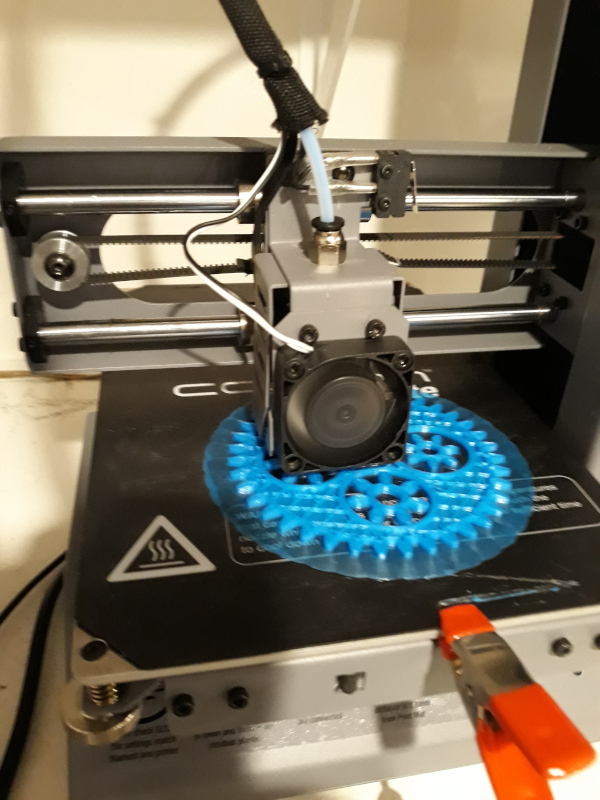
*Printing small gears*

The output shaft is supported by a couple of cheap 6901Z ball bearings and has
another 7 tooth pinion ('C') on the lower end, which drives the 117 tooth gear on the base.
The stepper is a 1.8⁰ per step or 200 steps per revolution of its output
shaft, so overall that's about 18624½ steps per revolution of the platform.

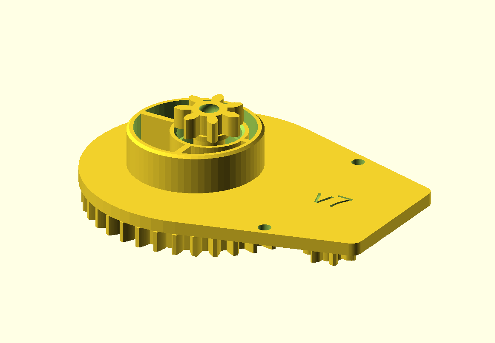
*Geartrain in base*

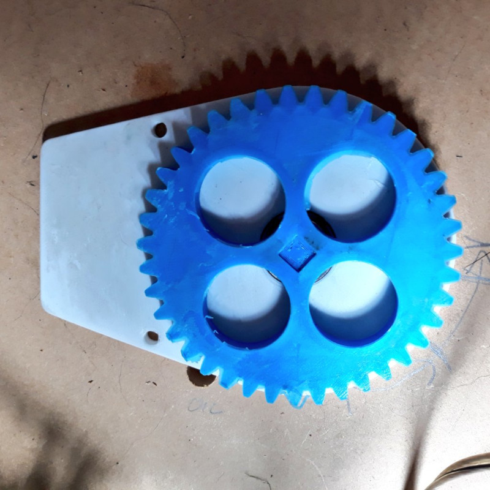
*Base mounted on platform*

The gears need a housing to support them, and that's 3D printed as well.
The lower part contains the eccentric and the seats for a couple of cheap
6901Z ball bearings.  These are a nice size to use because they are quite 
compact but the 12mm ID is big enough for a 3D printed driveshaft.

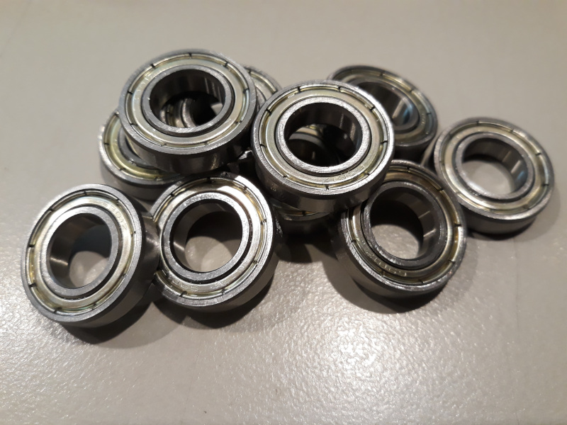
*6901Z bearings*

The upper part contains the motor mount for the NEMA-23 motor.
A couple of wood screws hole the whole thing down the the platform.

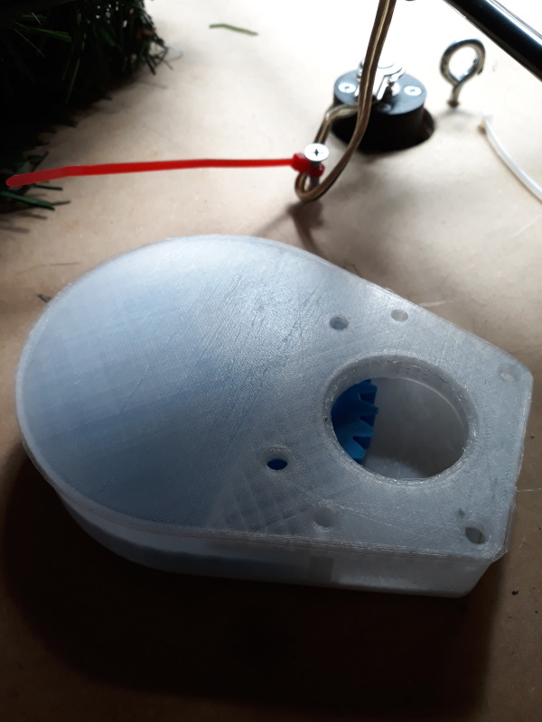
*Gearbox with cover & motor mount*

The secondary pinion is very close to the stationary base, which it is moving
relative to, so I've added a socket for a 8mm ball bearing in the end of the 
pinion.  This prevents the teeth of the pinion from touching the base and 
allows the pinion to glide smoothly over the base surface.  The ball is pressed
into place in a vice and then loosely retained by the socket.

The [3D Models are on GitHub](https://github.com/nickzoic/models3d/tree/master/saturnalia)
although there's still some work to be done.
(Since printing it, I've made the lid a little heavier and added some mounting 
ears just to keep the cover from buzzing)

Interestingly, just as I was finishing this article there was a subtle "pop" and the tree ground to a halt.
On inspection, the output shaft had snapped right where the gear meets the shaft:

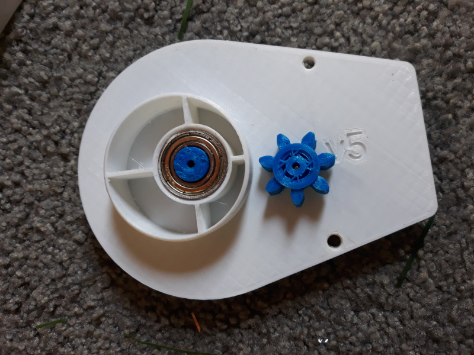
*Snapped Output Shaft*

This looks like it was due to poor selection of infill: the thick walls and open grid infill which
worked fine for the primary output gear wasn't suitable for the much smaller parts.
So I'm reprinting that with a much denser gyroid infill.

You might also notice I've started printing version numbers on everything.  This makes it a 
lot easier to keep track of which print is which.  Currently the tree has a v5 base, a v6
cover and I'm now printing a v7 driveshaft.  Not much has changed, but its good to keep
track of it.
 
## Slip Ring

The motor and controller need power to run, and getting power to a continuously
rotating platform isn't easy.

There's a device called a
"[slip ring](https://en.wikipedia.org/wiki/Slip_ring)"
which allows this to happen using sliding
contacts, and while these are pretty cheap on Ebay I thought it wouldn't quite 
fit the spirit of this junkbox project, so instead I figured that any concentric
connector would do in a pinch.

The most suitable connector in the junkbox was a 6.35mm / 1/4" phono connector,
as used in guitar leads and similar audio applications.
This isn't rated to any particular voltage or current
but they're very cheap and the contacts are pretty well formed for this sort of thing.

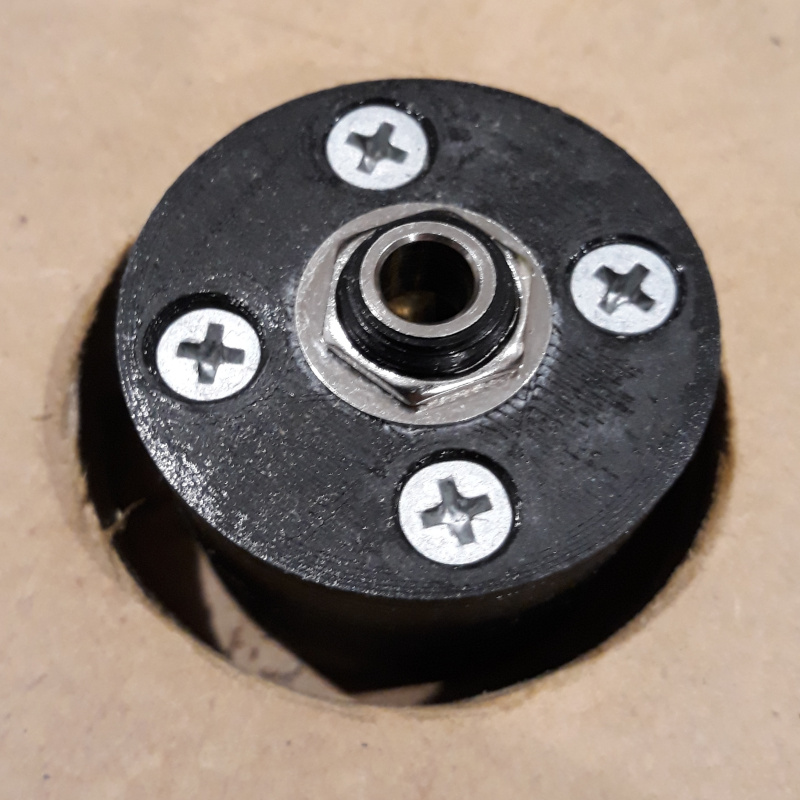
*Phono plug slip ring: socket*

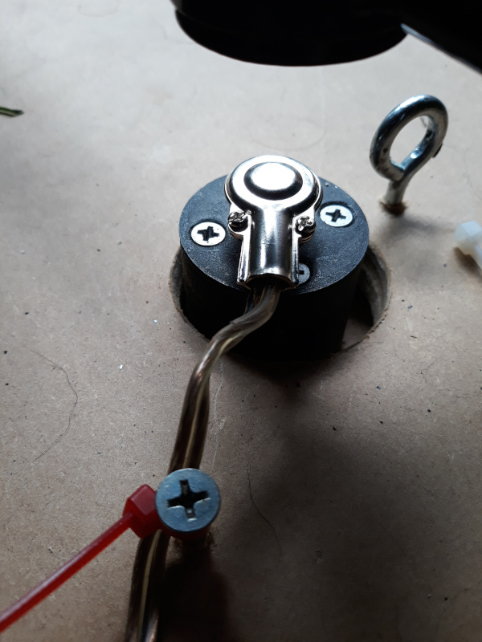
*Phono plug slip ring: plug*

Power is supplied from an old laptop charger at 15V, through the slip ring and
then power goes to the L293D based motor driver and to a couple of 5V/3A buck
converters.  Running the slip ring at a higher voltage lets us run it at a lower
current, hopefully reducing losses and increasing its life.

## Lights

The tree lights also have to be powered the same way, and so a 5V/3A buck 
converter module is used to supply power to a chain of 
300
[WS2811](https://www.adafruit.com/product/1378)-driven LED lights.
These are individually controllable from the same processor as the stepper driver
using the
[MicroPython NeoPixel library](http://docs.micropython.org/en/latest/esp32/quickref.html#neopixel-driver).
 

*WS2811 lights*

The [LED lights I bought on Ebay](https://www.ebay.com.au/itm/2X-50-X-12mm-LED-Module-RGB-WS2811-Digital-Pixel-Addressable-led-Strip-wate-H4Y3/283615712023)
and so far I'm very happy with
them.  Each light has its own tiny PCB and controller.  The strings can be connected
together but the wiring is far too flimsy to run more than one string at high
brightness ... later LEDs turn yellowish as the blue LED runs out of voltage to
function.  But if you're only driving a few LEDs at a time, or driving them at low 
power, the whole chain works nicely.  There's also spare wires at the start of each 
chain to attach extra power connections to boost the voltage in the chain.

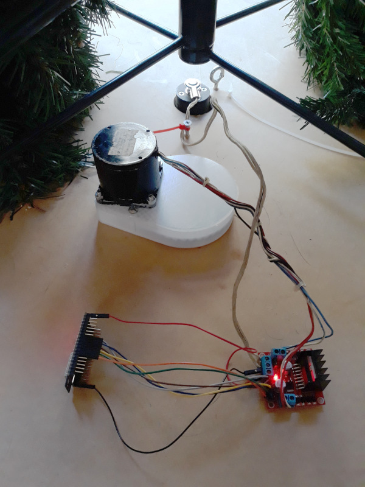
*Prototype Wiring*

## Software

This is still very much a work in progress, or to put it another way, it's 
rather janky.

[Code in MicroPython/ESP32](https://github.com/nickzoic/saturnalia/) controls
both stepper and lights.

A simple web server using [PyCoSe](https://github/nickzoic/pycose/) lets 
the tree be remote controlled from devices on our home WiFi.
Yeah, PyCoSe is a bit experimental at this point and I'm mostly using it for
this project to eat my own dog food.

## Further Work

The software needs a lot of work.  I think I might have just dislocated a pinion.
And the lights and baubles are not yet hanging (some of the lights are still in the
mail) and the videos are yet to be shot.  Also I want to add in some more explanatory
text about how the motors and gears work.

The biggest problem I've got is that both the lights and the motor need
real-time control, and the time taken to update the lights is greater than the
interval needed between microsteps of the motor.  So either I have to have 
the motor running less smoothly, or break the lights into smaller chains.

The ESP32 is a dual core CPU so in theory one core could handle each task but there's
also the WiFi to compete with: in practice I might end up using a secondary CPU
for motor control, or maybe just a whole 'nother ESP32.

I'm pretty happy with how the gearbox is working now, but the gear ratio
could be bigger and
if I was starting the design process over again I'd consider using a 
[Cycloidal Drive](https://en.wikipedia.org/wiki/Cycloidal_drive) instead.
It'd also be nice to have some kind of clutch mechanism so that the tree
can still be turned by hand when the motor is off.

The tree is a lot heavier now all the lights and decorations are on board, and
thus has a much higher moment of inertia ... I've added some code to gently
accelerate and decelerate the tree to reduce load on the geartrain, but it's 
interesting to see how much movement there is in the decorations as the tree
wobbles very slightly in its orbit.

If you're interested in following along, [follow me on Twitter](https://twitter.com/nickzoic/)
and I'll post updates and videos and so on there.

## MQTT

I mention just above that having two real-time functions plus the web server 
all competing for CPU time wasn't working real well, and I was considering adding
an extra secondary CPU ... well, instead, I added a whole 'nother ESP32 and
switched to using MQTT instead of HTTP.

How this works is that the two controllers each listen to their own MQTT topic,
and wait for a relevant message to set either the speed or the light mode.
Obviously this is pretty wasteful and flagrantly insecure and if you're connecting
to a public MQTT server then anyone in the world can spy on your Christmas tree
and even seize control of it by sending their own messages.

But it's pretty amazing how much neater and cleaner the code is, and how easy it
was to set up.  There's no need to worry about DHCP addresses or anything like that,
the tree just configures itself and listens.
This ties into my [L2IoT protocol](/art/l2iot-iot-without-ip/) concept as well.

(Update: after a certain amount of messing about it turns out that you need to
provide a keepalive ping every 30 seconds or so to stop the server vagueing out on
you.  It seems odd that the library doesn't do this for you, but thankfully it's 
easy to set up a timer for this purpose)

## More work

Depsite using microstepping, the motor is noticeably "ticky" as it jumps from
phase to phase.  The motor control loop takes about 3.5ms to run, so it's not
that.  I think I just need to fiddle the parameters a little to get a smoother
action.

## Plotting 3D position

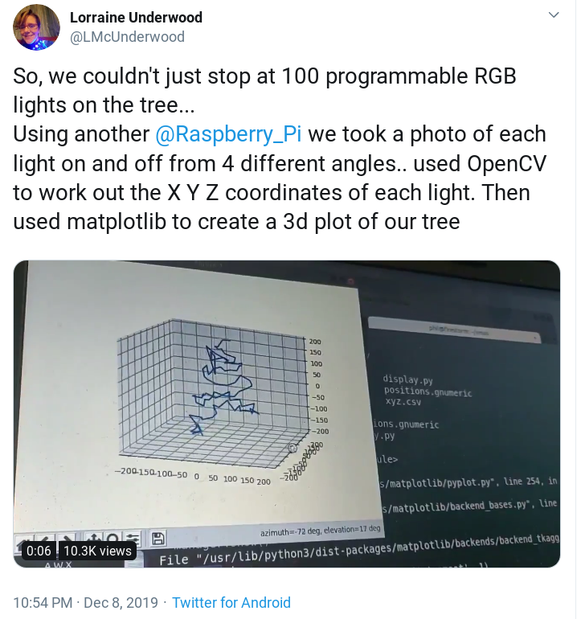
*Plotting the positions of lights on a tree*

[This tweet by Lorraine Underwood](https://twitter.com/LMcUnderwood/status/1203644133828640768)
discusses determining the location of the lights on a tree in 3D space.  I'd been
thinking along similar lines, using the rotator naturally, and now I've got my full
complement of lights on board and an ESP32-CAM board working it should be a fun project.
The aim then will be to synchronize the lights and motor movement, so that for example
the lights could be set to a vertical striped pattern which stands still even as the 
tree rotates 'under' it.

## Acknowledgements

Thanks to my family for inspiring and putting up with this strange project and
the terrible state of the loungeroom while I was assembling it ...

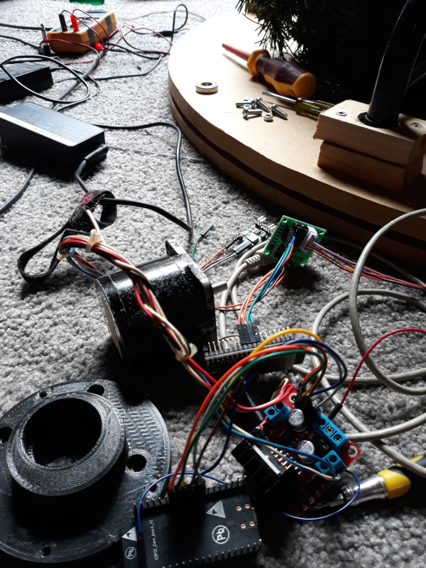

Merry Christmas (etc) to all of you out there in Internetland
and all the best wishes for 2020 `:-)`

## VIDEO

Everyone's been asking for it, so here it is:

[Time-lapse video](https://www.youtube.com/watch?v=RFfNYPqqQh0)

<iframe src="https://www.youtube.com/embed/RFfNYPqqQh0" frameborder="0" allow="accelerometer; autoplay; encrypted-media; gyroscope; picture-in-picture" style="position: absolute; width: 100%; height: 100%; left: 0; top: 0" allowfullscreen></iframe>

(I just assumed that YouTube would handle vertical videos more elegantly by now, but 
apparently not.)

## UPDATE BOXING DAY

The gearbox survived through Christmas!  I'll pull it apart when the tree comes down and
have a look at the wear on the teeth and the phono plug slip ring.

## FINAL UPDATE: JANUARY 2020

After a few days' runtime, wear on the gears is negligible, even on the smallest pinion on
the motor shaft which turns 93 times as often as the tree itself.
Surprisingly, the phono plug slip ring is showing no signs of wear
either, although I can't see the internal socket contacts so they may have suffered.
The re-printed output shaft was much stronger, and didn't break again despite the tree getting
stalled a few times by coffee tables, dogs and other obstacles.

My favourite way to run the tree was at very low speed, so that the movement was barely 
perceptible. The leaves vibrate slightly as if it a breeze, and if you stare at it long
enough, the tree seems to stay still and the rest of the room seems to move slightly.

Everyone else found this horrible and disturbing and preferred the tree to whisk merrily
around.  This was a bit beyond the capacity of the existing motor so I suspect for next year
we'll have an improved motor drive capable of handling 1 RPM or so, possibly using a 
toothed belt drive to minimize vibration.  Probably a proper slip ring too and the lazy
susan bearings might not be the best choice.

The old-school L298 motor driver I used wasn't a great choice, running way too hot due to
the voltage drop across the bipolar transistors.  It also has quite limiting PWM capabilities
due to slow switching (~1 µs).  I'll switch to MOSFET based drivers if I'm using a stepper
again.

I also need to run more power wiring for the LEDS.  The chains plug togther, but voltage
loss over more than one chain is way too high, leading to color shifting and very limited
brightness overall.  Attaching a separate pair of power wires at each end of each chain would
help this a lot.

The neopixel timing was also annoyingly glitchy due to timing issues.
New work on the [RMT peripheral in Micropython/ESP32](https://github.com/micropython/micropython/pull/5184) has made it possible to control neopixels without glitches. 
Alternatively, a little [picopixel driver board](https://github.com/usedbytes/neopixel_i2c) could 
be used to take the load off the main CPU.

UPDATE: [esp32.RMT](https://docs.micropython.org/en/latest/library/esp32.html#rmt) is now available,
and there's a [neopixel driver for esp32.RMT](https://github.com/nevercast/micropython-helpers/blob/develop/pixels.py) thanks to Josh.  So next year should be much less glitchy!

I'd also consider setting up a separate small MCU just to handle the stepper
timing: dealing with that in multi-threaded code is a bummer.  This would make a really
nice stand-alone board anyway: a little board with a ATTiny or similar and a couple of
MOSFET drivers, communicating to the host CPU on I2C much like the PicoPixel does.

Or maybe this is a good case for having a ESP32 + [FPGA](/tag/fpga/) board?

Last but definitely not least, in my haste to get this project ready in time for Christmas
Eve I ended up falling back on [all the IoT antipatterns I like to complain about](/art/the-internet-of-not-shit-things/) ... the tree just listened to unencrypted messages on a public Mosquitto
server and I even published the details in my github repo.  I never noticed anyone fooling
with it, but it's still not a very clever way to go.

But anyway: Happy New Year, and may 2020 be a happy and creative one for all of us.
