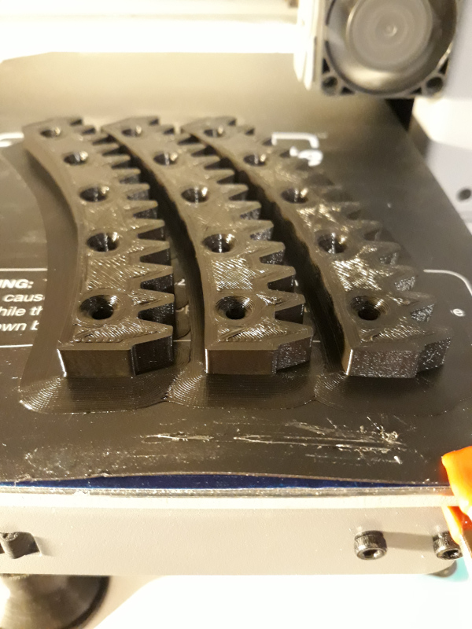

So we have an enormous, fake Christmas tree.  An
[eight foot tall monstrosity](https://en.wikipedia.org/wiki/Yeti)
in plastic and steel, which for 11 months lurks under the house in a giant bag,
waiting for December to come around so it can loom over our living room.

## Rotating Table

A couple of years ago I built a rotating table for the tree to sit on, out of a 
cheap lazy susan bearing and a couple of big circles of MDF.
This makes it really easy to wrap tinsel around the tree, and the decorate it
evenly all over, but one side always ends up getting left against the wall.
Which made me think: what if the tree could very slowly rotate on its own?

Like most involved ideas, it sat and fermented for a while until this year,
finally, I had a chance to put it into action.  Late last year I bought a
[cheap 3D printer](/art/aldi-cocoon-3d-printer/) and I have a bunch of 
random motors and [microcontrollers](/tag/microcontroller/) laying around so
I set out to make it work as much as possible with junkbox parts.

## Motor Drives

The first thing I needed was a way to drive the base.  I thought about belt drives
or adding some kind of gear right around the edge of the platform, but keeping things
aligned seemed like a challenge and I wanted to keep the side load on the
bearing to a minimum.

There's a 10mm gap between the base and the platform though, so there's a little
room in there for the gears.
The bearing has a nicely formed metal edge at 305mm OD, so it seemed natural
to use that as a guide and build the gear around it.

I quite like working in [OpenSCAD](https://openscad.org/) so I grabbed the excellent
[openscad gears library](https://github.com/chrisspen/gears) and experimented a bit
with [involute gears](https://en.wikipedia.org/wiki/Involute_gear) to pick an 
appropriate [gear modulus](https://en.wikipedia.org/wiki/Gear#Standard_pitches_and_the_module_system)
and number of teeth.

After some fiddling around with the design, I ended up with a tooth diameter of 335.5mm 
and since the gear is way bigger than the 120 x 135mm printable area of my printer,
I picked 9 segments of 13 teeth each for a total of 117 teeth.

It fits exactly around the 305mm outer diameter of the lazy susan bearing, with 
three screws holding each segment in place.

I wanted to have the motor components all accessible from on top of the base in case I need
to fix anything.
So the big gear is actually attached to the stationary base and the motor is attached to
the rotating platform.
The motor mounts through a 51mm round hole in the platform, which allows the smaller gear to 
be on an eccentric so it can be moved in and out a little to adjust the gear clearance.

First I tried a [NEMA-23 stepper](http://www.piclist.com/techref/io/stepper/nemasizes.htm)
I happened to have in the junkbox, directly driving a 7 
tooth pinion.  This worked okay and had plenty of power, but the aim was to turn the tree
quite slowly and at low speeds it was jerky and not terribly effective.

I also tried out a small [28BYJ-48 stepper](https://web.archive.org/web/20180308144538/https://grahamwideman.wikispaces.com/Motors-+28BYJ-48+Stepper+motor+notes), which has a 1:64ish ratio gearbox built in.
While it did an okay job at very low speeds, it had barely enough torque to do the
job and stalled a lot once the platform was weighed down a bit.  It would probably have been
fine for a more modest tree though.

So with yet more OpenSCAD work I ended up with the following:

The NEMA-23 motor turns a 7 tooth pinion ('A'), which engages with a large 39 tooth gear 
('B') on the output shaft.
There's another 7 tooth pinion on the lower end, which drives
the 117 tooth gear on the base.
So overall there's about a 93:1 drive ratio between the stepper and the 
platform.

The output shaft is supported by a couple of cheap 6901Z ball bearings and has
another 7 tooth pinion ('C') on the lower end, which drives the 117 tooth gear on the base.
The stepper is a 1.8⁰ per step or 200 steps per revolution of its output
shaft, so overall that's about 18624½ steps per revolution of the platform.

The gears need a housing to support them, and that's 3D printed as well.
The lower part contains the eccentric and the seats for a couple of cheap
6901Z ball bearings.

The upper part contains the motor mount for the NEMA-23 motor.
A couple of wood screws hole the whole thing down the the platform.

The [3D Models are on GitHub](https://github.com/nickzoic/models3d/tree/master/saturnalia)
although there's still some work to be done.
(Since printing it, I've made the lid a little heavier and added some mounting 
ears just to keep the cover from buzzing)

## Slip Ring

The motor and controller need power to run, and getting power to a continuously
rotating platform isn't easy.
There's a device called a
"[slip ring](https://en.wikipedia.org/wiki/Slip_ring)"
which allows this to happen using sliding
contacts, and while these are pretty cheap on Ebay I thought it wouldn't quite 
fit the spirit of this junkbox project, so instead I figured that any concentric
connector would do in a pinch.

The most suitable connector in the junkbox was a 6.35mm / 1/4" phono connector,
as used in guitar leads and similar audio applications.
This isn't rated to any particular current
but the contacts are pretty well formed for this sort of thing.

Power is supplied from an old laptop charger at 15V, goes to a phono socket 
mounted on the stationary base which sticks up through the rotating platform,
and a right-angle phono plug transmits power to the L293D motor driver module.

## Lights

The tree lights also have to be powered the same way, and so a 5V/3A buck 
converter module is used to supply power to a couple of strings of WS2811 based
LEDs.  These are controlled from the same processor as the stepper driver
using the
[MicroPython NeoPixel library](http://docs.micropython.org/en/latest/esp32/quickref.html#neopixel-driver).
 

## Software

This is still very much a work in progress.

[Code in MicroPython/ESP32](https://github.com/nickzoic/saturnalia/) controls
both stepper and lights.

A simple web server using [PyCoSe](https://github/nickzoic/pycose/) lets 
the tree be remote controlled from devices on our home WiFi.
Yeah, it's a bit experimental at this point and I'm mostly using it to eat my 
own dog food.

## Acknowledgements

Thanks to my family for inspiring and putting up with this strange project and
the terrible state of the loungeroom while I was assembling it ...

Merry Christmas to all of you out there in Internetland
and all the best eishes for 2020 `:-)`
