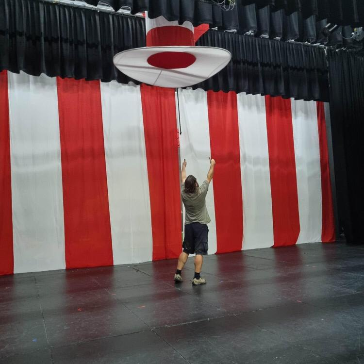
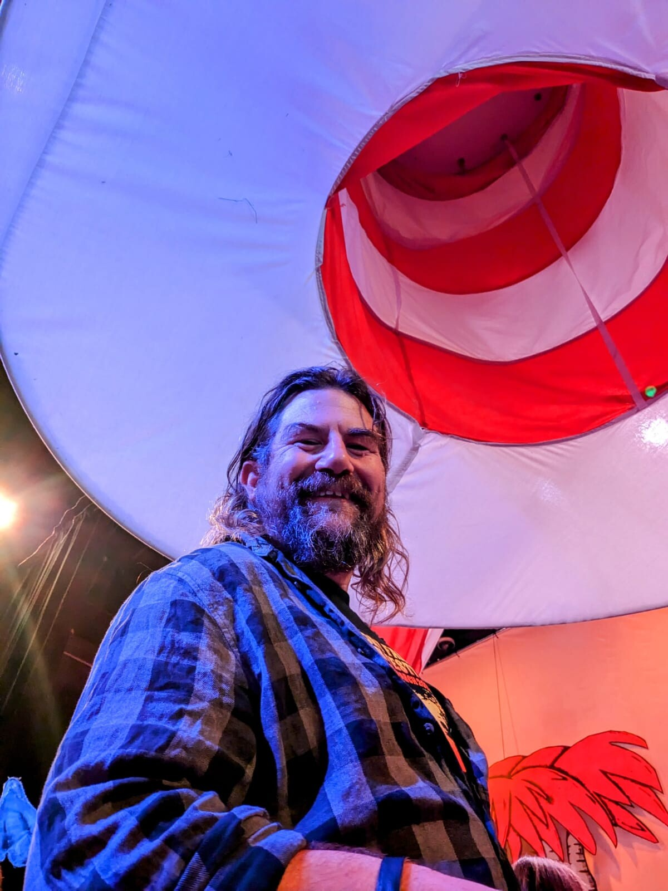

In totally not work related news, I've been working
on set design and construction for 
[Diamond Valley Singers](https://www.dvsingers.org/)'s 
production of
[Seussical Jr.](https://www.dvsingers.org/seussical-junior)
which a friend is directing, and also my kids and lots of 
their friends are performing in.

This has been a really mind-blowing experience and it's been
great to be doing something so disconnected from my normal
life of computing.  

*Curtains!  (photo: Gemma Patton)*

Still, there's a lot in common with software development:
having a big vision is important, but also you need to be
able to execute on the small details.
Some things which seem difficult turn out
to work first time and other things turn out to be way harder 
than they reasonably should.
Everything has a weird name.
And like software development, it's very much a team effort
and every contribution counts.

I came up with a bunch of silly ideas and the directors were cruel
enough to let me run with them.
This has meant making things like a 13m x 6m circus curtain
(with Kabuki Drop, see below)
and a levitating 2.1m tall "cat in the hat" hat from which
the Cat can appear ...

It's on stage now, some
[kind reviews](https://melbournetheatre.info/2023/03/25/review-seussical-jr/)
("arguably one of the most beautiful set designs the company has ever presented")
are coming in, everything seems to be running smoothly, our junior
performers are doing a fantastic job
and in another week it'll be a fading memory ...

## The Hat

The hat is a big fabric bag, supported by a corflute crown at the top, 
four springy wires (from old kids' play tents) between the segments and a 
brim made of 20mm PVC conduit.
I bent the conduit by plugging each 4m length back into itself and then 
leaving it in the hot sun for a day to take on that bend before cutting
to length.  This makes it a lot easier to fit into the brim.

We ended up having to move a bunch of stuff around up in the lighting 
grid for the hat to rise up into, this was a bit of a beginners mistake
on my part and if I had my time over I'd come up with a way to have the 
hat flatten itself out at the top of its rise.  Still, it's a nice opening
to the show.

There's a big hole in the top to let air in and out but even so lifting 
the hat is quite difficult, it doesn't weight much but there's a lot of drag.
Unfortunately, for the operators to get a good grip on the cord we had to 
use a pretty fat (5mm) cord which is a bit too obvious visually.

If I had my time over I'd also consider creating a cordless drill driven
windlass to get a smoother lift and avoid having the hat lift depend so 
much on the stage crew's grip strength!

## Kabuki Drop Mechanism

At one point, there's a very fast transition to "the circus", so I wanted to do something
very quick and visually arresting.
We made up a 13m x 6m curtain, that's the entire size of the proscenium,
which is hidden up in the lighting grid and drops suddenly when released.

This is a lot like a Kabuki Drop used in Japanese Kabuki theatre and widely
ripped off by Western stadium shows etc.  You can use solenoids or various 
mechanical devices to release the curtain.

I ended up using a mechanical design based on information in these sites:

* [Paperclip: Kabuki Drop](https://paperclip.rcs.ac.uk/index.php/Kabuki_Drop)
* [Manual Kabuki Drop Systems](https://magickabukidrop.com/manual-kabuki-drop-systems/)

I modified the plans slightly to use a single eye per attachment point.
A loop of paracord comes up through the eye and is secured with a pin,
which pulls out sideways when a release cord is tugged.

The pins are taken from [linchpins](https://en.wikipedia.org/wiki/Linchpin)
with the spring retainer removed and a hole drilled through the end to attach 
a cable tie.

<iframe src="https://www.youtube.com/embed/RXiF9Pmaz4s" frameborder="0" allow="accelerometer; autoplay; encrypted-media; gyroscope; picture-in-picture" style="position: absolute; width: 100%; height: 100%; left: 0; top: 0" allowfullscreen></iframe>

*[Prototype release mechanism (works)](https://youtu.be/RXiF9Pmaz4s)*

We ended up using eight of these mechanisms on along a 11 meter beam to support
our curtain, with a single cord running down into the wings for a crew member to
release the curtain.  It isn't a heavy blackout curtain, just a single layer of poplin,
so it's very light, less than 10kg all up.

At the end of that scene, the curtain is drawn up and to the side.  If you wanted it
to go away completely, you could add a second drop mechanism which would release the
top ...

To reset the curtain, we lower the curtain beam to about a foot off the floor
(it's on ropes from the lighting grid) and this naturally furls the curtain beneath the beam. 
Then we roll it loosely back on itself so the furled part is retained in a wrap of fabric,
and secure that beneath the beam with the cord loops.  This seems to work a lot
better than either just furling (which falls quickly, but comes loose easily)
or just rolling (which falls very slowly, and can get caught up itself as it drops).

*Me and the Hat*

## UPDATE JULY 2023

This year it's going to be [Frozen Jr.](https://www.dvsingers.org/frozen)!

I'm not doing set construction this time around, but will be helping out with props 
and lighting.

## UPDATE OCTOBER 2023

DVS's Seussical has got
[multiple nominations for 2023 Junior Lyrebird Awards](https://lyrebirdawards.au/2023-junior-nominations)
including for our set design
(**BEST SET - YOUTH MUSICAL UNDER $40K**) and also 
congrats to Cara, Cathie & Ellouise for their nominations
(and to everyone in the company for the "outstanding dance number"
nomination)
