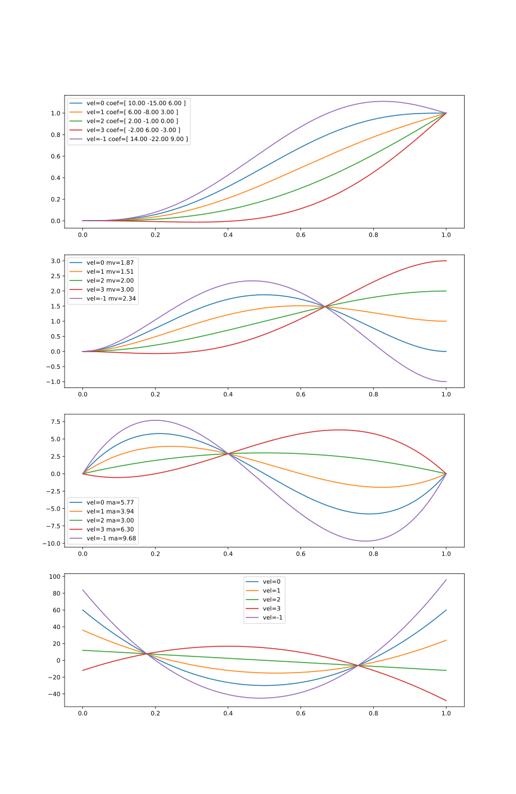
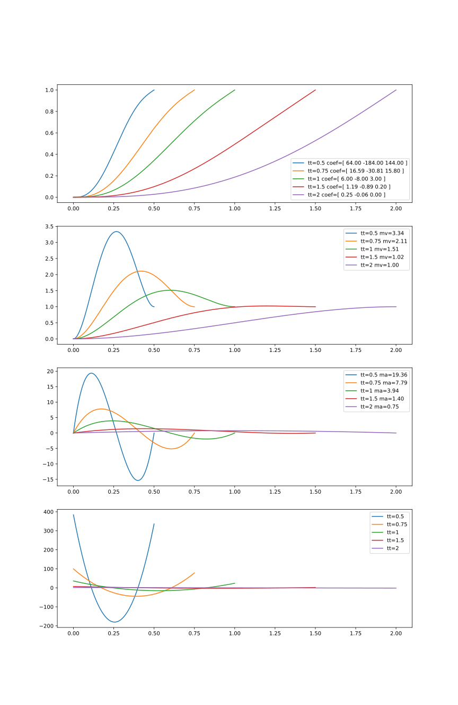
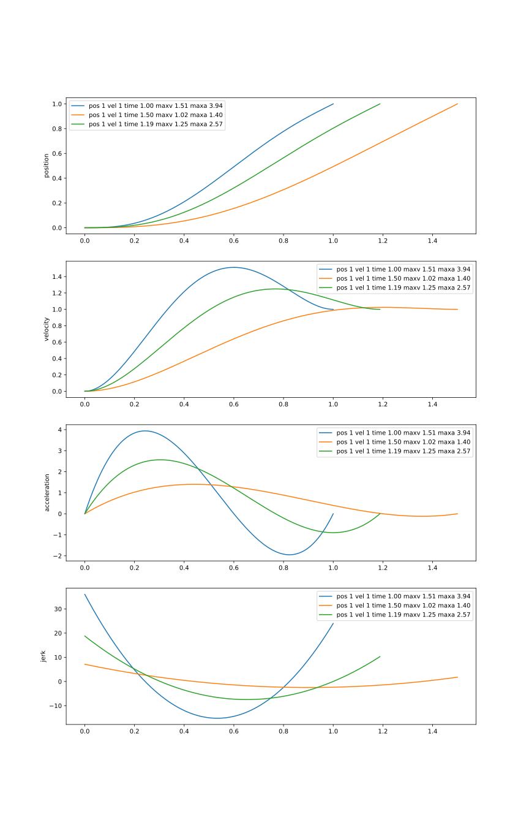

This article is all about movement.
Of a vehicle, or a robot, or something like a 3D printer which is really just a
specialized robot with a hot glue gun.

Some trajectories are fixed: the parts which are doing work like laying down plastic
for example, have to be from a specific point to another specific point at a set speed,
to most efficently do the task.  Other parts are pretty much free: the aim is to 
get from the end of the previous task to the start of the next one rapidly but with as
little fuss as possible. 

## Position, Velocity, Acceleration, Jerk?

[Jerk](https://wikipedia.org/Jerk_%28Physics%29) is the third derivative of
position, or the rate of change of acceleration, which might seem like a pretty
abstract thing to be worried about but:

Imagine a mass in a box under constant acceleration.  Springs inside the box are
pushign the mass to cause it to accelerate too. But if we change the size or 
direction of 
the acceleration, the mass is going to slide around until it reaches a new
equilibrium.

Now imagine the box is your skull and the mass is your brain.  Jerk is real!

### Higher Orders

There's also higher derivatives which are sometimes called
[Snap, Crackle and Pop](https://en.wikipedia.org/wiki/Fourth,_fifth,_and_sixth_derivatives_of_position)
Snap (sometimes called Jounce) is the rate of change of Jerk; Crackle is the rate
of change of Snap, etc.
I don't have as neat an illustration of what these physically mean but there seems to be a consensus that
they, and presumably higher derivatives again, have an effect on vibration and so on of
mechanisms, and so they should be minimized too.

### Discontinuities

Our robot follows a path made up of many segments, some freer than others.
The problem is smoothly transitioning between segments.
A discontinuity in velocity requires a large acceleration.
A discontinuity in acceleration requires a large jerk.
And so on.
When we combine segments into a path, it is important to match the ends to prevent
these discontinuities.
So our apparently "free" transport segments are actually critical to support
our "working" segments.

## Transitions & Trajectories

So let's look at a way to make our trajectories "smooth".
There's been a lot of work on this for as long as people have been making machines.
This is just one possible way to think about the problem ...

Let's start by looking at a smooth transition function:

### SmoothStep ...

[SmoothStep](https://en.wikipedia.org/wiki/Smoothstep) is a family of
polynomial functions which smoothly transition across the range [0,1]
in the domain [0,1] in a
[Sigmoid](https://en.wikipedia.org/wiki/Sigmoid_function) shape.

`$ S_1(t) = \begin{cases}0, & if\ t \leq 0 \\ 3t^2 - 2t^3, & if\ 0 \leq t \leq 1 \\ 1, & if\ 1 \leq t\end{cases} $`

Smoothstep is a polynomial function and so the first derivative `$ S^\prime_1 $`, is polynomial too:

`$ S'_1(t) = \begin{cases}0, & if\ t \leq 0 \\ -6t^2 + 6t, & if\ 0 \leq t \leq 1 \\ 0, & if\ 1 \leq t\end{cases} $`

and has the handy property that it is neatly zero at both ends.  However, `$ S''_1 $` does not have
this property.  Our velocity at each end of our movement is zero, but our acceleration is not.

### ... and SmootherStep ...

If we want acceleration to be zero at the beginning and end of our trajectory, we can use
[Smootherstep](https://en.wikipedia.org/wiki/Smoothstep#Variations), which is a fifth-order
polynomial with this property:

`$ S_2(t) = \begin{cases}0, & if\ t \leq 0 \\ 6t^5 - 15t^4 +10t^3, & 0 \leq t \leq 1 \\ 1, & 1 \leq t\end{cases} $`

`$ S'_2(t) = \begin{cases}0, & if\ t \leq 0 \\ 30t^4 - 60t^3 + 30t^2, & 0 \leq t \leq 1 \\ 0, & 1 \leq t\end{cases} $`

`$ S''_2(t) = \begin{cases}0, & if\ t \leq 0 \\ 120t^3 - 180t^2 + 60t, & 0 \leq t \leq 1 \\ 0, & 1 \leq t\end{cases} $`

### ... and Smooth<sup>n</sup>Step

The SmoothStep function can be worked out to an arbitrary depth, for example `$ S_6 $` is a 13th-order polynomial:

`$ S_6(t) = \begin{cases}0, & t \leq 0 \\ 924t^{13} - 6006t^{12} + 16380t^{11} - 24024t^{10} + 20020t^9 - 9009t^8 + 1716t^7, & 0 \leq t \leq 1 \\ 1, & 1 \leq t\end{cases} $`

For the `$ n $`-th Smoothstep function, all derivatives up to the `$ n $`-th derivative start and end at zero:

`$ S^{(m)}_n(0) = S^{(m)}_n(1) = 0 \qquad where \qquad 1 \leq m \leq n $`

The next few examples all use Smootherstep `$ S_2 $` because it is slightly less cumbersome
but we'll come back to `$ S_6 $` later.

### Logistic Function

The higher the order of smoothstep, the more it resembles
the [Logistic Function](https://en.wikipedia.org/wiki/Logistic_function)
except the tapered ends finish exactly at 0 and 1 instead of tapering off into infinity, which
is handy for those of us who would like to actually finish moving.

This graph compares the first few Smoothstep functions with a scaled version
of the logistic function `$ \frac{1}{1 + e^{6-12x}} $`:


### Some Python

If you want to mess around with these equations in Python, the `numpy.polynomial` library is rather handy.
`Polynomial` objects can be constructed from coefficients, and differentiated using the `deriv` method:

```
>>> from numpy.polynomial import Polynomial
>>> S_6 = Polynomial([0,0,0,0,0,0,0,1716,-9009,20020,-24024,16380,-6006,924], symbol='t')
>>> print(S_6)
0.0 + 0.0·t + 0.0·t² + 0.0·t³ + 0.0·t⁴ + 0.0·t⁵ + 0.0·t⁶ + 1716.0·t⁷ -
9009.0·t⁸ + 20020.0·t⁹ - 24024.0·t¹⁰ + 16380.0·t¹¹ - 6006.0·t¹² + 924.0·t¹³
>>> jerk = S_6.deriv(3)
>>> print(jerk)
0.0 + 0.0·t + 0.0·t² + 0.0·t³ + 360360.0·t⁴ - 3027024.0·t⁵ +
10090080.0·t⁶ - 17297280.0·t⁷ + 16216200.0·t⁸ - 7927920.0·t⁹ +
1585584.0·t¹⁰
>>> jerk(0)
np.float64(0.0)
>>> jerk(1)
np.float64(0.0)
```

## From Here To There

So let's work out a trajectory using SmootherStep. 
[Calculating `$ S_2 $` is explained pretty well in wikipedia](https://en.wikipedia.org/wiki/Smoothstep#5th-order_equation)
but note that I'm using `$ t $` as the free variable here since we're using `$ x $` for position and `$ x(t) $` for position
varying with *time*.

First, we set up a 5th order polynomial with variable coefficients `$ a_0, a_1, a_2, a_3, a_4, a_5 $`
and consider its first and second derivatives:

`$ S_2(t) = a_5 t^5 + a_4 t^4 + a_3 t^3 + a_2 x^2 + a_1 x + a_0 $`

`$ S'_2(t) = 5 a_5 t^4 + 4 a_4 t^3 + 3 a_3 t^2 + 2 a_2 t + a_1 $`

`$ S''_2(t) = 20 a_5 t^3 + 12 a_4 t^2 + 6 a_3 t + 2 a_2 $`

We also know some values we expect to see for `$ S_2 $` etc:

* Start from position 0, end up in position 1: `$ S_2(0) = 0 ; S_2(1) = 1 $`
* Start and end with zero velocity: `$ S'_2(0) = 0 ; S'_2(1) = 0 $`
* Start and end with zero acceleration: `$ S''_2(0) = 0 ; S''_2(1) = 0 $`

So now we can use some [Linear Algebra](https://en.wikipedia.org/wiki/Linear_algebra)
to work out the coefficients `$ a_n $` for our desired starting and finishing
values of `$ S_2 $`, `$ S'_2 $` and `$ S''_2 $`.

`$ \begin{bmatrix}0 & 0 & 0 & 0 & 0 & 1 \\ 1 & 1 & 1 & 1 & 1 & 1 \\ 0 & 0 & 0 & 0 & 1 & 0 \\ 5 & 4 & 3 & 2 & 1 & 0 \\ 0 & 0 & 0 & 2 & 0 & 0 \\ 20 & 12 & 6 & 2 & 0 & 0 \end{bmatrix} \begin{bmatrix} a_5 \\ a_4 \\ a_3 \\ a_2 \\ a_1 \\ a_0 \end{bmatrix} = \begin{bmatrix} S_2(0) \\ S_2(1) \\ S'_2(0) \\ S'_2(1) \\ S''_2(0) \\ S''_2(1) \end{bmatrix} = \begin{bmatrix} 0 \\ 1 \\ 0 \\ 0 \\ 0 \\ 0 \end{bmatrix} $`

Solving this, we find:

`$ \begin{bmatrix}a_5 \\ a_4 \\ a_3 \\ a_2 \\ a_1 \\ a_0 \end{bmatrix} = \begin{bmatrix}6 \\ -15 \\ 10 \\ 0 \\ 0 \\ 0 \end{bmatrix} $`

So our polynomial is:

`$ S_2(t) = 6 t^5 - 15 t^4 + 10 t^3 $` 

as expected.
This function makes a smooth transition from standing still at point 0 (`$ x(0) = 0 ; x'(0) = 0 ; x''(0) = 0 $`) to
standing still at point 1 (`$ x(1) = 1 ; x'(1) = 0 ; x''(1) = 0 $`)

### Variable Targets

Our 'target' matrix can represent other situations of starting and finishing position, velocity and acceleration.
For example we might be moving already from a previous trajectory, or we might want to be moving at the end of this
trajectory, for example if it leads into a working trajectory.

For example here's the same calculation but when our trajectory starts we're already at point 1 and moving right
(`$ x(0) = 1 ; x'(0) = 1 ; x''(0) = 0 $`) and when we end we'd like to be at point 2 and moving left
(`$ x(1) = 2 ; x'(1) = -1 ; x''(1) = 0 $`):

(we'll consider when we'd want to have `$ x''(0) \neq 0 $` and/or `$ x''(1) \neq 0 $` later)

`$ \begin{bmatrix}0 & 0 & 0 & 0 & 0 & 1 \\ 1 & 1 & 1 & 1 & 1 & 1 \\ 0 & 0 & 0 & 0 & 1 & 0 \\ 5 & 4 & 3 & 2 & 1 & 0 \\ 0 & 0 & 0 & 2 & 0 & 0 \\ 20 & 12 & 6 & 2 & 0 & 0 \end{bmatrix} \begin{bmatrix} a_5 \\ a_4 \\ a_3 \\ a_2 \\ a_1 \\ a_0 \end{bmatrix} = \begin{bmatrix} x_0 \\ x_1 \\ x'_0 \\ x'_1 \\ x''_0 \\ x''_1 \end{bmatrix} = \begin{bmatrix} 1 \\ 2 \\ 1 \\ -1 \\ 0 \\ 0 \end{bmatrix} $`

and solving we find:

`$ \begin{bmatrix}a_5 \\ a_4 \\ a_3 \\ a_2 \\ a_1 \\ a_0 \end{bmatrix} = \begin{bmatrix}6 \\ -14 \\ 8 \\ 0 \\ 1 \\ 1 \end{bmatrix} $`

### More Python

We can use numpy's linear algebra solver to find a solution for our situation and use this to produce a `Polynomial`
just for this segment of our trajectory:

```
>>> import numpy
>>> A = [[0,0,0,0,0,1],[1,1,1,1,1,1],[0,0,0,0,1,0],[5,4,3,2,1,0],[0,0,0,2,0,0],[20,12,6,2,0,0]]
>>> T1 = [0,1,0,0,0,0]
>>> M1 = numpy.linalg.solve(A,T1)
>>> print(M1)
[  6. -15.  10.   0.   0.   0.]
>>> T2 = [1,2,1,-1,0,0]
>>> M2 = numpy.linalg.solve(A,T2)
>>> print(M2)
[  6. -14.   8.   0.   1.   1.]
>>> p = numpy.polynomial.Polynomial(M2[::-1], symbol='t')
>>> print(p)
1.0 + 1.0·t + 0.0·t² + 8.0·t³ - 14.0·t⁴ + 6.0·t⁵
```

### Different final velocities



## Time for time

At this point, every segment is assumed to occur in unit time.
No matter how large or complicated the movement is, we assume it takes 1 second.

This is obviously problematic.
Our smooth curves and transitions have gotten rid of the discontinuities but
the physical system we're working with has limitations.

For example if we're dealing with a typical stepper actuated linear stage:

* position `$ x $` is limited by the length of the device's threaded axis
* velocity `$ x' $` is limited by the frequency the stepper motor can step at
* acceleration `$ x'' $` is limited by the stepper motor torque.
* jerk `$ x''' $` is limited by not wanting the device to shake itself to bits

### Jerk Limiting Algorithms

There are algorithms to produce jerk-limited trajectories such as Ruckig
([paper](https://arxiv.org/abs/2105.04830) / [ruckig.com](https://ruckig.com)).
The trajectory goes through several phases:

| velocity | acceleration direction | acceleration magnitude | jerk | phase |
|---|---|---|---|
| zero | zero | zero | zero | at rest |
| increasing | positive | increasing | positive | jerk is applied to start moving |
| increasing | positive | maximum | zero | jerk turned off to maintain maximum acceleration |
| increasing | positive | decreasing | negative | negative jerk reduces acceleration |
| maximum | zero | zero | zero | maximum velocity reached, acceleration stopped |
| decreasing | negative | increasing | negative | starting to slow down |
| decreasing | negative | maximum | zero | slowing as fast as possible |
| decreasing | negative | decreasing | positive | gently coming to a halt |
| zero | zero | zero | finished |

Not all phases are necessarily used, for example a given trajectory may
never hit maximum acceleration.
As the algorithm hops between phases there is a discontinuous change 
of jerk, meaning there is a large amount of snap which may cause issues.
(The algorithm could be expanded to more phases to allow a transition in jerk
and therefore a limit in snap, but its going to get confusing quick.)

### Scaling

For now at least, the plan is to check for 'excursions' and increase or
decrease `$ t $` as necessaryo

We can find maxima by finding the roots of the derivative.

**XXX check the math here**

`$ x_t = a_5 t^5 + a_4 t^4 + a_3 t^3 + a_2 t^2 + a_1 t + a_0 $`

`$ x'_t = 5 a_5 t^4 + 4 a_4 t^3 + 3 a_3 t^2 + 2 a_2 t + a_1 $`

`$ x''_t = 20 a_5 t^3 + 12 a_4 t^2 + 6 a_3 t + 2 a_2 $`

`$ \begin{bmatrix}0 & 0 & 0 & 0 & 0 & 1 \\ t^5 & t^4 & t^3 & t^2 & t & 1 \\ 0 & 0 & 0 & 0 & 1 & 0 \\ 5 t^4 & 4 t^3 & 3 t^2 & 2 t & 1 & 0 \\ 0 & 0 & 0 & 2 & 0 & 0 \\ 20 t^3 & 12 t^2 & 6 t & 2 & 0 & 0 \end{bmatrix} \begin{bmatrix} a_5 \\ a_4 \\ a_3 \\ a_2 \\ a_1 \\ a_0 \end{bmatrix} = \begin{bmatrix} x_0 \\ x_t \\ x'_0 \\ x'_t \\ x''_0 \\ x''_t \end{bmatrix} $`

So for example in our simple "smootherstep" scenario discussed above, while
trying to move from x=0 to x=1 in a span of 1 second our maximum velocity
is:

`$ S'_2(\frac{1}{2}) = 30(\frac{1}{2})^4 - 60(\frac{1}{2})^3 + 30(\frac{1}{2})^2 = 1.875 $`



If we decide that 1.875 m/s is too fast for our machine,
we could increase to `$ t=2 $`, recalculate our polynomial and
try again:

`$ \begin{bmatrix}0 & 0 & 0 & 0 & 0 & 1 \\ 32 & 16 & 8 & 4 & 2 & 1 \\ 0 & 0 & 0 & 0 & 1 & 0 \\ 80 & 32 & 12 & 4 & 2 & 0 \\ 0 & 0 & 0 & 2 & 0 & 0 \\ 160 & 48 & 12 & 2 & 0 & 0 \end{bmatrix} \begin{bmatrix} a_5 \\ a_4 \\ a_3 \\ a_2 \\ a_1 \\ a_0 \end{bmatrix} = \begin{bmatrix} x_0 \\ x_1 \\ x'_0 \\ x'_1 \\ x''_0 \\ x''_1 \end{bmatrix} $`

Likewise, we can increase `$ t $` if our maximum acceleration or jerk is higher
than our target, or decrease it if we're not approaching any of our maxima.
At each step we calculate a new polynomial until we're satistfied.



# TODO

* Unreachable states
* Decent python implementation
* Graphs
* Multiple axes / radial movement
* Transitions between smooth and straight.
