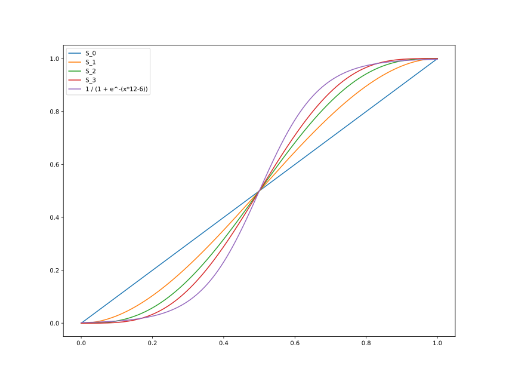

## Position, Velocity, Acceleration, Jerk?

[Jerk](https://wikipedia.org/Jerk_%28Physics%29) is the third derivative of
position, or the rate of change of acceleration, which might seem like a pretty
abstract thing to be worried about but:

Imagine a mass in a box under constant acceleration.  The mass is pushing up 
against the side of the box which causes it to accelerate too.  But if we change
the acceleration, the mass is going to slide around until it reaches a new
equilibrium.

Now imagine the box is your skull and the mass is your brain.  Jerk is real!

### Higher Orders

There's also higher derivatives which are sometimes called
[Snap, Crackle and Pop](https://en.wikipedia.org/wiki/Fourth,_fifth,_and_sixth_derivatives_of_position)
Snap (sometimes called Jounce) is the rate of change of Jerk; Crackle is the rate
of change of Snap, etc.

## Trajectories


## SmoothStep ...

[SmoothStep](https://en.wikipedia.org/wiki/Smoothstep) is a family of polynomial functions
which smoothly transition across the range [0,1] in the domain [0,1]:

`$ S_1(t) = \begin{cases}0, & if\ t \leq 0 \\ 3t^2 - 2t^3, & if\ 0 \leq t \leq 1 \\ 1, & if\ 1 \leq t\end{cases} $`

They have the same kind of [sigmoid](https://en.wikipedia.org/wiki/Sigmoid_function)
as the [Logistic Function](https://en.wikipedia.org/wiki/Logistic_function)
except the tapered ends finish exactly at 0 and 1 instead of tapering off into infinity, which
is handy for those of us who would like to actually finish something.

Smoothstep is a polynomial function and so the first derivative `$ S^\prime_1 $`, is polynomial too:

`$ S'_1(t) = \begin{cases}0, & if\ t \leq 0 \\ -6t^2 + 6t, & if\ 0 \leq t \leq 1 \\ 0, & if\ 1 \leq t\end{cases} $`

and has the handy property that it is neatly zero at both ends.  However, `$ S''_1 $` does not have
this property.  Our velocity at each end of our movement is zero, but our acceleration is not.

### ... and SmootherStep ...

If we want acceleration to be zero at the beginning and end of our trajectory, we can use
[Smootherstep](https://en.wikipedia.org/wiki/Smoothstep#Variations), which is a fifth-order
polynomial with this property:

`$ S_2(t) = \begin{cases}0, & if\ t \leq 0 \\ 6t^5 - 15t^4 +10t^3, & 0 \leq t \leq 1 \\ 1, & 1 \leq t\end{cases} $`

`$ S'_2(t) = \begin{cases}0, & if\ t \leq 0 \\ 30t^4 - 60t^3 + 30t^2, & 0 \leq t \leq 1 \\ 0, & 1 \leq t\end{cases} $`

`$ S''_2(t) = \begin{cases}0, & if\ t \leq 0 \\ 120t^3 - 180t^2 + 60t, & 0 \leq t \leq 1 \\ 0, & 1 \leq t\end{cases} $`

### ... and Smooth<sup>n</sup>Step

The SmoothStep function can be worked out to an arbitrary depth, for example `$ S_6 $` is a 13th-order polynomial:

`$ S_6(t) = \begin{cases}0, & t \leq 0 \\ 924t^{13} - 6006t^{12} + 16380t^{11} - 24024t^{10} + 20020t^9 - 9009t^8 + 1716t^7, & 0 \leq t \leq 1 \\ 1, & 1 \leq t\end{cases} $`

For the `$ n $`-th Smoothstep function, all derivatives up to the `$ n $`-th derivative start and end at zero:

`$ S^{(m)}_n(0) = S^{(m)}_n(1) = 0 \qquad where \qquad 1 \leq m \leq n $`



### Some Python

If you want to mess around with these equations in Python, the `numpy.polynomial` library is rather handy.
`Polynomial` objects can be constructed from coefficients, and differentiated using the `deriv` method:

```
>>> from numpy.polynomial import Polynomial
>>> S_6 = Polynomial([0,0,0,0,0,0,0,1716,-9009,20020,-24024,16380,-6006,924], symbol='t')
>>> print(S_6)
0.0 + 0.0·t + 0.0·t² + 0.0·t³ + 0.0·t⁴ + 0.0·t⁵ + 0.0·t⁶ + 1716.0·t⁷ -
9009.0·t⁸ + 20020.0·t⁹ - 24024.0·t¹⁰ + 16380.0·t¹¹ - 6006.0·t¹² + 924.0·t¹³
>>> jerk = S_6.deriv(3)
>>> print(jerk)
0.0 + 0.0·t + 0.0·t² + 0.0·t³ + 360360.0·t⁴ - 3027024.0·t⁵ +
10090080.0·t⁶ - 17297280.0·t⁷ + 16216200.0·t⁸ - 7927920.0·t⁹ +
1585584.0·t¹⁰
>>> jerk(0)
np.float64(0.0)
>>> jerk(1)
np.float64(0.0)
```

## From Here To There

To [work out `$ S_2 $`](https://en.wikipedia.org/wiki/Smoothstep#5th-order_equation)
we used some [Linear Algebra](https://en.wikipedia.org/wiki/Linear_algebra)
to work out the coefficients `$ a_n $`:

`$ \begin{bmatrix}0 & 0 & 0 & 0 & 0 & 1 \\ 1 & 1 & 1 & 1 & 1 & 1 \\ 0 & 0 & 0 & 0 & 1 & 0 \\ 5 & 4 & 3 & 2 & 1 & 0 \\ 0 & 0 & 0 & 2 & 0 & 0 \\ 20 & 12 & 6 & 2 & 0 & 0 \end{bmatrix} \begin{bmatrix} a_5 \\ a_4 \\ a_3 \\ a_2 \\ a_1 \\ a_0 \end{bmatrix} = \begin{bmatrix} x_0 \\ x_1 \\ x'_0 \\ x'_1 \\ x''_0 \\ x''_1 \end{bmatrix} = \begin{bmatrix} 0 \\ 1 \\ 0 \\ 0 \\ 0 \\ 0 \end{bmatrix} $`

But our 'target' matrix can represent other situations of starting and finishing position, velocity and acceleration.
For example we might be moving already, or we might want to be moving at the end of this trajectory.
We can use numpy's linear algebra solver to find a solution for our situation and use this to produce a `Polynomial`
just for this segment of our trajectory:

```
>>> import numpy
>>> A = [[0,0,0,0,0,1],[1,1,1,1,1,1],[0,0,0,0,1,0],[5,4,3,2,1,0],[0,0,0,2,0,0],[20,12,6,2,0,0]]
>>> T1 = [0,1,0,0,0,0]
>>> M1 = numpy.linalg.solve(A,T1)
>>> print(M1)
[  6. -15.  10.   0.   0.   0.]
>>> T2 = [0,1,0,1,0,0]
>>> M2 = numpy.linalg.solve(A,T2)
>>> print(M2)
array([ 3., -8.,  6.,  0.,  0.,  0.])
>>> p = numpy.polynomial.Polynomial(M2[::-1], symbol='t')
>>> print(p)
0.0 + 0.0·t + 0.0·t² + 6.0·t³ - 8.0·t⁴ + 3.0·t⁵
```

## Time for time

At this point, every segment is assumed to occur in unit time.
No matter how large or complicated the movement is, we assume it takes 1 second.

This is obviously problematic.
The physical system we're working with has limitations.
For example if we're dealing with a typical stepper actuated linear stage:

* position `$ x $` is limited by the length of the device's threaded axis
* velocity `$ x' $` is limited by the frequency the stepper motor can step at
* acceleration `$ x'' $` is limited by the stepper motor torque.
* jerk `$ x''' $` is limited by not wanting the device to shake itself to bits

### Jerk Limiting Algorithms

There are algorithms to produce jerk-limited trajectories such as Ruckig
([paper](https://arxiv.org/abs/2105.04830) / [ruckig.com](https://ruckig.com)).
The trajectory goes through several phases:

| velocity | acceleration direction | acceleration magnitude | jerk | phase |
|---|---|---|---|
| zero | zero | zero | zero | at rest |
| increasing | positive | increasing | positive | jerk is applied to start moving |
| increasing | positive | maximum | zero | jerk turned off to maintain maximum acceleration |
| increasing | positive | decreasing | negative | negative jerk reduces acceleration |
| maximum | zero | zero | zero | maximum velocity reached, acceleration stopped |
| decreasing | negative | increasing | negative | starting to slow down |
| decreasing | negative | maximum | zero | slowing as fast as possible |
| decreasing | negative | decreasing | positive | gently coming to a halt |
| zero | zero | zero | finished |

Not all phases are necessarily used, for example a given trajectory may
never hit maximum acceleration.
As the algorithm hops between phases there is a discontinuous change 
of jerk, meaning there is a large amount of snap which may cause issues.
(The algorithm could be expanded to more phases to allow a transition in jerk
and therefore a limit in snap, but its going to get confusing quick.)

### Scaling

For now at least, the plan is to check for 'excursions' and increase or
decrease `$ t $` as necessary.

`$ \begin{bmatrix}0 & 0 & 0 & 0 & 0 & 1 \\ t^5 & t^4 & t^3 & t^2 & t & 1 \\ 0 & 0 & 0 & 0 & 1 & 0 \\ 5t^5 & 4t^4 & 3t^3 & 2t^2 & t & 0 \\ 0 & 0 & 0 & 2 & 0 & 0 \\ 20t^5 & 12t^4 & 6t^3 & 2t^2 & 0 & 0 \end{bmatrix} \begin{bmatrix} a_5 \\ a_4 \\ a_3 \\ a_2 \\ a_1 \\ a_0 \end{bmatrix} = \begin{bmatrix} x_0 \\ x_1 \\ x'_0 \\ x'_1 \\ x''_0 \\ x''_1 \end{bmatrix} $`

So for example in our simple "smootherstep" scenario discussed above, while
trying to move from x=0 to x=1 in a span of 1 second our maximum velocity
is:

`$ S'_2(\frac{1}{2}) = 30(\frac{1}{2})^4 - 60(\frac{1}{2})^3 + 30(\frac{1}{2})^2 = 1.875 $`

If we decide that 1.875 m/s is too fast for our machine,
we could increase `$ t $`, recalculate our polynomial and
try again:

`$ \begin{bmatrix}0 & 0 & 0 & 0 & 0 & 1 \\ 32 & 16 & 8 & 4 & 2 & 1 \\ 0 & 0 & 0 & 0 & 1 & 0 \\ 5t^5 & 4t^4 & 3t^3 & 2t^2 & t & 0 \\ 0 & 0 & 0 & 2 & 0 & 0 \\ 20t^5 & 12t^4 & 6t^3 & 2t^2 & 0 & 0 \end{bmatrix} \begin{bmatrix} a_5 \\ a_4 \\ a_3 \\ a_2 \\ a_1 \\ a_0 \end{bmatrix} = \begin{bmatrix} x_0 \\ x_t \\ x'_0 \\ x'_t \\ x''_0 \\ x''_t \end{bmatrix} $`


