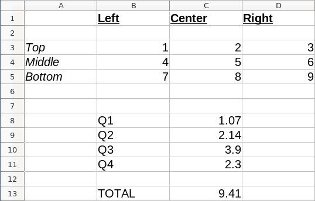
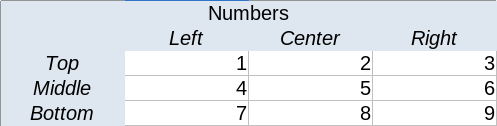
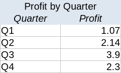

## Background

[Spreadsheets](https://en.wikipedia.org/wiki/Spreadsheet)  have been around a very long time.
Starting off as blank paper ledgers back when [Computers](https://en.wikipedia.org/wiki/Computer_(job_description))
were [Human](https://www.nasa.gov/feature/jpl/when-computers-were-human), they then became
[arguably the first](http://www.bricklin.com/firstspreadsheetquestion.htm)
[Killer App](https://en.wikipedia.org/wiki/Spreadsheet#VisiCalc) for personal computers.

An electronic spreadsheet has a grid of cells, named by column/row coordinates, and each cells can 
be set to just a plain value or to a formula which derives the cell value from other cell values.
Because cell values can depend on other cell values in turn, the spreadsheet forms a kind of 
[visual dataflow language](/art/programming-beyond-text-files/) and thus
[spreadsheets are turing complete](https://www.felienne.com/archives/2974).

[Microsoft Excel](https://products.office.com/en-au/excel)
is ubiquitous in business, adding formatting and charting and multiple sheets per file 
and integration with the rest of the office suite.  Despite its limitations, probably
more useful business work has been done in Excel and its imitators than in all other
languages combined.

It's hard to deny the convenience of using a spreadsheet to manipulate tabular data, as
opposed to editing whatever kind of markup.  Standard unix tools like
[sort](http://www.man7.org/linux/man-pages/man1/sort.1.html) and 
[awk](https://en.wikipedia.org/wiki/AWK) are powerful but
[not easy for beginners](https://likegeeks.com/awk-command/) especially those 
less used to command line programming.

## Issues

However, the standard spreadsheet has some pretty severe problems:

* Types are per *cell*, not per *row* or *column*.  A column could have a whole jumble
  of different typed cells in it.
* Aggregate functions like `SUM()` can easily be incorrectly set up to address a subset of
  rows in a table area, losing important data.

  See this [botched economic analysis](https://theconversation.com/the-reinhart-rogoff-error-or-how-not-to-excel-at-economics-13646)

  > [The authors] had not selected the entire row when averaging growth figures: they omitted data from Australia,
  > Austria, Belgium, Canada and Denmark [...] When that error was corrected, the “0.1% decline” data became a 2.2%
  > average increase in economic growth. 

* Anything that looks like a number, and anything that looks like a date, gets autoconverted.

  See this paper on [scrambled gene names](https://genomebiology.biomedcentral.com/articles/10.1186/s13059-016-1044-7)
  
* It's not clear, at first glance, if a cell is a static value or gets its value from a 
  formula.
* Formulae are cut-and-pasted between cells, and its easy to get this wrong.  The
  differences between relative and absolute addresses are subtle and easy to confuse.
* Header rows and columns are not really marked separate from data, so it's easy to 
  accidentally sort them along with the data they're meant to be labelling.
* Presentation information, like fonts and column widths, are jumbled up with formulae
  and with data.  
* Dealing with large amounts (>1Mrows) of data in spreadsheets can be rather slow.

### Naming Things

Back in about 2010 or so I got interested in methods for extracting formulae and data from
spreadsheets into regular code.  A spreadsheet would get imported and each cell treated as
a simple assignment statement like `a10 = a7 + b9;` and the resulting mess could be sorted
into an appropriate order and then executed quickly.

There's a lot of business logic wrapped up in spreadsheets no-one fully understands
any more, and this would be a first step towards converting that into readable logic.
However, the process of extracting the patterns from thousands of formulae scattered
among cells is pretty fraught, and there's no way[1] to differentiate or give names to
variables, constants and labels,so the resulting code is no less of a mess than the original
spreadsheet, really.
Here we are again, [Naming Things](https://martinfowler.com/bliki/TwoHardThings.html).

One possibility is, we could simply dump the collection of formulae out in the form
of a more convential programming language, and then compile and run it.
Just about any language would work as the target:

```C
double a10 = 1.01;
double a11 = 1.02;
double b10 = 12;
double b11 = 12;
double c10 = pow(a10, b10);
double c11 = pow(a11, 11);
double c12 = c11 - c10;
```

Obviously there's a lot of repetition, but once the 'transpile' step is done, conventional
refactoring tools can be used to give constants and variables more sensible names.
It's still horribly ugly of course, but at least it is a start, and there's even a change
someone might notice the typo in the formulae above:

```C
double interest_rate_1 = 1.01;
double interest_rate_2 = 1.02;
double months_per_year = 12;
double compound_rate_1 = pow(interest_rate_1, months_per_year);
double compound_rate_2 = pow(interest_rate_2, months_per_year);
double profit = compound_rate_2 - compound_rate_1;
```

... and at least it'll run quick!

[1] (There's actually some facilities for naming things built in to Excel, but because
they're pretty well hidden they're not used a lot.)

### Array-like Nature

However, this code transformation ignores the fundamentally tabular nature of spreadsheets.
A single sheet might have many tables within it, and they're not usually formally declared,
but they still exist.
The problem is, the information within the file is generally too patchy to somehow
magically extract types and form classes etc.
You could use some heuristic or another, like the
[Decompilers](https://en.wikipedia.org/wiki/Decompiler)
of old[2] but fixing up the wrong guesses is always going to be a bear.
Header rows aren't always marked, columns aren't always consistent, formulae may be 
different or missing in places.

However, an interactive analysis tool could help with this, allowing an iterative
process to conversion.
It's not going to be trivial: I have fond memories of playing with the
[Sourcer](https://corexor.wordpress.com/2015/12/09/sourcer-and-windows-source/) 
disassembler back in the early days of PC viruses, and it was an *adventure*.

### An Example

A typical spreadsheet is one "workbook" split into multiple "worksheets", and each "worksheet"
may contain multiple tabular regions with different types of data in them.



The example above contains three separate regions for example:

* A three by three table of digits with row labels and column headers (`A1:D5`)
* A one by four table with row labels only (`B8:C11`)
* A single cell with a label (`B13:C13`)

Each of these have vagaries of formatting and type. 


## Starting from Somewhere Better

There's an old joke about "sure you can walk there, but I wouldn't start from here".

Perhaps it'd make more sense to think about this as "how would you make a new spreadsheet"
rather than "how would you convert an existing spreadsheet".
We've thought about what makes conversion hard, so let's add some information to make it easy.

### 1. Multiple Tables

In the example, `B1` is a column label, `B3:B5` are the elements of labelled column,
`B8:B11` is a sequence of labels and `B13` is a row label.
So what useful thing can we say about Column B as a whole?  Not much.



<br/>



<br/>


There's now three separate tables, each of which has a title, column and/or row 
labels and a clear separation of purpose.

Because tables are separate, each can have a different 'source', whether that be 
a database, local file storage or a 'temporary' table held only in RAM.

### 2. Labels on Everything

When developing software, labels make programs readable to humans.
Table, column and row labels allow us to write much more natural formulae.
An individual cell or a group of cells can be referred to by label, so
we can write:

`Profit.Total = SUM(Profit by Quarter.Profit)`

... which is a lot more readable than our earlier `C13 = SUM(C8:C11)`.

A whole row or column can be addressed, or a cell can be addressed by specifying
row and column in either order. For example, the cell `Numbers.Center.Middle`
is the same cell as `Numbers.Middle.Center`.

In this way, tables can be extended, re-ordered or even "flipped" diagonally with
no effect on the rest of the spreadsheet!

### 3. Visual Indication

In the original example, there's no consistent indication of what is a heading or a 
string or a number.
It happens that the cell `C13` is a *formula*, taking it's value from `SUM(C8:C11)`.
Theres's no particular visual indication of this either.

Table headings, row/column headings and formulae should all be visually distinct,
to avoid confusion.
The flow of data between tables should be also presented clearly.

The visual layout of the spreadsheet would also then become detatched from the logical
layout of the spreadsheet, so that a user with different requirements
(eg: mobile devices, bigger fonts, clearer colours)
could display the spreadsheet differently without the issues that this causes in Excel.

### 4. Types Whereever Possible

Labels are separate from the row or column they're labelling.  As well as a label,
each row/column can be given a type ... integer, float, all the usuals.
A cell's type is limited by both its row and its column.
It'd probably also be appropriate to do some
[Type Inference](https://en.wikipedia.org/wiki/Type_inference).

It might also be useful to use row/column predicates to limit the valid 
values of cells, bringing in a bit of
[Design by Contract](https://en.wikipedia.org/wiki/Design_by_contract) as well.

### 5. Explicit is better than Implicit

(Borrowed from [PEP20](https://www.python.org/dev/peps/pep-0020/))

In a traditional spreadsheet, it's possible to select an arbitrary range of cells
and apply a formula to that.
It's pretty easy to get that range wrong and add new rows outside the range.
Instead of allowing a formula to target a subset of rows accidentally, this would
have to be made explicit, so you could still write a formula like

`SUM(Country.GDP IF Country.Name != 'Australia' ELSE 0)`

... if that is, for some weird reason, what you actually meant.
It's still possible to write a misleading spreadsheet, of course, but it
makes it a lot harder to do [subtly, sneakily](http://www.underhanded-c.org/)
or by accident.

### 6. Graphical / Textual duality

Much like [Flobot](/art/flobot-graphical-dataflow-language-for-robots/), every
graphical program in this system would be "dual" with a text representation.
This would mean that programs could be compared and maintained using
[familiar source control systems](/art/a-canticle-for-diff3/).


## Further Work

We've considered the strengths and weaknesses of conventional spreadsheets and 
proposed some interesting principles for designing something better.

It sounds a bit radical, but sometimes, it really is time to 
[reinvent the wheel](https://en.wikipedia.org/wiki/John_Boyd_Dunlop#Pneumatic_tyres)!

## UPDATE

[I posted this on twitter](https://twitter.com/nickzoic/status/1270518501174726657)
and got some good feedback already.

* I haven't really talked about it so far because
  I've been thinking mostly about the programming experience but a "table" in this sense
  absolutely could be a view into an external database or into an API, and a "table" could 
  also be exposed to the world as an microservices-like API.

* If rows and columns are notationally equivalent, how do I express that some are 
  orthoganal to others?  Can this generalize to more dimensions?

* It's easy enough to write "this cell is the total of those cells", but there's a
  notational issue around how to express "the cells in table X are the totals of
  each of the columns of table Y".

* I desparately need a name for a "row or column".  Vector, in math terms, would be a 
  `Nx1` or `1xM` matrix, so would be a good name for mathematicians, but I'm not sure
  it gives the right idea for anyone else.

* [graphical programming is programming](/art/programming-beyond-text-files/)

* If anyone does know a product and/or service which covers these bases already, let
  me know!
