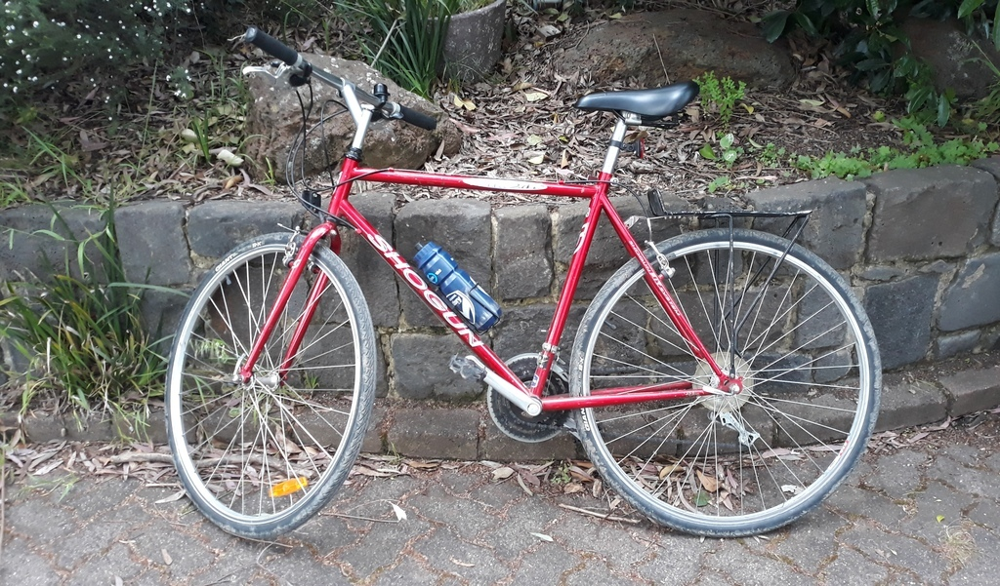
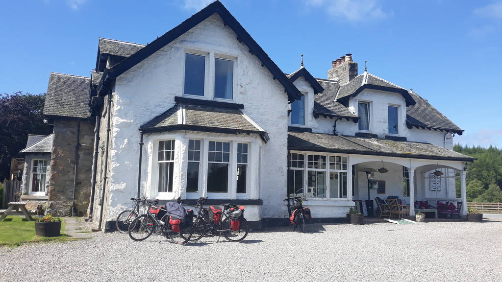

## Pre-history

As a kid I rode bikes.  I mean, everyone did.  We lived in a very hilly suburb
though so mostly we didn't ride at home, we rode when we were down at
[Phillip Island](https://www.visitphillipisland.com.au/),
since that's almost entirely flat.  I never really had a decent bike
until when I was at Uni I went and bought a shiny new Shogun Metro to
get around on. Despite also having various cars and motorcycles I kept the
pushie handy and used to commute from Fitzroy to the city on it fairly
regularly. Zipping around the inner suburbs on two wheels was always a joy.

*Shogun Metro AT (the Red Rattler)*

Then I got married and moved to a hilly suburb and the bike gathered cobwebs
for many years.  More motorcycles came and went, a couple of kids came along
and we wobbled around the park on our bikes a bit, but I never really rode it
much.

## Ride to Work ...

But then: I was working for a client where a lot of the staff rode to work
every day, and one of those
[Ride To Work Day](https://bicyclenetwork.com.au/rides-and-events/ride2work/ride2work-day/)
things was happening, and in a fit of bravado I declared I was going to dust
the bike off and ride it in.  Well, not all the way from Watsonia to
Fitzroy, I'd catch the train most of the way, but still, that counted enough
for breakfast, right?

That first morning was a disaster, the brain may not forget how to ride a
bicycle but the muscles sure do and I was barely a kilometer from home when I
ran out of puff and almost threw up my breakfast. I was tempted to abandon the
bike but I hadn't brought a lock or anything and rather than leave it to the
wolves I pushed it up the remaining hill and down to the station.

The train commute in gave me time to catch my breath, and rolling off at
Clifton Hill I felt a renewed willingness to give it a go.  Also, it was gently
downhill all the way to Fitzroy.  So I got back in the saddle and zigged and
zagged my way slowly across the familiar Fitzroy grid, feeling like a bit of a
fraud, but I got a free breakfast anyway.

## In Train-ing ...

That night I walked to the station and the bike stayed locked up at work for a couple of days
until I found the energy to roll down to Victoria Park station and the train
home.  In retrospect, I decided I'd quite enjoyed *parts* of this process, and
so over the next few weeks I did this same thing a few more times: bike and
train in, walk and train home, the opposite the next day.  Eventually I was
riding to and from the station more often than walking or taking the tram.

And then one fateful morning, maybe I'd just missed a train at Watsonia, maybe
the weather was especially beautiful, I don't remember, but instead of getting
off the bike at Watsonia I kept going to Macleod, and got the train from there.
And then at some point I leapfrogged Macleod and went to Rosanna.  And one day
I jumped off at Dennis instead of waiting for Clifton Hill.  Before I knew it,
I was riding at least half way fairly regularly and before too long I was
working out how to follow the Darebin Creek Trail and even starting to enjoy
it.

The train was still there as a backup when the weather was too hot or too cold
or I just couldn't be bothered, but I'd somehow transitioned from occasional
recreational wobbler to committed commuter.

## Commuting Life

After a couple of years on the red rattler, I decided it was time to upgrade.  I was pretty 
sure I knew what I wanted: alloy frame, carbon forks, disc brakes and a whole lot of gears 
for the Watsonia hills.  If I was smarter I would have searched for a bargain on gumtree or
whatever but instead I just walked into Ivanhoe Cycles, the same shop which had sold me that
Shogun Metro a couple of decades earlier.  I test rode a bunch of things including a carbon
racer which cost more than my car and weighed less than my wallet, but in the end I decided
on a [Giant Cross City 1](https://www.giant-bicycles.com/au/cross-city-1-disc-2018),
which ticked all the boxes and also (in case you think I'm being
entirely rational here) had a very nice grey-and-orange color scheme going on.

*Bicycle/Train commuting with panniers and raincoat*

I didn't really change the bike at all during this time, other than fitting a very
basic rack and upgrading the tyres from the stock 32mm tyres (which I found quite
squirrelly on crushed gravel trails) to 38mm Schwalbe Marathons
which were much nicer.  Mostly I just commuted on the Darebin Creek, Main Yarra and
Merri Creek trails, and also poked my nose into the more accessible bits of
Plenty Gorge from time to time.  And a few side trips, of course ...

*Me and the bike, somewhere near Heathcote I think*

## Scotland

In 2019 several of us met up in Scotland and rode the Great Glen Way from
Inverness to Fort William, which was a fantastic experience.  We took 4 days
to do it, doing all of about 40km a day, and staying at pubs and backpackers'
along the way.

It was better understood as a pub crawl with bikes rather than cycle touring
per se, with lots of long lunches and loch-side relaxation.

*Bikes at White Bridge pub*

## The Great Unpleasantness

And then in 2020, COVID struck and Melbourne was plunged into a series of lockdowns of
various levels of pointlessness.  The bike proved an essential mental health
measure, and just about every day I'd jump on and try to find a new way to get to
the 5km limit and back.  A lot of the time that meant heading over into 
Plenty Gorge and I reckon I rode, or at least pushed the bike along, every trail 
in the southern part of the gorge at one time or another.

*"Burn The Witch" trail in Plenty Gorge*

Once the [more ridiculous restrictions](/art/qr-codes-advice/) were lifted
I got around to installing
[Ride with GPS](https://ridewithgps.com/), recording a few rides and starting
to make plans for longer rides around the local creek trails and further afield,
like the [Warrnambool / Port Fairy Rail Trail](https://www.portfairytowarrnamboolrailtrail.com.au/)

*Warrnambool / Port Fairy Rail Trail*

*Incidentally, a huge thankyou to
[Bicycle Center Warrnambool](https://www.bicycle-centre.com.au/store_locations/Warrnambool-bike-shop)
for squeezing a broken spoke replacement and wheel trueing in late on
 a Friday afternoon.*

## Going for Distance

One series of trails in particular had leapt out at me: 

    Watsonia -> Darebin Creek Trail -> Main Yarra Trail ->
    Mullum Mullum Creek Trail -> Eastlink Trail ->
    Dandenong Creek Trail -> Carrum

That's right, I could ride all the way to the beach, 99% on bike trails.
76km was further than I'd ridden before, but ... I could get the train back
home from Carrum, and if anything went wrong there were plenty of train
stations to provide a 'crap out' option.

And after a couple of false starts, in November 2021, I finally did it!
One trail merged into another and before I knew it I was crossing the 
footbridge over the Maroondah Highway, the highest point of my trip.
And then down to the empty beach at Carrum for a swim!  

*Bike down at Carrum Beach*

That was enough for the day, so I got the train home via the city
and had just enough energy left to ride up from Richmond to Jolimont ...

Recently I've done [Westerfolds](https://www.parks.vic.gov.au/places-to-see/parks/yarra-valley-parklands/attractions/westerfolds-park)
to Carrum and back a couple of times,
which is about 120km and cuts out the annoying last hills up into Darebin.
Now my ambition is the crack the ton, 100 miles (161km) in a day.
Perhaps I should go somewhere a lot flatter to try it out.

Another recent highlight was riding up
[Mt Donna Buang](https://theclimbingcyclist.com/climbs/yarra-ranges/mt-donna-buang/),
starting from [Healesville](https://www.visityarravalley.com.au/discover/yarra-valley/healesville)
and going up, over then back down the other side and
back to the car via the O'Shannassy Aqueduct Trail and Panton's Gap.
A very big day, pretty slow going in places, but well worth it.

*The hang-glider launch pad at Mount Donna Buang*

*A giant valve on the O'Shannassy Aqueduct Trail*

## Bikepacking

I used to do a fair bit of solo travel by [motorcycle](https://moto.zoic.org/)
and while I've got rid of all my old bikes now I do kind of miss it.
So I've started working towards Bikepacking!

*Bike, packed.*

Is it bikepacking or cycle touring?  I'm not sure.  Like a lot of things
it's a bit of a grey area.  But I've taken the bike out for a few rides 
with the gear pictured and it handles everything from singletrack to 
fast concrete with no problem.

I'll write some more about turning a commuter bike into a touring bike
and [cooking for weight weenies](/art/cooking-for-weight-weenies/)
later, suffice to say the geometry is pretty similar and it's really
just a bit of upgraded ergonomics and some extra luggage.

*The bike and I made it up to Starling's Gap*

## Further Inspiration

### Sites

* [Sheldon Brown](https://www.sheldonbrown.com/)
* [Melbourne Cycle Loops](https://www.melbournecycleloops.com/)
* [Ride With GPS](https://ridewithgps.com/)
* [Adventure Cycling Victoria](https://www.adventurecyclingvictoria.com/) (also [at ridewithgps](https://ridewithgps.com/users/661133))

### Youtubers

* [Tim from AdVANture ST](https://www.youtube.com/@advanturest)
* [Galaxy on Trail](https://www.youtube.com/@galaxyontrail)
* [Ryan Van Duzer](https://www.youtube.com/@duzer)
* [Maudi & Eric: Wheels to Wander](https://www.youtube.com/@WheelstoWander)
* [Tim Fitzwater](https://www.youtube.com/@TimFitzwater)
* [Amy Cycling Adventures](https://www.youtube.com/@amy.cycling.adventures)
* [Scotland MTB and Cross Country Adventures](https://www.youtube.com/@scotlandmtbandcrosscountry8367)
