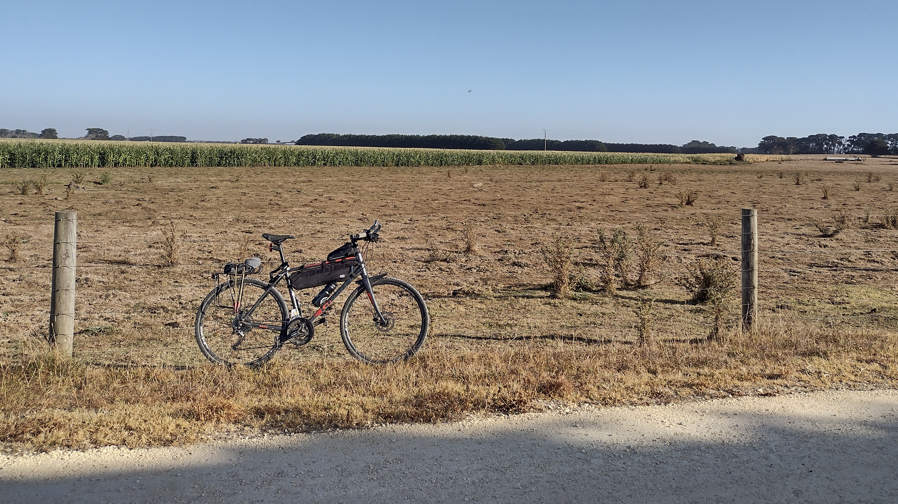
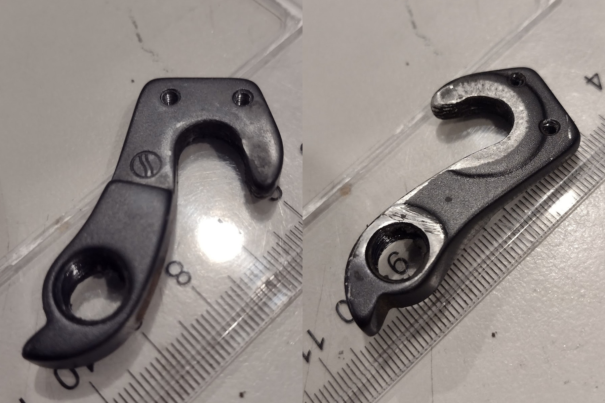
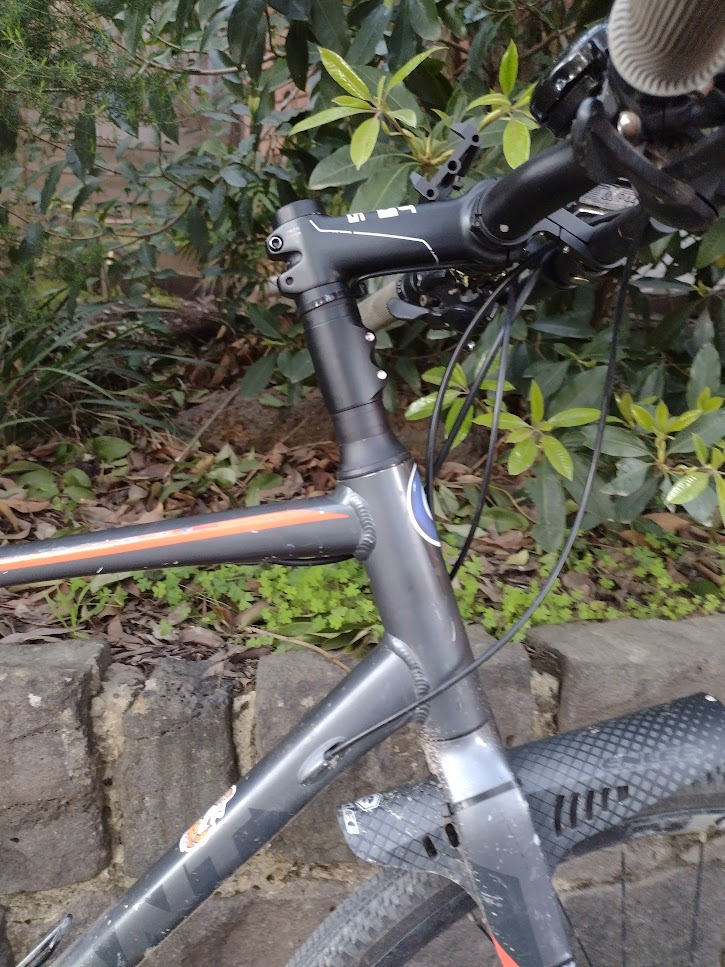
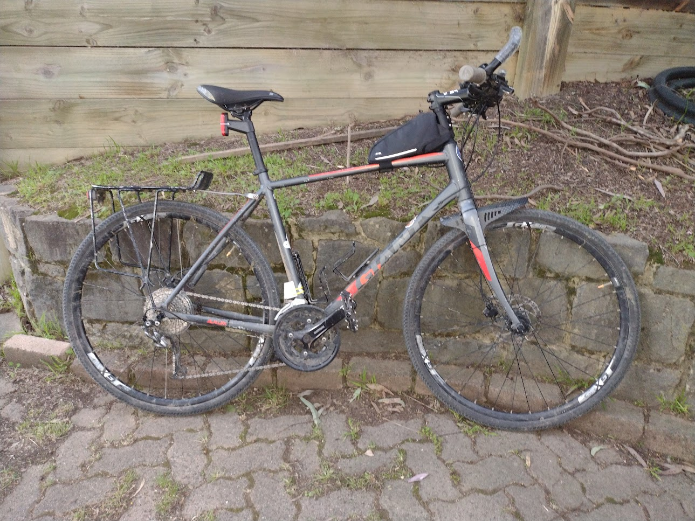
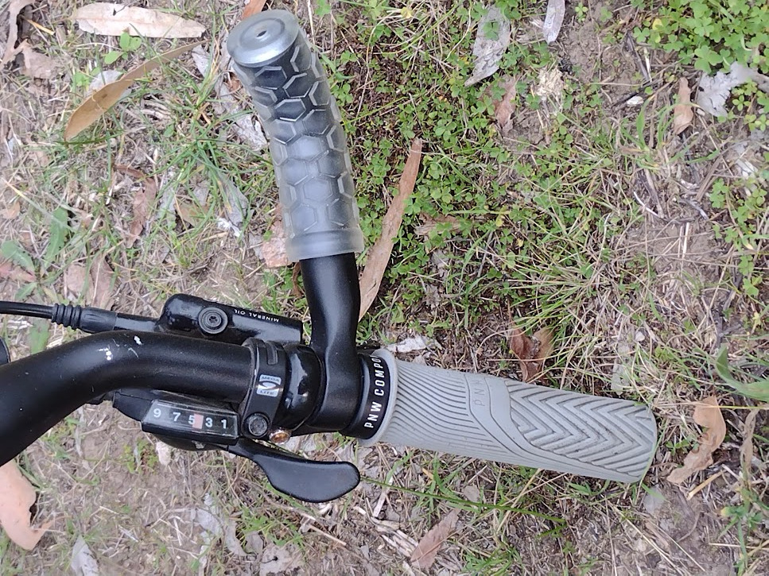
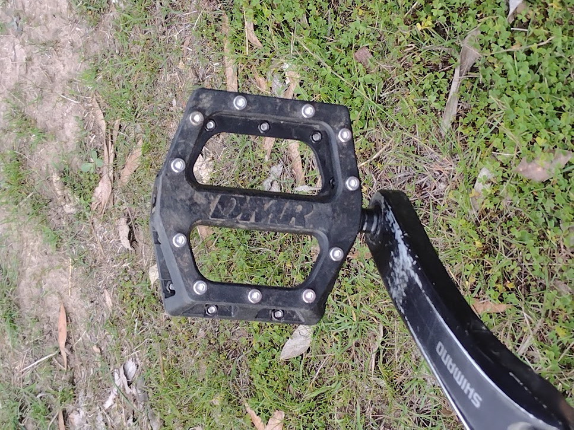

This is a quick summary of how I turned my commuter bike
into a touring/bikepacking bike.

All this stuff is entirely subjective and personal, this is just 
documenting what I did and not what might or might not work for you.

## Giant Cross City 1 

The bike is a [Giant Cross City 1 Disc 2018](https://www.giant-bicycles.com/au/cross-city-1-disc-2018)
size Large.

*The bike, on the Port Fairy Rail Trail*

I test rode a few things but I really liked this one: it's not a huge bike and
the standover height is quite low, but it has an alloy frame, good brakes,
carbon forks and a wide range of gears.

I [bought it as a commuter](../the-cycling-bikepacking-post/#commuting-life) and
it did a couple of years of that, very slowly getting upgraded as the opportunity
arose ...

### Cross City 1 Derailleur Hanger

There's some chance you've stumbled upon this page while trying to find out
what derailleur hanger you need for this bike.
*Why are bicycle manufacturers like this?*

The Cross City isn't listed in the [Giant Hanger Finder](https://www.giantbikespares.com/hanger_finder)
but it appears to me to be a
[R01630](https://ivanhoecycles.com.au/products/derailleur-hanger-giant-R01630) ...
I think the "Cross City" is just a local name for the "Escape City", maybe?
As Ivanhoe Cycles point out, it **does not** have a ridge which fits inside the dropout.

## Tyres

The bike came with 32mm road tyres which were okay but I found them sluggish at low
pressures and squirrelly at high pressures and never found a sweet spot 
between the two.  I replaced them with a set of 40mm Schwalbe Marathon Mondials
(I'd checked the maximum tyre clearance before I bought it) which I liked 
a lot better.  I've also run it with regular Marathons, or with a Marathon on the front
and a Marathon Mondial on the back, which worked nicely.

(don't feel bad for the old tyres, they went onto the pub bike)

It's been rather wet around here lately so I'm currently running 40mm gravel tyres
which aren't quite as hard wearing or easy rolling as the Marathons but a lot more effective
when the trails are muddy.  So far I've tried Maxxis Ramblers and WTB Vulpines,
pretty happy with both although the Vulpines were a real battle to get mounted.

I tend to run the rear tyre pretty much at it's pressure limit and the front tyre
a little softer, which given the [weight distribution](../cooking-for-weight-weenies/)
of bike & rider should help a bit.

## Bars & Stem

Originally it would have had a 105mm stem length but the dealer changed it over
for a 120mm +6⁰ to add a little room.

The bars were fairly long (maybe 720mm?) and I found my hands
always moved in a little on the grips so I hacksawed a bit off each bar end to make
the whole thing narrower, and liked it like that.  I think I cut it down to about 660mm.

(Cutting down bars is pretty easy to do.  If you don't have a pipe cutter, you can just wrap masking 
tape around the bar and use that as a guide line for a hacksaw with a fine tooth blade.)

Later I replaced the bars with
[SQlab 310 Sport 2.0](https://www.sq-lab.com/en/area-of-use/trekking/sqlab-handlebar-310-sport-2-0-31-8.html)
bars which have a little more backsweep (16⁰) and a little downsweep (10⁰) and no rise at all.
They're about 680mm wide.  I might get around to trimming them back to 660mm or so.
I don't really understand super wide bars, unless you're doing downhill or something,
they just turn you into a windsock and catch more trees.

*The other option I was considering was
[Ritchey Kyote](https://ritcheylogic.com/bike/handlebars/comp-kyote-handlebar)
which have more backsweep at 27.5⁰ ... but at 800mm I'd have to cut a lot off
the ends ...*

To compensate for the lack of rise, and my aging back, that 120mm stem is now
flipped to -6⁰ on top of 90mm of
[stem riser](https://sheldonbrown.com/handsup.html).  Putting a negative
stem on top of a riser might seem a bit perverse but combined with the head 
tube angle, having the stem angle negative makes the stem pretty much horizontal
and that moves the bars a little further forward as well.  There's a few mm left
in the stack if I want to go slightly higher or lower.

*does my steerer look big in this?*

It'd probably [look ridiculous](https://en.wikipedia.org/wiki/Tall_bike) if
it wasn't for the top tube bag which sits just
behind the steerer.  That holds my headlight battery, some tools and
generally wallet & keys & such when riding.  It's far forward enough that I can
still stand over the frame behind it.

*extended steerer with top tube bag in place*

I also have a couple of [inner bar ends](https://bikepacking.com/gear/adding-alt-hand-positions-to-flat-bars/)
which are just cheap 150mm "classic bar ends" from BBB, with a pair of very cheap
flexi rubber grips forced over them (try some compressed air down the hole in the end)
They're not perfect but they're enough to let me swap my hand positions
around when they're getting tired, or pull myself forward for a long slow climb.

*Handlebar setup*

While that takes my hands away from the
brakes it's actually pretty easy to slide my hands down and brake with my outer fingers.
Since the bars got a bit narrower as well there's no problem with the cables
reaching.

I found with the swept bars the "ergonomic" grips which came with the bike no 
longer really sat well in my hands so I've put on
[PNW Loam XL](https://www.mtbdirect.com.au/products/pnw-components-loam-xl-grip?variant=40691101827117)
grips which are just amazing.  These are a couple of mm larger diameter 
than the standard ones and that makes a big difference to hand comfort for me.

## Granny Gears

One of the things I really liked about this bike was that it came with
a broad range of gears: a triple 26/36/48 crankset and a 9 speed 11-34 cassette.

*I know triples are uncool these days, and everyone loves 1x drivetrains
and that have two separate gear shifts is rocket surgery and beyond young 
people or whatever.  Hey, I can be a hipster too, I retrofitted my daughter's
bike with a single narrow/wide front sprocket and a 9 speed friction shifter
for the back.  Gnarly.*

But I still like them.  The stock lowest gear, 26:34, is quite low indeed at 21
[gear inches](https://www.sheldonbrown.com/gloss_g.html#gearinch), but I ended up
using it quite a bit, for example on gravel roads where it's quite nice to be able to spin
up hills even if you're going slow.

The rear derailleur is able to handle up to a 36T cassette.
To that end, when the 11-34T cassette was getting worn out I replaced it with a
[11-36T](https://www.pushys.com.au/shimano-alivio-cs-hg400-11-36t-9-speed-cassette-silver.html)
making that lowest gear about 6% lower.

Then, when the inner crankset gears were starting
to look a bit shonky I replaced the smallest one with a 24 tooth, making those gears
about 7% lower.

So now I have a 655% gear range and a ridiculously low 24:36 (18 gear inches) granny gear.
I don't need very often but I reckon I use it more than the 48:11 (119 gear inches)
highest gear.  The chain is a bit short if you try to shift into the largest
gear on both the back and the front but there's no reason to want to do that so I don't.

*As for 1x drivetrains: call me back when they release a 10-66 tooth 12 speed cassette :-)*

The smallest chainring is an alloy
[Truvative 24T](https://www.pushys.com.au/truvativ-v1-24t-9-10-speed-triple-inner-aluminium-chainring-black.html)
(hey it was in stock), the middle a
[Deore FC-M590 36T](https://www.pushys.com.au/shimano-deore-fc-m590-36t-chainring-black.html)
and the biggest one is the stock Acera 48T but they all seem to get along.

Oh, and as they've worn out I've changed the bottom bracket and chain
and pulleys over for Deore ones which are a very slight upgrade for only
a couple of bucks extra.

## Axles & Skewers

The only thing which has really gone wrong on this bike has been the
[quick-release skewers](https://www.sheldonbrown.com/skewers.html),
each of which let me down at one point or another.

Yes, the QR skewers make it quicker to change tyres *but on this bike
I've had more QR failures than punctures!*.

I've ended up replacing the skewers with
[allen key skewers](https://www.99bikes.com.au/qr-skewer-set-bbb-wheelfixed-allenkey)
since I always carry allen keys anyway.  It's really just a very long
bolt and a fancy nut and washer but it looks okay and it's easy to tighten 
enough to keep the axle in place and
as a bonus the wheels are slightly less convenient to steal.

(I'd tried replacing the rear axle with an [Ebay solid axle](https://www.ebay.com.au/itm/324139203337)
(3/8" x 26tpi).  This proved slightly annoying
because the solid axle didn't fit with a lot of cassette ring tools which
use the skewer hole for alignment, and also I had to have a 15mm spanner 
in the toolkit to undo the axle nuts, which was a nuisance.)

*Note to self: the rear wheel bearings are 1/4" and the front ones are 3/16".*

## Pedals

The stock plastic pedals got dangerously slippery real quick.
But I'm just too much of a klutz for cleats / clipless pedals, and also
I find it useful to have hiking shoes on for inevitable hike-a-biking
sections.

*Pedals with replacement studs*

I've replaced them with some [DMR V11](https://www.dmrbikes.com/Catalogue/Pedals/V11-2/V11)
flat pedals (hey, they were on special).
The bearings are much better than the previous Giant flat pedals
but unfortunately they come with very pointy little studs which were
[quite painful if you contact them](img/blood.jpg).

So I've replaced the studs with 44 stainless socket head screws (M4 x 0.7 x 6mm)
They are still very grippy with the tread on my usual hiking shoes but much less
aggressive to my calves.  These cost $20 for 100 from a local bolt supply place.
The heads fill up with mud but that's a small price to pay.

## Saddle

All of the above stuff is subjective and personal, but there is nothing more
subjective and personal than saddles.  There's a million articles out there
about chamois and sit bones and I'm not going to write another one but I'll
just say that adjusting a bad saddle correctly won't turn it into a good
saddle but *not* adjusting a good saddle correctly will still leave you 
hobbling.

I found the [Selle Italia S5](https://www.selleitalia.com/s-5-superflow/)
to be a good fit for me personally and if you're getting any kind of numbness
in your nether regions on long rides I'd really recommend trying out the
split-style saddles.

## Summary

I've put a lot of miles on this bike, and intend to put on plenty more.
By now I've probably spent more on accessories and replacement parts than
on the original bike, but what I've ended up with is a bike which runs
very well.

The point is: despite all the different brand names and spec levels, you 
can run a total dog's breakfast of bits and pieces and it'll mostly work just fine.

Which is pretty wonderful, when you think about it.

Coming soon: luggage!
