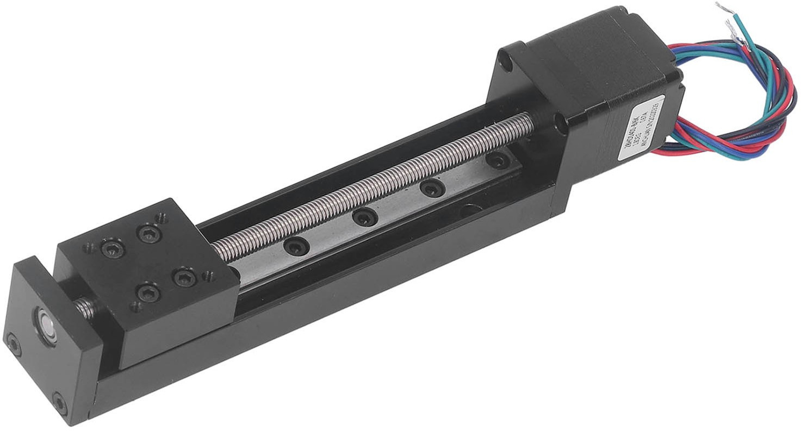
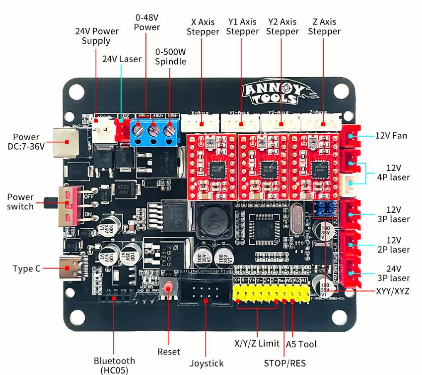
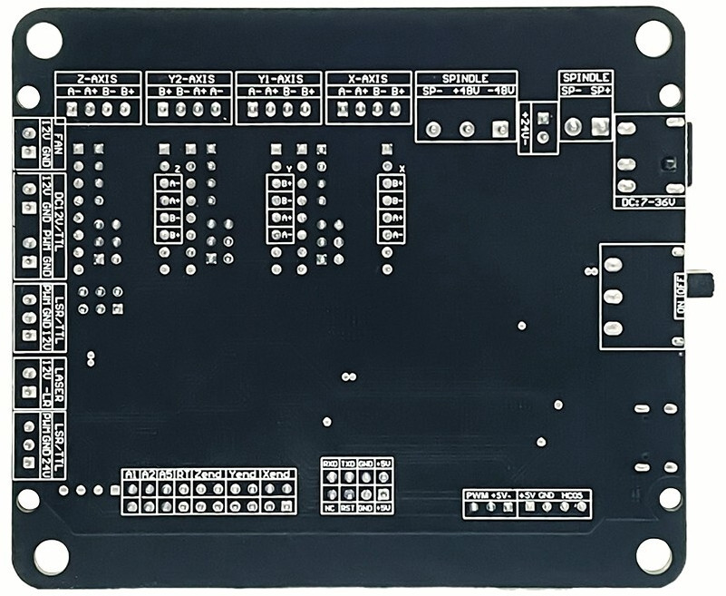
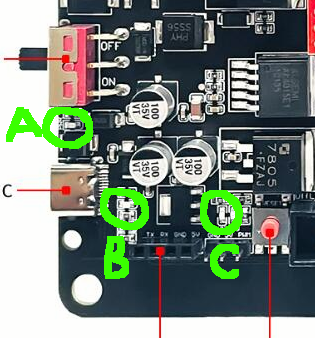
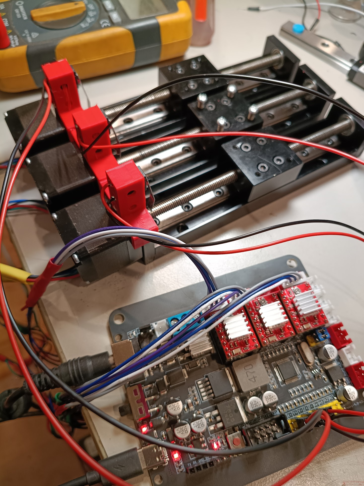

For an upcoming project I want to get three axis motion working with
linear stages which use a [stepper motor](https://en.wikipedia.org/wiki/Stepper_motor)
and a [trapezoidal thread](https://en.wikipedia.org/wiki/Trapezoidal_thread_form) to move 
in a very accurate way.

## Stepper Stages


*photo: ebay listing*

I used [these stages](https://www.ebay.com.au/itm/358054743590) which
have a NEMA11 motor and a Tr6-2 thread (1mm pitch, double start),
resulting in 100 steps per mm (not 200 like the listing said).

As shipped the end plates were a little misaligned causing the stages
to jam near the end of travel.  To fix this,
loosen the two screws, send the stages out to the end
of their travel and then tighten the end screws again.  No more problem!

The actual length of travel is about 103mm.
I'll post some accurate measurements later.

## GRBL board

I combined them with this [GRBL driver board from Ebay](https://www.ebay.com.au/itm/234270397356).
In the photos it is identified as `LY-GRBL3-10086-V11` but the
board as shipped is identified as `LY-3Axis-4.0-V2.0`.
It is otherwise the same.



*photos: ebay listing*

### USB configuration

Plugged into a USB-C port, it shows up as a USB device with descriptors:

```
  bDeviceClass            2 Communications
  bDeviceSubClass         0 [unknown]
  idVendor           0x0483 STMicroelectronics
  idProduct          0x5740 Virtual COM Port
  bcdDevice            2.00
  iManufacturer           1 tomeko net
  iProduct                2 LUNYEE_4axis_Control
```

... and supporting a
[CDC](https://en.wikipedia.org/wiki/USB_communications_device_class) data interface.

Is there a proper GCode [device class](https://en.wikipedia.org/wiki/USB#Device_classes)?
If there was, would anyone use it?

In Linux it gets recognized as a serial adapter and appears as `/dev/ttyACM0` (etc).

### GRBL build

The `$I` command reveals it is running a custom build of GRBL 1.1f:

```
Monport
[VER:1.1f.20230316:������������������������]
[OPT:VMZHL,35,254]
```
*some `�` omitted for clarity*

### CPU

This particular board uses a Gigadevice ARM Cortex CPU, probably a
[GD32F303VCT6](https://www.gigadevice.com/product/mcu/mcus-product-selector/gd32f303vct6)
but I'm damned if I can read the inscription.

I probably should have found an [ESP32](/tag/esp32) based board if I'd wanted to
do some software development, but this one was cheap and ticked all the boxes.

### Stepper Drivers

The board comes pre-populated with three `A4988` drivers.
They have little heatsinks on top already and have
[current limit trimpots which need to be set up](https://ardufocus.com/howto/a4988-motor-current-tuning/)
to suit your stepper motors, which means turning the trimpots
gently to achieve a `V_REF` which corresponds to a healthy maximum
current for your specific driver modules and stepper motors.

As shipped the board is set up to
[microstep](https://en.wikipedia.org/wiki/Stepper_motor#Microstepping)
where each microstep is 1/16th of a full step.
So with 100 steps per mm, we get 1600 microsteps per mm, or to put it
another way 625nm per microstep!

Microstepping is not without its drawbacks, eg: reduced torque and repeatability,
so we might end up going back to 1/4 or 1/8 steps instead.
This is controlled by the [stepper driver jumpers](https://software.farm.bot/v7/Device/arduino-firmware/microstepping.html)
hidden under the drivers themselves.

### GRBL Settings

GRBL keeps a bunch of [settings](https://github.com/gnea/grbl/blob/master/doc/markdown/settings.md) 
in NVRAM and these are the ones I changed:

Setting | Purpose | Stock Value | New Value
---|---|---|---
$3 | Direction Invert (X,Y,Z) | 6 (invert Y and Z) | 3 (invert X and Y)
$20 | Soft Limit enable | 0 | 1
$23 | Home dir invert | 7 | 7 (invert X, Y, Z) |
$27 | Homing pull-off, mm | 2.000 | 1.000 
$100, $101, $102 | X,Y,Z steps per mm | 800, 800, 800 | 1600, 1600, 1600
$110, $111, $112 | X,Y,Z max rate | 2000, 2000, 100 | 2000, 2000, 2000
$130, $131, $132 | X,Y,Z limit | 500, 500, 200 | 100, 100, 100

By keeping the limit switch activation
point about 1mm from the end of travel and reducing homing pull-off to 1mm (`$27=1`)
the stage limits can be set to a very neat 0 - 100 mm.

For some reason the Z axis is inverted in hardware.
I checked my stepper wiring many times and it just is.
So I invert X and Y (`$3=3`) to match, so that 0 is with the stage at the stepper end
and 100 is with the stage at the far end.
Homing direction is also inverted (`$23=7`), so the homing cycle travels to the negative X, Y and Z
direction.

In my case the Z axis is just like the others so I've set its max rate to be
the same as that of X and Y (`$112=2000`).

### Axis Connectors

Each axis has it's own [JST XH2.5](https://electronics.alibaba.com/buyingguides/xh2.54-connectors-what-you-actually-need-to-know)
with the following pinout.
Except Y2 which is a reversed pinout of Y1.
The steppers had bare wires and I had some spare pre-wired headers with Grey/Blue/Purple/White wires, so I just made up some frankencables.

Pin | Phase | Header Wire Color | Stepper Wire Color |
---|---|---|---
1 | A- | Grey | Red |
2 | A+ | Blue | Blue |
3 | B- | Purple | Green |
4 | B+ | White | Black |

Using motors with pre-installed connectors would save a lot of messing about with solder and heatshrink.

### Limit / Home switches

When the board first wakes up, it doesn't know where the stepper stages have been left.
So it has to perform a homing cycle, and to do that it needs[^2] some switches to tell it when
each axis is 'home'.  Optionally you can also provide limit switches for the other
end of travel, but in this case I'm happy to trust the steppers to count correctly
and use soft limits (`$20=1`, `$130=100`, `$131=100`, `$132=100`).

[^2]: Unless you're an [Apple Disk II drive](https://www.youtube.com/shorts/yNVecgQZcxY)
    in which case you just smack into the 
    end of travel 80 times and figure after that you must be home.

The home and limit switches wire to two-pin "dupont" (aka "pin header")
connectors on the board.
For now I've just used microswitches in a 3d printed plastic carrier which clips
to the stepper, eventually the microswitches will get housed in a less ugly way.

### Board Power

The stepper drivers are powered from the DC connector, which is
[5.5mm OD / 2.5mm ID](https://www.jaycar.com.au/2-5mm-dc-power-line-connector-14mm-shaft/p/PP0512),
with a slightly chunkier ID than the typical 2.1mm.
It is center positive and expects 7 - 36V.  
I found a 19V 4A supply to suit.
Don't forget to turn on the switch!

The logic is, or at least can be, powered from the USB-C port while the motor power is off.
There are a number of other power connectors on the board whose purpose is not entirely clear but
is presumably for spindles, lasers, etc.
I'm hoping to repurpose one of these for lighting power.

There are three red power LEDs on the board which might be helpful to know about:



* A: Motor Power labelled `PWR`
* B: USB-C Power (no label)
* C: Either Motor or USB-C Power labelled `3V3`

## Does it work?

Yes!  The three axis can be controlled independently or together using G-Code commands.
Note that GRBL starts a homing cycle with `$H` instead of the more common `G28`.



## Next Steps

* [printing](/tag/3dprint) a case for the board and some parts to hold the stages 
    together and more elegant end stop switch holders.
* implementing [smoother kinematics](/art/smooth-move-taming-trajectories-with-polynomials/) by
    sending way too much Gcode.
  
