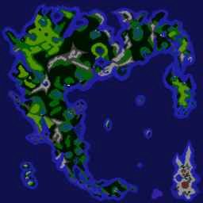

# GALAGA

Some time in the early '80s, Dad brought home an Apple 2
[clone](https://en.wikipedia.org/wiki/Apple_II_series#Clones),
pretty much identical to an [Apple II+](https://en.wikipedia.org/wiki/Apple_II_Plus)
except the instead of the first line of the display saying `APPLE ][` during
boot it said `GALAGA`.
I think it may have been a Sekon: the lower/uppercase switch sounds familiar.

Ah, [Applesoft BASIC](https://en.wikipedia.org/wiki/Applesoft_BASIC) and the
first thrill of [programming](https://www.calormen.com/jsbasic/)

        10 PRINT "POOP"
        20 GOTO 10

With it came a dusty shoebox full of pirate floppy disks,
hand labelled and mostly turned into
[flippy disks](https://en.wikipedia.org/wiki/Disk_II#Disk_II)
by cutting a second write-protect hole in them so the backs
could be used for more software: double the capacity!

I have fond memories of [Lode Runner](https://en.wikipedia.org/wiki/Lode_Runner), 
[Apple Cider Spider](htps://en.wikipedia.org/wiki/Apple_Cider_Spider),
[Choplifter](https://en.wikipedia.org/wiki/Choplifter),
[Conan](https://en.wikipedia.org/wiki/Conan:_Hall_of_Volta)
and [The Bilestoad](https://en.wikipedia.org/wiki/The_Bilestoad).
[Rocky's Boots](https://en.wikipedia.org/wiki/Rocky%27s_Boots) went on to 
inspire [Flobot](/art/flobot-graphical-dataflow-language-for-robots/).

# Emulation

You can try Apple 2 software out in your browser using the excellent
[apple2js](https://github.com/whscullin/apple2js)
[Apple 2 emulator](https://www.scullinsteel.com/apple2/).  
This is a [CPU level](https://github.com/whscullin/apple2js/blob/master/js/cpu6502.js)
emulator of the Apple, running in plain old Javascript.
Incredible.
I've used it for screenshots in this article.

# Quest of the Avatar

But the undisputed champion of games was
[Ultima IV](https://en.wikipedia.org/wiki/Ultima_IV:_Quest_of_the_Avatar),
which was not merely an ephemeral *game*, something you played for a few
minutes, but an *adventure* in which you had to explore, learn and 
build up your resources to take on more fearsome enemies.

The game was so large it used *four* floppy sides, and much swapping of 
disks was required, with the game halting whenever you entered or left a 
town or dungeon to demand a swap of disks.
When you quit the game, your progress was saved to the "britannia" disk.

The game was supposed to come with various materials and an
ingenious piece of copy protection: an instruction book and a cloth map.
These were difficult to photocopy with the technology of the day,
and necessary to answer questions at a few key points in the game.
Of course, being a pirate copy, it had none of the above and it wasn't
like we could just
[look it up online](https://ultima.fandom.com/wiki/Ultima_IV_Locations_Map).

Additionally, I was never the most *patient* or *methodical* of kids,
and so spending hours jotting down clues and beating up on skeletons and orcs
to build up enough funds for a decent sword was maaaaybe pushing it a little.

# Disks

The disks aren't included in the apple emulator above, but you can download
them [at wowroms](https://wowroms.com/en/roms/apple-ii/download-ultima-iv-quest-of-the-avatar/1466.html)
and point the emulator at them.  There's also a version
[at virtualapple.org](http://www.virtualapple.org/ultimaivdisk.html)
featuring this excellent "crack screen":

*The Digital Gang Presents: ULTIMA IV THE LAST CRACK BY: HOT ROD OF BLACK BAG SPECIAL THANX: SHERLOCK APPLE THANX The Dragon Lord DISTRIBUTED BY D.I.S.C*

Apple 2 disks generally have 16 sectors x 35 tracks. Each sector is 256 bytes, so the total
floppy size is 143360 bytes (140KB).

Disks don't have to have a "file system" on them, instead the computer
just [loads the "boot" sector and jumps to it](https://en.wikipedia.org/wiki/Apple_DOS#Boot_loader)
and that tiny program is expected to do the rest of the work.
Data disks don't have to have any structure at all.
A small set of assembly subroutines known as RWTS ("Read/Write/Track/Sector") take care of 
sector access.

# Sector Editor

As it turns out, there were some more disks in the dusty shoebox, including a *sector editor*

(Probably [Copy II Plus 5](https://apple2online.com/web_documents/copy_ii_plus_5.0_-_manual.pdf),
which includes a sector editor among other things. You can find it at
[apple2online.com](https://apple2online.com/index.php?p=1_24))

A sector editor lets you investigate and change the contents of floppy disks. 
Apple 2 disks are not large or sophisticated, and indeed if you create a new character,
and save the game, you can use your sector editor to check out the map disk
and find your new character's name stored neatly at Track $14, Sector $4, Offset $04
If you're looking in a disk image file, that's offset hex 14404 (but note that the
character codes in caps but offset by hex 80 and terminated by 00,
so NICK would be stored as `CE C9 C3 CB 00`.

Nearby are many interesting values ... you start off the game with 300 health, 300 food
and 200 gold and right there in the file are the bytes `25 21 18 00` which look oddly
familiar ...

# Ethical Doubts

Let's try setting them to something more fun, like `99 98 97 96` ...

OK, now we're in business.  With a bit more messing around and comparing
save games we find that the changes are all in track 14 ...

Offset | Values | Purpose
--- + --- + ---
14020 | 00 00 01 86 | 186 moves!
... | ... | ...
14304 | 50 55 65 60 50 50 55 50 | Virtues? 3rd one probably Valor?
14314 | 02 99 | Food 299
14316 | ? | ?
14317 | 02 00 | Gold 200
... | ... | ...
1433C | 00 03 04 00 00 00 00 00 | Reagents
... | ... | ...
14400 | 00 EC | 
14402 | 00 02 | 
11404 | CE C9 C3 CB 00 |  "NICK"
11414 | 5C | Male?
11415 | 02 | Fighter?
11416 | C7 | 'G' for good, or D0 'P' for poisoned
14417 | 25 | STR 25
14418 | 21 | DEX 21
14419 | 18 | INT 18
1441A | 00 | MP 0
1441B | 20 | ? Level
1441C | 03 00 | HP 0300
1441E | 03 00 | HM 0300
14420 | 02 05 | EX 0205
14422 | 05 | Ready (Axe)
14423 | 02 | Armour (Leather)
14424 | C9 CF CC CF 00 | "IOLO"
... | ... | ...

Anyway, you get the idea.  The game moves along a lot quicker once you've got
9, 99 or 9999 of everything, even if the display is sometimes a little glitchy.

# Adventure ho!

