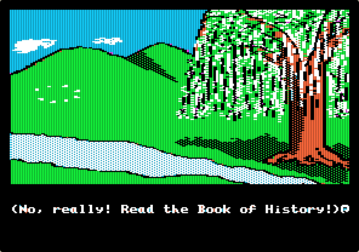
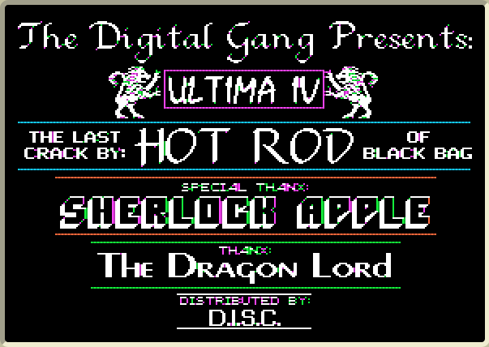
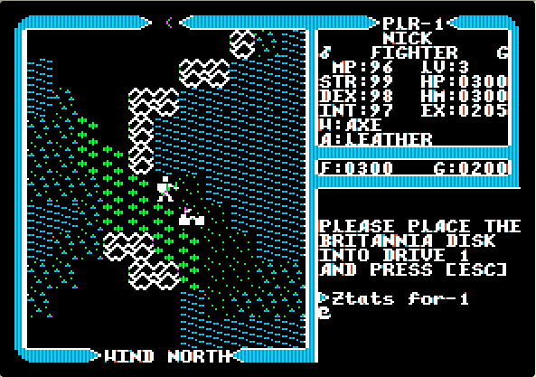
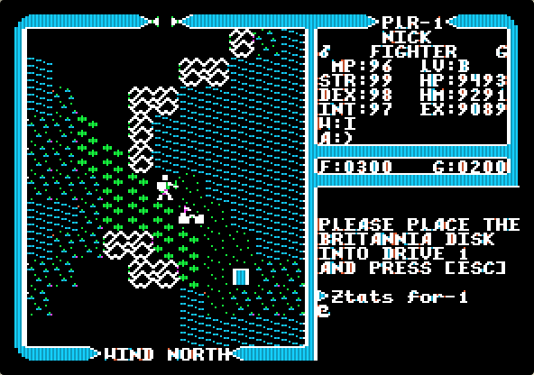
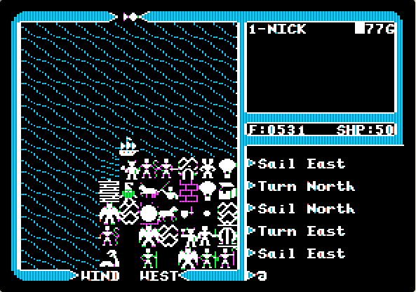
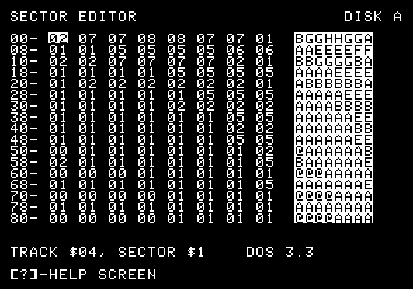
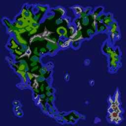

# GALAGA

Some time in the early '80s, Dad brought home an Apple 2
[clone](https://en.wikipedia.org/wiki/Apple_II_series#Clones),
pretty much identical to an [Apple II+](https://en.wikipedia.org/wiki/Apple_II_Plus)
except the instead of the first line of the display saying `APPLE ][` during
boot it said `GALAGA`.
I think it may have been a Sekon: the lower/uppercase switch sounds familiar.

Ah, [Applesoft BASIC](https://en.wikipedia.org/wiki/Applesoft_BASIC) and the
first thrill of [programming](https://www.calormen.com/jsbasic/)

        10 PRINT "POOP"
        20 GOTO 10

With it came a dusty shoebox full of pirate floppy disks,
hand labelled and mostly turned into
[flippy disks](https://en.wikipedia.org/wiki/Disk_II#Disk_II)
by cutting a second write-protect hole in them so the backs
could be used for more software: double the capacity!

I have fond memories of [Lode Runner](https://en.wikipedia.org/wiki/Lode_Runner), 
[Apple Cider Spider](htps://en.wikipedia.org/wiki/Apple_Cider_Spider),
[Choplifter](https://en.wikipedia.org/wiki/Choplifter),
[Conan](https://en.wikipedia.org/wiki/Conan:_Hall_of_Volta)
and [The Bilestoad](https://en.wikipedia.org/wiki/The_Bilestoad).
[Rocky's Boots](https://en.wikipedia.org/wiki/Rocky%27s_Boots) went on to 
inspire [Flobot](/art/flobot-graphical-dataflow-language-for-robots/).

# Emulation

You can try Apple 2 software out in your browser using the excellent
[apple2js](https://github.com/whscullin/apple2js)
[Apple 2 emulator](https://www.scullinsteel.com/apple2/).  
This is a [CPU level](https://github.com/whscullin/apple2js/blob/master/js/cpu6502.js)
emulator of the Apple, running in plain old Javascript.
Incredible.
I've used it for screenshots in this article.

# Quest of the Avatar

But the undisputed champion of games was
[Ultima IV](https://en.wikipedia.org/wiki/Ultima_IV:_Quest_of_the_Avatar),
which was not merely an ephemeral *game*, something you played for a few
minutes, but an *adventure* in which you had to explore, learn and 
build up your resources to take on more fearsome enemies.

The game was so large it used *four* floppy sides, and much swapping of 
disks was required, with the game halting whenever you entered or left a 
town or dungeon to demand a swap of disks.
When you quit the game, your progress was saved to the "Britannia" disk.
Of course, if things were going badly you could just choose not to save.

The game was supposed to come with various materials and an
ingenious piece of copy protection: an instruction book and a cloth map.
These were difficult to photocopy with the technology of the day,
and necessary to answer questions at a few key points in the game.
Of course, being a pirate copy, it had none of the above and it wasn't
like we could just
[look it up online](https://ultima.fandom.com/wiki/Ultima_IV_Locations_Map).

*(No, really!  Read the Book of History!)*

Additionally, I was never the most *patient* or *methodical* of kids,
and so spending hours jotting down clues and beating up on skeletons and orcs
to build up enough funds for a decent sword was maaaaybe pushing it a little.

(If you actually want to try playing, the easiest way is to download the
free PC/Mac version of 
[Ultima IV from GOG.com](https://www.gog.com/game/ultima_4).
You don't need to change disks all the time, the graphics are better and
some gameplay bugs are fixed.)

# Disks

The disks aren't included in the apple emulator above, but you can download
them [at wowroms](https://wowroms.com/en/roms/apple-ii/download-ultima-iv-quest-of-the-avatar/1466.html)
and point the emulator at them.  There's also a version
[at virtualapple.org](http://www.virtualapple.org/ultimaivdisk.html)
featuring this excellent "crack screen":

*The Digital Gang Presents: ULTIMA IV THE LAST CRACK BY: HOT ROD OF BLACK BAG SPECIAL THANX: SHERLOCK APPLE THANX The Dragon Lord DISTRIBUTED BY D.I.S.C*

Apple 2 disks generally have 16 sectors x 35 tracks. Each sector is 256 bytes, so the total
floppy size is 143360 bytes (140KB).

Disks don't have to have a "file system" on them, instead the computer
just [loads the "boot" sector and jumps to it](https://en.wikipedia.org/wiki/Apple_DOS#Boot_loader)
and that tiny program is expected to do the rest of the work.
Data disks don't have to have any structure at all.

A small set of assembly subroutines, build into the system ROM, take care of sector
access.
These are known as RWTS ("Read/Write Track Sector") and form the interface between 
software and hardware.

There's lots of details of these things out there: in those primitive times we were
forced to fend for ourselves with only a couple of
[Beagle Bros](http://beagle.applearchives.com/)
publications and a mysterious glue-bound book entitled "HARDWARD MANUAL" for advice.

# Sector Editor

As it turns out, there were some more disks in the dusty shoebox, including a *sector editor*

(Probably [Copy II Plus 5](https://apple2online.com/web_documents/copy_ii_plus_5.0_-_manual.pdf),
which includes a sector editor among other things. You can find it at
[apple2online.com](https://apple2online.com/index.php?p=1_24))

A sector editor lets you investigate and change the contents of floppy disks. 
Apple 2 disks are not large or sophisticated, and indeed if you create a new character,
and save the game, you can use your sector editor to check out the map disk
and find your new character's name stored neatly at Track $14, Sector $4, Offset $04
If you're looking in a disk image file, that's offset hex 14404 (but note that the
character codes in caps but offset by hex 80 and terminated by 00,
so NICK would be stored as `CE C9 C3 CB 00`.

*Copy II Plus Sector Editor*

Nearby are many interesting values ... you start off the game with 300/300 HP and there's
bytes `03 00 03 00` just near your name, and the bytes `25 21 18 00` look oddly
familiar too ...

*player stats*

# Ethical Doubts

Let's try setting them to something more fun, like `99 98 97 96`, and then
restarting the game ...

*modified player stats*

OK, now we're in business.  With a bit more messing around and comparing
save games we find that there's quite a lot of things we can change in 
track 14 ...

Offset | Values | Purpose
--- | --- | ---
11416 | C7 | 'G' for good, or D0 'P' for poisoned
14417 | 25 | STR 25
14418 | 21 | DEX 21
14419 | 18 | INT 18
1441C | 03 00 | HP 0300

*more modified player stats*

Anyway, you get the idea.  The game moves along a lot quicker once you've got
9, 99 or 9999 of everything, even if the display is sometimes a little glitchy.

Interestingly, these values are mostly stored in
[Binary Coded Decimal (BCD)](https://en.wikipedia.org/wiki/Binary-coded_decimal)
which stores each digit 0-9 into a hex nibble.
The 6502 processor supports BCD calculations through a 
["Decimal Mode"](http://www.6502.org/tutorials/decimal_mode.html)
which makes it easy to calculate addition and subtraction of BCD numbers.

The "save" area is almost certainly just a write of the memory space used for
keeping track of the status during the game.
Writing weird values here and there certainly can make a mess of the game state,
but it's pretty easy to keep backups of the Britannia disk.

# More Save Details

Just for fun I worked out a few more disk locations:

Offset | Values | Purpose
--- | --- | ---
14004 | 23 | Current Longitude (hex)
14005 | DE | Current Latitude (hex)
... | ... | ...
14020 | 00 00 01 86 | Number of moves made in game
... | ... | ...
14304 | 50 55 65 60 50 50 55 50 | Virtues? 3rd one probably Valor?
14314 | 02 99 | Party Food 299
14316 | ? | ?
14317 | 02 00 | Party Gold 200
... | ... | ...
1433C | 00 03 04 00 00 00 00 00 | Reagents on hand
... | ... | ...
14400 | 00 EC | ?
14402 | 00 02 | ?
11404 | CE C9 C3 CB 00 |  "NICK"
11414 | 5C | 5C for Male?
11415 | 02 | Class 2: Fighter?
11416 | C7 | C7 'G' for good, or D0 'P' for poisoned
14417 | 25 | STRength 25
14418 | 21 | DEXterity 21
14419 | 18 | INTelligence 18
1441A | 00 | MP 0 (Magic Points, I think)
1441B | 20 | Level?
1441C | 03 00 | HP 0300 Hit Points
1441E | 03 00 | HM 0300 Maximum Hit Points
14420 | 02 05 | EX 0205 Experience
14422 | 05 | Current Weapon (Axe)
14423 | 02 | Current Armour (Leather)
14424 | C9 CF CC CF 00 | "IOLO"
... | ... | ...

Names & stats for each of the other party characters follow.
By carefully experiment, you could work out what each byte means and 
how to set all party characteristics, and also the position of
ships, the balloon, etc.

# Journey Onward!

I'm not sure if we ever did work out, back then, how to change the stored position and thus teleport
around the map, but once you have STR 99 / DEX 99 / HP 9999 and plenty of 
reagents to unpoison yourself at will it's pretty easy to get around Britannia
sweeping up monsters.

But there was still the matter of the map. We'd got hold of the Sextant by this point, 
which would give you a latitude & longitude in the format A'B" C'D" where each letter 
was between A and P.  That's a pretty thinly disguised pair of bytes, so we were pretty
confident that the world was

* 256 x 256 tiles
* [toroidal](https://en.wikipedia.org/wiki/Wraparound_(video_games\))
* A bit obsessed with the number 16.

But how was it stored?
The hint came in the form of a rectangle of very weird ocean.  When we sailed around the 
*back* of the world, to coordinates A'A" A'A", in the middle of the deepest ocean was a
rectangle of ... random stuff.

 
*random stuff in the map*

It didn't take too long to work out that was pretty much a 16x16 block,
taking up locations A'A" A'A" through A'P" A'P".
While the sea was sea, the monsters weren't real monsters ... just tiles. 
Indeed, as it turns out the map is stored in 16x16 regions, each taking up
one 256 byte disk sector, on the 16 sectors of the first 16 tracks of the disk.

The weird stuff in the ocean?
That was a DOS 3.3 boot sector which had been accidentally written to the disk
at some time during its pirate misadventures.

*sector editor showing map-like sector*

After a while you realize that you can pretty much see the map right there in the sector
editor.

It's interesting to note that there's plenty of spare room on this disk: the map only uses 
up 16 tracks out of 35, and the last few tracks are entirely blank.

# Cartomancy

Our next step was printing a map from this data.
I can't remember exactly how we did this now, but I do remember designing
8x8 1-bit icons for each of the more common map cells (deep ocean was completely
blank) and writing a program to load two sectors at a time and turn each pair
into a dot-matrix printable image about 10cm x 5cm.
128 of these small rectangles of printer paper were then cut out and glued 
together to form a giant, if rather scruffy, map.

Sadly, the physical map and the programs used to produce it are long gone.

Years later, I used some resources found online to prduce the following 
4096x4096 pixel map.
Each map tile uses the actual 16x16 tile from the game, so the map is 
256 x 16 = 4096 pixels in each direction.

The towns are stored in a similar manner on the "towns" disk, with each of the 
17 town maps having a 32x32 map.  There's 17 because there's an upstairs and a downstairs
of Castle Britannia!
That disk also contains all the conversations you can have with townsfolk.

There's more of that sort of thing on [this old Ultima IV page](https://code.zoic.org/ultima/)
of mine.

# Nostalgia ain't what it used to be

Anyway, the point of this article isn't really Ultima IV.
I don't think we ever even finished the game, in any real sense.
(I suspect the only game I've ever really "finished", in the "without cheating"
sense, is Portal.)

The point is that through this process I learned too see software as observable,
mutable, fallible.
Looking at how the software behaved led to a theory of how it might be changed,
and those changes altered the game. But if you altered it too far, unexpected 
things could occur, things which the game designer never considered.

And that put me on the road I'm on today ...

# Further Reading

* Lots more Ultima IV tech stuff at [Ultima Codex](https://ultimacodex.com/)

* If you enjoyed this and you'd like to try a similar adventure for yourself,
  check out the [Synacor Challenge](https://challenge.synacor.com/)

* Or check out [PICO-8](https://www.hanselman.com/blog/ThePICO8VirtualFantasyConsoleIsAnIdealizedConstrainedModernDayGameMaker.aspx)
  for a fun, extremely resource constrained "fantasy console".

