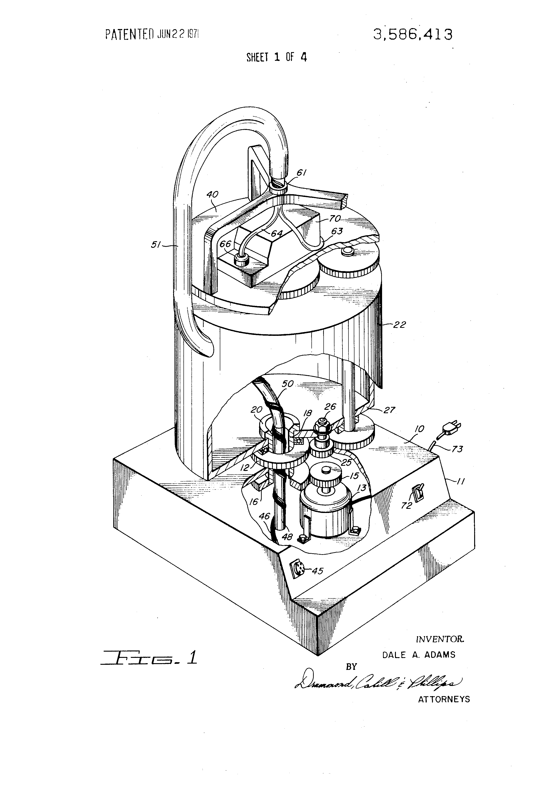
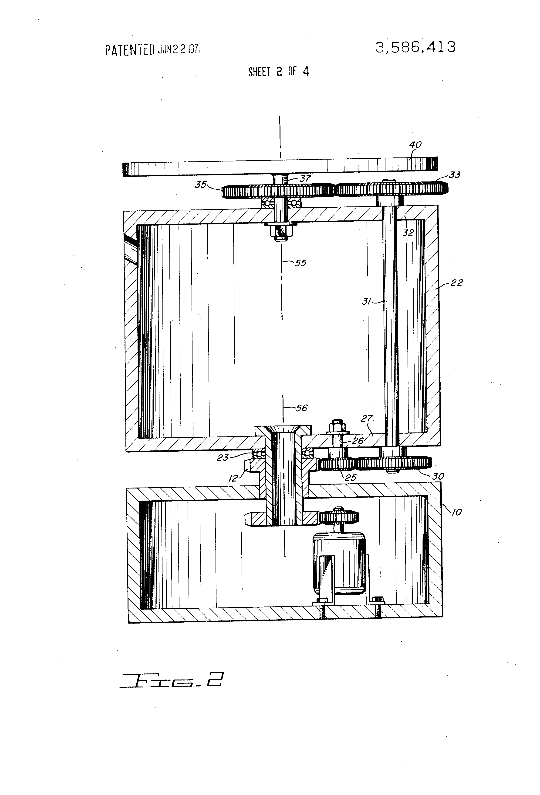

While working on [a frivolous project](../saturnalia-a-rotating-christmas-tree/)
I was looking for a way to connect wiring from a stationary base to a rotating platform,
in this case under a Christmas Tree.
I knew what I needed was a rotating contact of some kind, a bit like the
[concentric contacts in the base of fancy electric kettles](https://www.aliexpress.com/item/32849830287.html).

I had no idea what that was called, but it turns out it is called a
[Slip Ring](https://en.wikipedia.org/wiki/Slip_ring)
and there are [many applications](https://youtu.be/gisdyTBMNyQ)
and you can just [buy them on ebay](https://www.ebay.com.au/sch/i.html?_nkw=slip+ring+for+robotics&_sop=15)!

Slip rings introduce a point where contacts can wear out and introduce resistance and noise.
There's been a lot of work on this over the last couple of centuries for things like
lighthouses and antennas.

In my searching I had happened upon a patent which seemed to solve the problem without any kind of sliding
contact at all, but I'd skipped over it because it involved gears and multiple rotation speeds.
It was bugging me though: how on earth could it possibly work with no sliding parts at all?

## The Patent

[US Patent 3,586,413](https://patents.google.com/patent/US3586413A/en) by describes an
"Apparatus for providing energy communication between a moving and a stationary terminal".

*US Patent 3486413, Figure 1*

Patents are written in weird language which attempts to both communicate an idea with an example
and prevent its limitation by that example, but the following sentences sum it up:

* *A rotating support is mounted on a stationary surface for rotation about an axis.*
* *A rotating platform is mounted on the rotating support to permit relative rotation between the two.*
* *An electric motor is geared to rotate the rotating support and a gear arrangement is provided
  to drive the rotating platform in the same direction but at twice the angular velocity of the rotating support.*

The patent includes a diagram of the geartrain required to drive the platform and support, which
seems pretty complicated:

*US Patent 3486413, Figure 2*

However, the following patent text hints at the fact that the gearing is not essential to the idea:

* *Similarly, the rotating platform may directly be driven and the rotating support may be connected
  thereto to rotate at the required velocity.*
* *If the electrical conductor or a conductor guide is to be used as the means for mechanically driving the rotating
  support or the rotating platform, then the ratio of velocities will automatically be achieved and the necessity
  for gear trains or other motion transmitting means is eliminated.*

## Simplifying

## Thinking Flexibly

## The Spinor Linkage

[The Spinor Linkage](https://www.researchgate.net/publication/360037741_The_spinor_linkage_-_a_mechanical_implementation_of_the_plate_trick)

