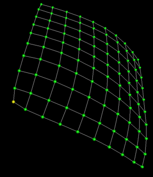

Virtual Localization is a technique for Mesh Network routing. It tries
to make it easy to route packets across the mesh by assigning each node
a “Virtual Location”, which can then be used for Greedy Forwarding. It
is a fully distributed algorithm … no one node holds the whole map of
the network, the map is spread across all nodes with each node having a
small map of its immediate surroundings.

I've also written some [papers on Virtual
Localization](https://mesh.zoic.org/), but this post is an attempt to
summarize what I'm doing and talk about why.

Virtual Location
================

There’s been lots of work along these lines over the years, almost all
of which attempts to map out the network by using triangulation of the
distances between nodes. Mostly, people attempt to measure distance by
looking at the signal attenuation: theoretically, radio signals
attenuate as `1/r``2`.

However, in practice there are all sorts of
measurement errors introduced by reflection and absorbtion by your
surroundings, including buildings, furniture, people, etc, and so
distance measurement is often inaccurate, making triangulation rather
fraught.

Virtual Localization abandons this attempt and instead uses a much
simpler metric: either two nodes can communicate or they can’t. This is
very easy to measure ... if each node sends a beacon listing all the
nodes whose beacons it can hear, every node gets to know who its
1-neighbours (direct neighbours) and 2-neighbours (neighbours’
neighours) are.

Without distance information, our Virtual Locations will never
correspond that closely to the real location of the nodes. However, my
research has shown that this is a blessing in disguise … the Virtual map
is actually better for greedy forwarding than the real one! Also, by
embedding the virtual locations in a higher dimensional space than the
real locations, we can introduce more degrees of freedom in which to
converge, leading to a better result.

New Work
========

So I recently reworked my mesh network simulator to merge the “hardware”
code in with the “simulator” code ... so that they can share the
implementation of the actual Virtual Localization algorithm. There’s
some new [VRML files](../vrml/) based on simulation over at
<https://mesh.zoic.org/> ... the idea is to eventually test the software
on hardware nodes.

