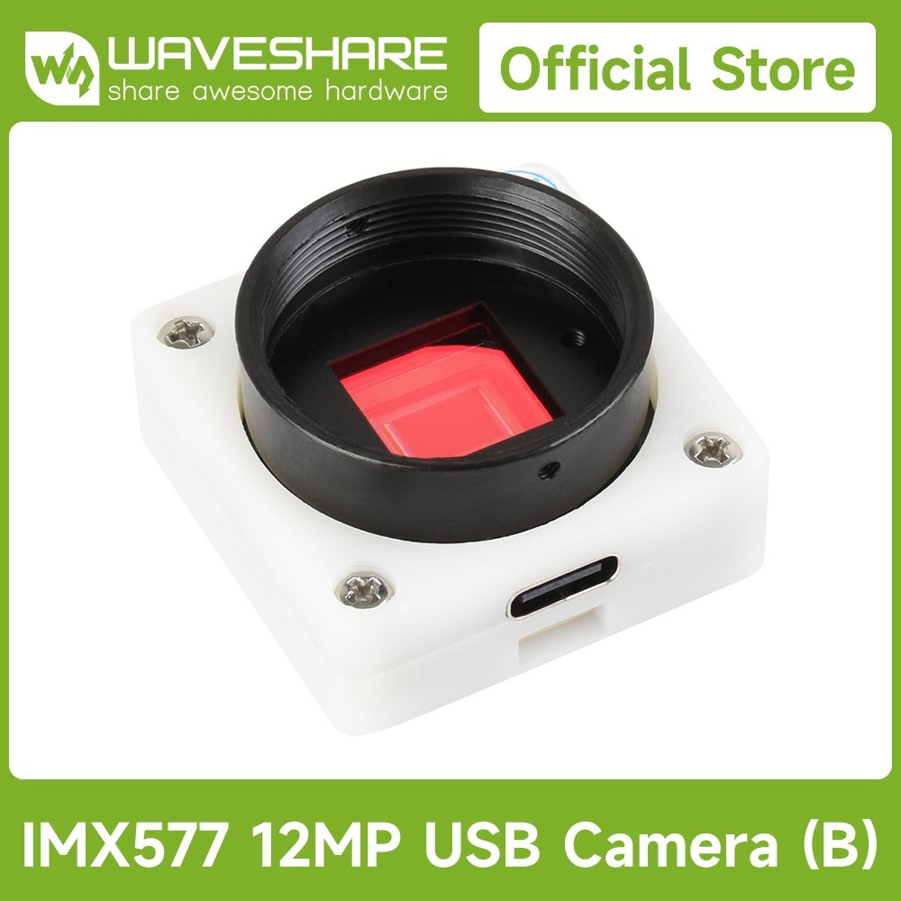

In [this article](/art/cccp-computer-controlled-camera-project/)
I mentioned I was upgrading to a better camera, well, the better
camera is here ...

## Waveshare IMX577 Camera


*IMX577 based USB camera from Waveshare*

It's a 
[Waveshare IMX577 Camera](https://www.waveshare.com/wiki/IMX577_12MP_USB_Camera_%28B%29)
which connects a [Sony IMX577](https://www.sony-semicon.com/files/62/pdf/p-13_IMX577-AACK_Flyer.pdf) sensor and a USB2 interface.

The USB2 interface is not without its limitations: somehow the sensor's native 4056 × 3040
gets trimmed down to 3840 × 3024 and the frame rate is a bit limited by the USB
interface, but it does save messing around with
[CSI-2](https://www.mipi.org/specifications/csi-2).

It also has a CS mount which suits various C and CS mount lenses and adaptors.

The sensor size is called '1/2.3"'[^misleading] which is 7.857mm on the diagonal.
Sensor pixels are 1.55μm on a side, so you can work out with the 
crop the image area is actually 5.952mm x 4.687mm with diagonal 7.576mm[^vig].

[^misleading]: called '1/2.3"'
    [for historical reasons](https://en.wikipedia.org/wiki/Image_sensor_format#Table_of_sensor_formats_and_sizes),
    rather misleading but at least I finally understand why
    [MFT system](https://en.wikipedia.org/wiki/Micro_Four_Thirds_system)
    is called "four thirds" despite being only 21.63mm on the diagonal.

[^vig]: The diagonal is the important dimension for the optics
    as that's the size of the "image circle" required to avoid
    [vignetting](https://en.wikipedia.org/wiki/Vignetting)

## Interfacing from Python

There's two major ways to use the camera from Python, and each has its
benefits and limitations.

### linuxpy.video.device

The [linuxpy package](https://pypi.org/project/linuxpy/) is a
"Human friendly interface to linux subsystems using python"[^human].
It includes a `linuxpy.video.device.VideoCapture` interface which 
supports [python asyncio](https://docs.python.org/3/library/asyncio.html).

`pip install linuxpy`

[^human]: your humans may vary 

#### `Device`


```
from linuxpy.video.device import Device
device = Device('/dev/video0')
```

We can also iterate over all the video devices in the system using
`iter_video_capture_devices`, and *once we've opened the device* 
we can use `device.info` to hopefully find the one we're looking for:

```
from linuxpy.video.device import iter_video_capture_devices

for device in iter_video_capture_devices():
    device.open()
    print(f"{device.filename} {device.info.card}")
    for frame_size in device.info.frame_sizes():
        print(f"{frame_size.pixel_format.human_str()} @ {frame_size.info.width} x {frame_size.info.height}")
    device.close()
```

#### `VideoCapture`

```
from linuxpy.video.device import VideoCapture

capture = VideoCapture(device)
capture.set_format(1024, 768, "MJPG")
with capture as frames:
    async for frame in frames:
        read_io = BytesIO(frame.data)
        image = Image.open(read_io, formats=['JPEG'])
```

### OpenCV2

`pip install opencv-python cv2_enumerate_cameras`

```
import cv2
from cv2_enumerate_cameras import enumerate_cameras

for camera_info in enumerate_cameras(cv2.CAP_ANY):
    print(camera_info)
    cap = cv2.VideoCapture(camera_info.index, camera_info.backend)
```

There isn't such an obvious way to handle asyncio
but opencv can run in a separate thread.

## Pan, Tilt, Zoom

If you're asking for the full 3840 × 3024 resolution
the frame rate is limited to 10 fps.

