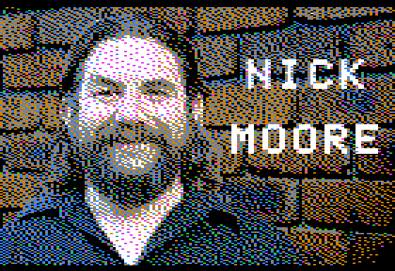
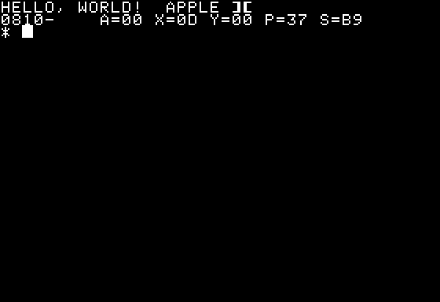

I wrote (and presented) about my teenage obsession with Ultima IV 
and the Apple 2 in [Ultima IV: Reflections](/art/ultima-iv-reflections/)
and [Journey Onward: The Apple 2 and me](/art/journey-onward-apple-2-and-me/),
but I kind of regret letting go of the Apple so quickly when PCs came along.

So I thought, here in the cold light of 2020, I should write a new piece
of software for the 40 year old Apple II.

# Emulation

I don't actually have an Apple II any more ... it's tempting to pick up a
IIc or IIe from fleabay but there's not many left and I'm not sure I have the
enthusiasm for real hardware.

Thankfully, [MAME](https://www.mamedev.org/) does a good job of emulating
an Apple 2 when combined with the correct [Apple II Plus](https://mirrors.apple2.org.za/Apple%20II%20Documentation%20Project/Computers/Apple%20II/Apple%20II%20plus/ROM%20Images/) 
and [Apple Disk II](https://mirrors.apple2.org.za/Apple%20II%20Documentation%20Project/Interface%20Cards/Disk%20Drive%20Controllers/Apple%20Disk%20II%20Interface%20Card/ROM%20Images/)
ROM Images. With the right [zip file](files/apple2p.zip) in the right place, run:

        mame apple2p -uimodekey DEL -flop1 $image.dsk

There's also a great javascript simulator [Apple2js](https://www.scullinsteel.com/apple2/)
which already has a bunch of disks available, if installing MAME isn't your idea of fun.

# Writing Software

Actually writing software from inside the emulator would get old quick: the keyboard
mapping is weird and the 40 column screen is small.  So I want to get my tools on the
outside and just boot a disk image.

## Notation & Encodings

A quick note re: notation, the Apple 2 era tended to write numbers as 
hexadecimal, starting with `$` eg: `$A9`.  Most numbers are single bytes,
but addresses are 16 bits, written like `$3FFF`.  The 6502 is little endian,
so this would be stored in memory as `$FF $3F`.

Also note that the Apple 2 is described as supporting ASCII, but earlier
Apples had no lower case characters and stored normal letters with the high
bit set, so for example `HELLO` is stored as `$C8 $C5 $CC $CC $CF`.

## Files under DOS

[a2tools](https://github.com/catseye/a2tools) does a good job of manipulating 
`.dsk` DOS 3.3 image files.

* `a2ls`: list files (like CATALOG)
* `a2in`: add files to a disk image
* `a2out`: copy files from a disk image
* `a2rm`: delete files from a disk image

There's no `a2format` command but you can download an empty formatted floppy
image and add files to that.

I used this method to make the slideshow at the start of the Journey Onward 
presentation: it's a real disk image with some HGR images and a tiny applesoft
HELLO program which is automatically run when the disk boots:

```
 10  HGR2 
 20  PRINT  CHR$ (4);"BLOAD TITLE1.HGR,A$4000"
 20  PRINT  CHR$ (4);"BLOAD TITLE2.HGR,A$4000"
 30  GET X$
 40  TEXT 
```


`HELLO` could also load and run a binary, so with a bit of help from a `Makefile`
it'd be easy enough to make a floppy to run a game on the fly.

## Disk Images

An alternative is to make a raw disk image.  

When booting, the Apple first passes control to a piece of code known as `BOOT0` 
which resides on the Disk II controller.  This is responsible for loading 
track 0 sector 0 of the floppy, known as BOOT1, into memory at location
`$0800` and then jumping to location `$0801`.

Actually, it'll do more than that.  If you set the very first byte of that very
first sector to a larger value it'll load several sectors, up to `$10` to load
the whole first track into memory from `$0800` to `$17FF`.

### Sector Interleaving

But there's a trick to it.  DOS 3.3 doesn't use this facility, only loading up 
a single sector for BOOT1 which takes over from there.  And DOS 3.3 chose to
interleave its sectors, strangely not by reordering them when formatting them
onto the disk but by renumbering them as it reads them.

| BOOT0  | 0 | 1 | 2 | 3 | 4 | 5 | 6 | 7 | 8 | 9 | A | B | C | D | E | F |
|--------|---|---|---|---|---|---|---|---|---|---|---|---|---|---|---|---|
| DOS 3  | 0 | 7 | E | 6 | D | 5 | C | 4 | B | 3 | A | 2 | 9 | 1 | 8 | F |

The emulator knows about this, and so when it is pretending to be a 
floppy disk, it renumbers the sectors back the other way, so that they appear
to DOS to be in the same order as they are in the `.dsk` file.

| DOS 3  | 0 | 1 | 2 | 3 | 4 | 5 | 6 | 7 | 8 | 9 | A | B | C | D | E | F |
|--------|---|---|---|---|---|---|---|---|---|---|---|---|---|---|---|---|
| BOOT0  | 0 | D | B | 9 | 7 | 5 | 3 | 1 | E | C | A | 8 | 6 | 4 | 2 | F |

BOOT0 knows nothing of this renumbering, and so just reads the sectors
in as per their labels.  So to make the first track all load neatly into memory,
we need to cut and splice our memory into place. I wrote a quick
[bin2dsk.py utility](files/bin2dsk.py) to do this.  It just picks up 256 
byte chunks and shuffles them so that when the sectors are loaded they come
out in the right place:

| `.bin` Offset | `.dsk` Offset | RAM Address   |
|---------------|---------------|---------------|
| $0000 - $00FF | $0000 - $00FF | $0800 - $08FF | 
| $0100 - $01FF | $0700 - $07FF | $0900 - $09FF |
| $0200 - $02FF | $0E00 - $0EFF | $0200 - $02FF |
| ... etc ...   | ... etc ...   | ... etc ...   |

See also: [Beneath Apple DOS]() page 3-22..23

## ACME Assembler

There are a [lot of 6502 tools](http://6502.org/tools/asm/) out there.
For my first foray I'm using [ACME](https://github.com/meonwax/acme)
not for any particularly good reason other than there's a 
[Ubuntu package](https://launchpad.net/ubuntu/focal/+package/acme) 

This is pretty much the minimal `HELLO, WORLD!` program in a sector:

```
; this code will be loaded at $0800 by BOOT0 which then jumps to $0801.

* = $0800

; this byte is supposed to be "number of sectors to load" but by the
; time it reads this is has already loaded.
!byte 0

print
    ldx 0
print_loop
    lda message,X     ; start of message buffer
    beq exit          ; stop if we got a zero
    sta $0400,X       ; start of text screen
    inx
    bne print_loop

exit
    brk

message
    !convtab "apple2.convtab" ; convert to Apple's weird ASCII.
    !text "HELLO, WORLD!", 0

```
(you can grab this code [here](files/hello.zip))

Run it in MAME and it looks like this:



## So, what to write?

My first thought was to avoid this question, probably indefinitely, by writing
an interpreted VM to run over the top of the 6502 and provide a sane number of 
registers and addressing modes comprehensible to humans and stuff like that.
But it turns out [Woz already did, with SWEET 16](https://en.wikipedia.org/wiki/SWEET16)
which takes a lot of the fun out of it.

### The impractical dream

My next idea was to do something utterly impossible: Minecraft for Apple 2.
Ultima IV fit a lot of 2D world onto a disc, how much could we manage in three
dimensions?  Assuming a minecraft-like, uncompressed map fitting onto one floppy,
we'd have 35 tracks x 16 sectors x 256 bytes to play with.  Restricting ourselves
to 16 block types, we could construct a 4 x 4 x 32 chunk in each sector, giving
us room for a 92 x 92 x 32 world map on a disk.

We'd load and save sectors on demand as we moved through the map, and mobs etc
would be stored on the remaining 31 sectors of the disk.
Hmmm, restrictive but possible.
The original pocket edition was about 256 x 256 x 64 and had relativly few block types.

3D rendering?  Well, not *impossible*.  Sure there's no floating point math, actually
there's no division or multiplication either, but if we restrict our perspectives to
always horizontal and only 8 (or so) different directions, we can exploit the symmetries
of the grid and just use lookup tables for everything.

Each block type could just have a set colour, I'm not going for much here, but even
then we hit a final hurdle trying to display multiple colours: the dreaded palette
select bit per seven pixels.  As illustrated [here](https://en.wikipedia.org/wiki/Apple_II_graphics#High-Resolution_%28Hi-Res%29_graphics) trying to combine colours can lead to
a mess.

Maybe this would be worth revisiting for the substantially less limited
[Apple IIc](https://en.wikipedia.org/wiki/Apple_IIc#Improving_the_IIe)
[Double HiRes](http://www.battlestations.zone/2017/04/apple-ii-double-hi-res-from-ground-up.html)
or even the [Apple IIGS](https://en.wikipedia.org/wiki/Apple_IIGS#Graphics_modes)
which as a bonus has much larger 800kB floppies.
 
### Slightly Less Impossible

[Isometric](https://en.wikipedia.org/wiki/Isometric_video_game_graphics) projection
