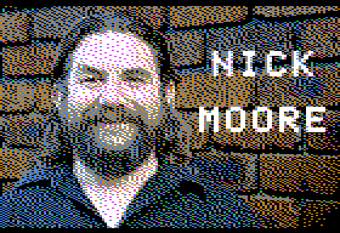
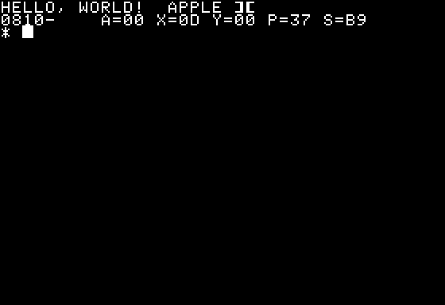
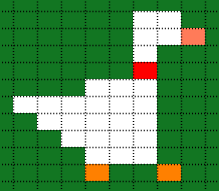

I wrote (and presented) about my teenage obsession with Ultima IV 
and the Apple 2 in [Ultima IV: Reflections](/art/ultima-iv-reflections/)
and [Journey Onward: The Apple 2 and me](/art/journey-onward-apple-2-and-me/),
but I kind of regret letting go of the Apple so quickly when PCs came along.

So I thought, here in the cold light of 2021, I should write a new piece
of software for the 40 year old Apple II.

# Emulation

I don't actually have an Apple II any more ... it's tempting to pick up a
IIc or IIe from fleabay but there's not many left and I'm not sure I have the
enthusiasm for real hardware.

Thankfully, [MAME](https://www.mamedev.org/) does a good job of emulating
an Apple 2 when combined with the correct [Apple II Plus](https://mirrors.apple2.org.za/Apple%20II%20Documentation%20Project/Computers/Apple%20II/Apple%20II%20plus/ROM%20Images/) 
and [Apple Disk II](https://mirrors.apple2.org.za/Apple%20II%20Documentation%20Project/Interface%20Cards/Disk%20Drive%20Controllers/Apple%20Disk%20II%20Interface%20Card/ROM%20Images/)
ROM Images. With the right [zip file](files/apple2p.zip) in the right place, run:

        mame apple2p -uimodekey DEL -flop1 $image.dsk

There's also a great javascript simulator [Apple2js](https://www.scullinsteel.com/apple2/)
which already has a bunch of disks available, if installing MAME isn't your idea of fun.

## Typical File Locations

* For Linux: `$HOME/mame/roms/apple2p.zip`
* For Windows: `C:\mame\roms\apple2p.zip`

# Writing Software

Actually writing software from inside the emulator would get old quick: the keyboard
mapping is weird and the 40 column screen is small.  So I want to get my tools on the
outside and just boot a disk image.

## Notation & Encodings

A quick note re: notation, the Apple 2 era tended to write numbers as 
hexadecimal, starting with `$` eg: `$A9`.  Most numbers are single bytes,
but addresses are 16 bits, written like `$ABCD`.  The 6502 is little endian,
so this would be stored in memory as `$CD $AB`.

Also note that the Apple 2 is described as supporting ASCII, but earlier
Apples had no lower case characters and stored normal letters with the high
bit set, so for example `HELLO` is stored as `$C8 $C5 $CC $CC $CF`.

## Files under DOS

[a2tools](https://github.com/catseye/a2tools) does a good job of manipulating 
`.dsk` DOS 3.3 image files.

* `a2ls`: list files (like CATALOG)
* `a2in`: add files to a disk image
* `a2out`: copy files from a disk image
* `a2rm`: delete files from a disk image

There's no `a2format` command but you can download an empty formatted floppy
image and add files to that.

I used this method to make the slideshow at the start of the Journey Onward 
presentation: it's a real disk image with some HGR images and a tiny applesoft
HELLO program which is automatically run when the disk boots:

```
 10  HGR2 
 20  PRINT  CHR$ (4);"BLOAD TITLE1.HGR,A$4000"
 20  PRINT  CHR$ (4);"BLOAD TITLE2.HGR,A$4000"
 30  GET X$
 40  TEXT 
```


`HELLO` could also load and run a binary, so with a bit of help from a `Makefile`
it'd be easy enough to make a floppy to run a game on the fly.

## Disk Images

An alternative is to make a raw disk image.  

When booting, the Apple first passes control to a piece of code known as `BOOT0` 
which resides on the Disk II controller.  This is responsible for loading 
track 0 sector 0 of the floppy, known as BOOT1, into memory at locations
`$0800`-`$08FF` and then jumping to location `$0801`.

Using a raw disk image also avoids the whole question of whether distributing Apple DOS is
allowed or not.

### Finding BOOT0

The disk controller card is usually in Slot 6, with its ROM mapped to addresses
$C600 .. $C6FF, but it could be in some other slot.

Older Apple 2 machines needed the user to run a command `PR#6` to jump to the 
disk controller ROM, but newer "autostart" machines would look in each successive ROM
mapping locations $C700 through $C100.  If a disk ROM is found, jump to it:

From [AutoF8ROM Disassembly](https://6502disassembly.com/a2-rom/AutoF8ROM.html):

```
fab4: a9 c8                    lda     #$c8            ;load hi slot +1
fab6: 86 00                    stx     LOC0            ;SETPG3 must return X=0
fab8: 85 01                    sta     LOC1            ;set ptr H
faba: a0 07        SLOOP       ldy     #$07            ;Y is byte ptr
fabc: c6 01                    dec     LOC1
fabe: a5 01                    lda     LOC1
fac0: c9 c0                    cmp     #$c0            ;at last slot yet?
fac2: f0 d7                    beq     FIXSEV          ;yes and it cant be a disk
fac4: 8d f8 07                 sta     MSLOT
fac7: b1 00        NXTBYT      lda     (LOC0),y        ;fetch a slot byte
fac9: d9 01 fb                 cmp     DISKID-1,y      ;is it a disk ??
facc: d0 ec                    bne     SLOOP           ;no so next slot down
face: 88                       dey
facf: 88                       dey                     ;yes so check next byte
fad0: 10 f5                    bpl     NXTBYT          ;until 4 checked
fad2: 6c 00 00                 jmp     (LOC0)

fb02: 20 ff 00 ff+ DISKID      .bulk   $20,$ff,$00,$ff,$03,$ff,$3c
```

What's interesting is that DISKID is checking *every second* byte in the ROM 
(note the doubled `dey` ...), offset by one, in reverse order ...

| y   | (LOC0),y | DISID-1,y | expected byte |
|-----|----------|-----------|---------------|
| $07 | $Cx07    | $FB08     | $3C           |
| $05 | $Cx05    | $FB06     | $03           |
| $03 | $Cx03    | $FB04     | $00           |
| $01 | $Cx01    | $FB02     | $20           |

From [C600ROM Disassembly](https://6502disassembly.com/a2-rom/C600ROM.html):
```
                   bits          .var    $3c
...
c600: a2 20        ENTRY         ldx     #$20              ;20/00/03 is the controller signature
c602: a0 00                      ldy     #$00
c604: a2 03                      ldx     #$03
                   CreateDecTabLoop
c606: 86 3c                      stx     bits
```

which happen to correspond to the bytes $20, $00, $03 and $3C in the BOOT0 ROM 
listing above, but *WHY* is an interesting question!  Why not just a magic number
at $C6FC .. $C6FF or whatever?

# Finding BOOT0 ... Again

Anyway, the BOOT0 code might not be running at $C600 if the disk controller is in a different
slot so a short time later we do some stack shenanigans to find out where our code is running:

From [C600ROM Disassembly](https://6502disassembly.com/a2-rom/C600ROM.html):
```
                   STACK         .eq     $0100  {addr/256}
                   MON_IORTS     .eq     $ff58             ;JSR here to find out where one is
                   slot_index    .var    $2b    {addr/1}   ;slot number << 4

c621: 20 58 ff                   jsr     MON_IORTS         ;known RTS
c624: ba                         tsx
c625: bd 00 01                   lda     STACK,x           ;pull hi byte of our address off stack
c628: 0a                         asl     A                 ;(we assume no interrupts have hit)
c629: 0a                         asl     A                 ;multiply by 16
c62a: 0a                         asl     A
c62b: 0a                         asl     A
c62c: 85 2b                      sta     slot_index        ;keep this around
```

From [AutoF8ROM Disassembly](https://6502disassembly.com/a2-rom/AutoF8ROM.html):
```
ff58: 60                       rts
```

Yep, so we JSR to a location which will definitely just RTS back to us straight away, and now we know
our current address will be on top of the stack, so we read that and store it in a
handy zero page location which BOOT1 can read when it needs to find BOOT0 later.

Why not just JSR to BOOT1 in the first place?  Why not use an RTS which is actually in this ROM?
There's an entire *FIVE SPARE BYTES* on the end of BOOT0!

All these strange decisions, lost in time, like tears in rain.

### Loading One Sector

So, let's write our own loader.

There are a [lot of 6502 tools](http://6502.org/tools/asm/) out there.
For my first foray I'm using [ACME](https://github.com/meonwax/acme)
not for any particularly good reason other than there's a 
[Ubuntu package](https://launchpad.net/ubuntu/focal/+package/acme) 

This is pretty much the minimal `HELLO, WORLD!` program in a sector:

```
; this code will be loaded at $0800 by BOOT0

* = $0800

; this byte is supposed to be "number of sectors to load"
; but by the time it reads this is has already loaded the
; first sector, so zero works too

!byte 0

; BOOT0 then jumps to $0801, so this is our entry point

print
    ldx 0
print_loop
    lda message,X     ; start of message buffer
    beq exit          ; stop if we got a zero
    sta $0400,X       ; start of text screen
    inx
    bne print_loop

exit
    brk               ; drop into monitor

message
    ; convert to Apple's weird ASCII
    !convtab "apple2.convtab"
    !text "HELLO, WORLD!", 0

```
(you can grab this code [here](files/hello.zip))

Run it in MAME and it looks like this:



The `APPLE ][` banner is still there, but we've written the text
`HELLO, WORLD!` at the top left corner of the screen, and then
that last `brk` instruction jumps to the monitor, which prints
the current values of registers and drops to a CLI to allow you
to inspect, manipulate and execute memory.

### Sector Interleaving

Actually, BOOT0 will do more than load one sector.

If you set the very first byte of that very
first sector to a larger value it'll load several sectors, up to `$10` to load
the whole first track into memory from `$0800` to `$17FF`.

But there's a trick to it.  DOS 3.3 doesn't use this facility, only loading up 
a single sector for BOOT1 which takes over from there.  And DOS 3.3 chose to
interleave its sectors, strangely not by reordering them when formatting them
onto the disk but by renumbering them as it reads them.

| BOOT0  | 0 | 1 | 2 | 3 | 4 | 5 | 6 | 7 | 8 | 9 | A | B | C | D | E | F |
|--------|---|---|---|---|---|---|---|---|---|---|---|---|---|---|---|---|
| DOS 3  | 0 | 7 | E | 6 | D | 5 | C | 4 | B | 3 | A | 2 | 9 | 1 | 8 | F |

The emulator knows about this, and so when it is pretending to be a 
floppy disk, it renumbers the sectors back the other way, so that they appear
to DOS to be in the same order as they are in the `.dsk` file.

| DOS 3  | 0 | 1 | 2 | 3 | 4 | 5 | 6 | 7 | 8 | 9 | A | B | C | D | E | F |
|--------|---|---|---|---|---|---|---|---|---|---|---|---|---|---|---|---|
| BOOT0  | 0 | D | B | 9 | 7 | 5 | 3 | 1 | E | C | A | 8 | 6 | 4 | 2 | F |

BOOT0 knows nothing of this renumbering, and so just reads the sectors
in as per their labels.  So to make the first track all load neatly into memory,
we need to cut and splice our memory into place. I wrote a quick
[bin2dsk.py utility](files/bin2dsk.py) to do this.  It just picks up 256 
byte chunks and shuffles them so that when the sectors are loaded they come
out in the right place:

| `.bin` Offset | `.dsk` Offset | RAM Address   |
|---------------|---------------|---------------|
| $0000 - $00FF | $0000 - $00FF | $0800 - $08FF | 
| $0100 - $01FF | $0700 - $07FF | $0900 - $09FF |
| $0200 - $02FF | $0E00 - $0EFF | $0200 - $02FF |
| ... etc ...   | ... etc ...   | ... etc ...   |

See also: [Beneath Apple DOS](https://mirrors.apple2.org.za/Apple%20II%20Documentation%20Project/Books/Beneath%20Apple%20DOS.pdf) page 3-22..23

Once we've reshuffled the sectors this way, we can load an entire track in
to memory from $0800 - $17FF just by setting that first byte to $10.  That's
16 sectors, or 4K, which is quite a lot of 6502 code, certainly enough to 
make a good start!

### Loading Another Track

But let's say we want more ... how can we load multiple tracks without DOS?
It turns out we can alter a few things and jump back into the BOOT0 code to
load more data.

* Advance the stepper motor two phases
* Increment the 'track' zero page variable
* Set X register to the slot number * 16
* jump to $C05C + slot number * 256

Once the track is loaded, our loader code at $801 is called again.
We can just check if all our data is loaded (there's a pointer of where 
the loader is up to stored at $26/$27) and if not we go around again 
until all our memory is loaded.
The same sector-reshuffling as above applies.
We could load 184 sectors / 11½ tracks this way, being careful not to
overshoot into $C000 I/O peripheral space.

Disk access is pretty slow, so it'd be nice to show some kind of splash
screen once the first track has arrived and some kind of loading message
as the others roll in.

### UPDATE: Copy Protection

This kind of direct access to hardware led to all sorts of creative 
abuse of the system, largely with the goal of preventing copying of 
disks.  This is a really great write-up of how a copy protection system
works and can be reverse engineered:

* [Spare Change: 4am Crack](https://ia904502.us.archive.org/30/items/SpareChange4amCrack/Spare%20Change%20%284am%20%26%20san%20inc%20crack%29.txt)

## Memory Map

My aim here is to write an absolutely minimal program, so it's worth considering
what memory we've got available with no DOS or anything loaded:

| From  | To    | Purpose |
|-------|-------|---------|
| $0000 | $00FF | "Page Zero" variables |
| $0100 | $01FF | 6502 stack, grows downwards |
| $0200 | $02FF | Available space |
| $0300 | $03d5 | BOOT0 sector read buffer & translate tables |
| $03D6 | $03FF | Available space |
| $0400 | $07FF | Text / LORES Screen 1 |
| $0800 | $0BFF | Text / LORES Screen 2, also BOOT1 or available space |
| $0C00 | $1FFF | Available Space |
| $2000 | $3FFF | HIRES Screen 1 |
| $4000 | $5FFF | HIRES Screen 2`*` |
| $6000 | $BFFF | Available Space`**` |
| $C000 | $CFFF | I/O, Peripheral mapped memory |
| $D000 | $FFFF | ROM |

`*`: Not in 16K models

`**`: Except for 16K models, and 32K models only have $6000 .. $7FFF available.

If we don't want to use Text / LORES Screen 2 we can just load our entire program
in in chunks all the way from $0800 to $BFFF.  Once we've finished loading,
the space from $0200 - $03FF, part of which was used by the BOOT0 loader,
is available too.

If we *do* want to use LORES Screen 2, 
we can write a loader in the space $0800-$0BFF which once it has finished loading
jumps to $0C00 before clearing $0800 - $0BFF for use as Page 2.
If you don't want to waste space and you're finished with disk reads, the loader could
copy $0A00 - $0BFF over $0200-$03FF.

That's the nice thing about these simple systems: once you've finished with a 
stage, you can just throw it away.

If we're not using AppleSoft BASIC or DOS, we can use pretty much any part 
of memory except for what's needed by the
[Monitor](https://www.callapple.org/Books2/Monitor_Peeled.pdf) ... it's nice
to still have that available!

### I/O, Peripheral mapped memory

There are seven "expansion slots".  Most pins are common across all slots,
but each slot has its own "device select" and "i/o select" pins which are used to map 16 
I/O addresses and 256 ROM addresses, so the non-RAM address space ends up looking
like this:

| Slot   | I/O Addresses  | ROM Addresses  |
|--------|----------------|----------------|
| Main   | $C000 .. $C07F | $D000 .. $FFFF |
| 0      | $C080 .. $C08F | N/A            |
| 1      | $C090 .. $C09F | $C100 .. $C1FF |
| 2      | $C0A0 .. $C0AF | $C200 .. $C2FF |
| 3      | $C0B0 .. $C0BF | $C300 .. $C3FF |
| 4      | $C0C0 .. $C0CF | $C400 .. $C4FF |
| 5      | $C0D0 .. $C0DF | $C500 .. $C5FF |
| 6      | $C0E0 .. $C0EF | $C600 .. $C6FF |
| 7      | $C0F0 .. $C0FF | $C700 .. $C7FF |
| Shared | N/A            | $C800 .. $CFFF |

* [some good documentation of this on Stack Overflow](https://retrocomputing.stackexchange.com/questions/5730/how-did-the-address-decode-for-apple-ii-expansion-cards-work)


## Graphics

The [Apple 2 has two graphics modes](https://en.wikipedia.org/wiki/Apple_II_graphics):
Low-res or "GR" graphics which has 40x48 rectangular
pixels in 16 colours, packed two pixels per byte,
and Hi-res or "HGR" graphics which has 280x192 pixels and six
colours but some bizarre limitations.

There's a lot of quite strange messing about between the pixel clock and the NTSC 
chroma burst which is typically documented as if it is a precise science whereas 
really it's a big ball of hair. 
[Apple II Circuit Description](https://mirrors.apple2.org.za/Apple%20II%20Documentation%20Project/Books/W.%20Gayler%20-%20The%20Apple%20II%20Circuit%20Description.pdf)
chapter 8 gives you some idea of the horrors within.

Emulators attempt to approximate this but without the levels of analogue depravity
present in the original, with all sorts of weird effects and colour fringing.
Sadly I don't have an actual physical Apple 2 on hand
so I can't back this up with 'scope traces and photos of glowing phosphors.

### Lo-Res

40 x 48 pixels in 15 colours (16, but there's two identical shades of grey).
Each byte of video memory holds two coloured pixels.  The pixels are distinctly
rectangular, about 3:2, which is odd. 

[LoRes](https://en.wikipedia.org/wiki/Apple_II_graphics#Low-Resolution_%28Lo-Res%29_graphics)
colours, as seen in MAME anyway, are actually quite fetching.
The only game I can remember being written in LoRes is the original
Little Brick Out by Woz so there's a certain additional cachet there.

### Hi-Res

Each scan line is 40 bytes, each of which displays seven pixels for a horizontal
resolution of 280 pixels.  The eighth bit of each byte alters the colour phase of 
that group of bits, shifting between colour palettes.  It's really a bit more 
complicated than it seems.  The order of scan lines is all jumbled up in memory too.

Additionally, the 280 x 192 pixels aren't quite square on a 4:3 CRT. The exact
proportions depend on a bunch of analogue stuff but I think on a typical CRT a 
pixel would end up being about 10% narrower than it was tall.  

# So, what to write?

## What not to write.

My first thought was to avoid this question, probably indefinitely, by writing
an interpreted VM to run over the top of the 6502 and provide a sane number of 
registers and addressing modes comprehensible to humans and stuff like that.
But it turns out
[Woz already did this 40 years ago, with SWEET 16](https://en.wikipedia.org/wiki/SWEET16)
which takes a lot of the fun out of it.

Any kind of networking is out, really: Apple IIs had serial ports but very few
people would have had access to any kind of dial-up network so I think I should 
restrict myself to one-player games, or two-player-one-computer games at the most.

Writing a small FORTH or Lisp machine is tempting, but there were already quite
a lot of these too, and the risk would be that I'd spend all my time on the language
and never get around to writing the game.

### Tile-based RPGs.

Tile-based RPGs are an obvious option.  6502workshop have just released
[Nox Archaist](https://www.6502workshop.com/p/nox-archaist.html) 
which looks like a cool Ultima-style RPG world.
(There's also a list of [Tile-based RPGs for Apple 2](https://www.6502workshop.com/p/tile-based-apple-ii-rpgs.html))

By making each tile a multiple of 14 pixels across, the tiles can be stored as 
simple bitmaps and colour fringing isn't a (big) problem.
With some careful bit-juggling maybe even a multiple of 7 pixels.
While clip-clopping a whole tile at a time is traditional,
it'd be nice to have half- or quarter- tile movement.

Tile-based games can also be sort of side-on isometric like
[Stardew Valley](https://stardewvalleywiki.com/Stardew_Valley_Wiki)
A weird top-down pseudo-perspective like Zelda would also be possible.

I started thinking about a kind of graphical
[roguelike](https://en.wikipedia.org/wiki/Roguelike) with 14x16 tiles
but I never really got into Rogue to be honest and also as soon as you
try to draw a little sword wielding dude in a tile you end up looking
an awful lot like Ultima but without the plot.

UPDATE: [Beneath Apple Manor](https://en.wikipedia.org/wiki/Beneath_Apple_Manor)
is pretty much a Roguelike, despite predating Rogue itself by a couple of years.

### The impractical dream

My next idea was to do something utterly impossible: Minecraft for Apple 2.

Ultima IV fit a lot of 2D world onto a disc, how much could we manage in three
dimensions?  Assuming a minecraft-like, uncompressed map fitting onto one floppy,
we'd have 35 tracks x 16 sectors x 256 bytes to play with.  Restricting ourselves
to 16 block types, we could construct a 4 x 4 x 32 chunk in each sector, giving
us room for a 92 x 92 x 32 world map on a disk.

We'd load and save sectors on demand as we moved through the map, and mobs etc
would be stored on the remaining sectors of the disk.
Hmmm, restrictive but possible.
The original pocket edition was about 256 x 256 x 64 and had relativly few block types.

3D rendering?  Well, not *impossible*.  Sure there's no floating point math, actually
there's no division or multiplication either, but if we restrict our perspectives to
always horizontal and only 8 (or so) different directions, we can exploit the symmetries
of the grid and just use lookup tables for everything.

Each block type could just have a set colour, I'm not going for much here, but even
then we hit a final hurdle: trying to display multiple colours.
Specifically, the dreaded palette select bit per seven pixels.
As illustrated [here](https://en.wikipedia.org/wiki/Apple_II_graphics#High-Resolution_%28Hi-Res%29_graphics) trying to combine colours can lead to
a mess.

Maybe this would be worth revisiting for the substantially less limited
[Apple IIc](https://en.wikipedia.org/wiki/Apple_IIc#Improving_the_IIe)
[Double HiRes](http://www.battlestations.zone/2017/04/apple-ii-double-hi-res-from-ground-up.html)
or even the [Apple IIGS](https://en.wikipedia.org/wiki/Apple_IIGS#Graphics_modes)
which as a bonus has much larger 800kB floppies.

To be interesting, the game would also have to write back sectors to the disk,
which adds a level of complexity I'm not sure I want to deal with right now!

UPDATE: How about 2½D, ala Doom? Each X/Y location would only have a few numbers
(ground height, water depth, foliage height, etc) rather than a whole stack of 
voxels as in Minecraft)
 
### Slightly Less Impossible

[Isometric](https://en.wikipedia.org/wiki/Isometric_video_game_graphics) projection
might be possible, with a lookup table.  Each 'face' could be represented the same
way every time, and by choosing our face dimensions carefully and adding a black or
white border we could avoid colour palette collisions.  

Typically a 2:1 pixel ratio is used for isometric drawings on computer, so we could
align the tile boundaries with the word boundaries in Hi-Res mode use 7:3, 7:4 or
14:7 ratio depending on what looked best. Anything which needed partial occlusion
like sprites or particle effects 
would be stuck being black-and-white to prevent colour fringing.

It'd be possible to put together a neat
[Syndicate](https://en.wikipedia.org/wiki/Syndicate_%281993_video_game%29)-like
game this way.

### Side-scrollers

Side-on 2D perspectives are mostly associated with platformers like
[Conan: Hall of Volta](https://en.wikipedia.org/wiki/Conan:_Hall_of_Volta)
but 
[Below the Root](https://en.wikipedia.org/wiki/Below_the_Root_%28video_gamecl%29) 
and the (much more recent)
[Night in the Woods](https://en.wikipedia.org/wiki/Night_in_the_Woods)
shows how this format can be used for a narrative-driven adventure game.

### HONK

During the Recent Unpleasantness I spent a bit of time playing 
[Untitled Goose Game](https://goose.game/) with my daughter, and 
it is an absolute hoot, especially the two-player version and I
absolutely recommend it.


*screenshot from near the conclusion of the 2 player version
of _Untitled Goose Game_ (on PC).  Did I mention that it is 
really good and you should buy it if you possibly can?*

And there's something about it's muted palette which reminds me
of the LORES palette.  Okay, so how about a low res goose?
The first step was to see what a goose made of big fat lores pixels
would look like, so I fired up a trusty spreadsheet and drew this:


*a pixelly goose*

Hmmm, maybe!

# CONTINUED

... continued in [Writing an Apple 2 game in 2021: Part 2](/art/writing-an-apple-2-game-in-2021-2/) ...

For updates [follow the RSS](https://nick.zoic.org/feed.rss) or [follow me on Mastodon](https://aus.social/@nickzoic/)
