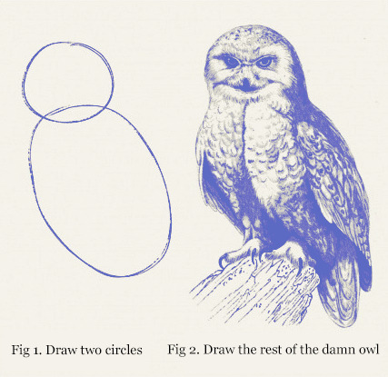
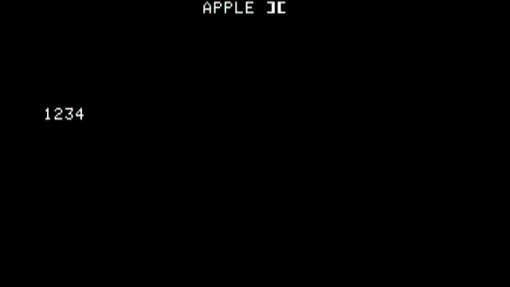

PREVIOUSLY: In [Writing an Apple 2 game in 2021 Part 1](/art/writing-an-apple-2-game-in-2021-1)
I give a bit of an introduction to the Apple 2 platform and discuss how I'm hoping
to proceed and what I'm trying to write.

In this article, I'm going to talk more about the process of building and running
the software.

# The Mighty 6502

The [6502](https://en.wikipedia.org/wiki/MOS_Technology_6502)
was first launched in 1975, and hit the market at just the right time
for the personal computer revolution: in fact, its extremely 
competitive pricing threw fuel on the fire.

## Zero Page

I know I've criticized the 6502 before as being a CPU with "approximately 1 register",
but now I'm getting to know it a bit better I'm starting to think of it more
like a CPU with 259 registers, 256 of which just happen to be mapped to the start of RAM.

These are the "zero page" locations, and many instructions have a special "zero page"
addressing mode.  As always, memory access is slightly slower than registers, but the
base speed of the 6502 is so low already that it barely matters.

For example, when splitting a byte into nybbles it seems sensible to stash the value
in X.  But, assuming the value is stored in a zero page address, it's actually faster
to reload in from the zero page (3 cycles) than to TAX then TXA (2 cycles each).

There's a lot of other "performance assumptions" which don't hold ... there's no cache
and no pipeline, and therefore no branch prediction or speculative execution.
There's no memory management either: instructions can write over code, or jump into data.

## Registers

In addition to the 256 zero-page locations there's three main registers of 8 bits each:
A, X and Y.

A is the main "accumulator" which is where most of the ALU operations happen.
X and Y are "index registers" which have fewer operations on them, but are used by
the addressing modes.  Compared to even a [Z80](https://en.wikipedia.org/wiki/Zilog_Z80)
it's pretty minimal!

There's also an 8 bit stack pointer, 7 bits of processor flags and a 16-bit program
counter.
The stack just starts somewhere in the range $0100 .. $01FF and grows down
until it wraps around.  That's enough room for 128 return addresses so maybe don't get too
far into the recursion.
Stack access isn't particularly fast ... about the same speed as zero page access.

## Addressing Modes

*Here's a [6502 Instruction Set](https://www.masswerk.at/6502/6502_instruction_set.html)
page*

Accumulator-centric instructions like `ADC` (add with carry), `CMP` (compare),
`EOR` (exclusive or), `LDA` (load), `ORA` (or), `SBC` (subtract with borrow)
and `STA` (store) all support a large number of addressing modes:

In the following table, `n` represents an 8 bit quantity following the instruction,
and `nn` represents a 16-bit little-endian quantity following the instruction.

* `M[nn]` represents an 8-bit quantity in memory location `nn`.
* `Z[n]` represents an 8-bit quantity in zero page location `n`.
* `ZZ[n]` represents a 16-bit quantity in zero page location `n` and `n+1` (little-endian)

Remember zero page locations wrap around.

addressing mode | meaning | typical cycles
--- | --- | ---
immediate | `n` | 2
zeropage | `Z[n]` | 3
zeropage,X | `Z[n+X]` | 4
absolute | `M[nn]` | 4
absolute,X | `M[nn+X]` | 4-5
absolute,Y | `M[nn+Y]` | 4-5
(indirect,X) | `M[ZZ[n+X]]` | 6
(indirect),Y | `M[ZZ[n]+Y]` | 5-6

Note the asymmetry of those last two modes.  The first uses `n+X` to choose a zero page
location, then goes and gets the memory pointed to by the 16-bit value at that location.
The second uses `n` to choose a zero page location, then adds Y to the 16-bit value at
that location to get a new address, which it goes and gets.

The second form is probably what you're after in most cases.

## Beg, Steal or Borrow ...

One thing which caught me out and I figure I should mention here.  To add 1000
to a 16-bit quantity in zero-page location `foo`, you do something like:

```
CLC        ; clear the carry flag  
LDA foo    ; load the low byte
ADC $#E8   ; add 232 (1000 = 768 + 232)
STA foo    ; store the low byte
           ; carry flag is now set if we need to carry
LDA foo+1  ; load the high byte
ADC $#03   ; add 3 to the high byte, plus carry if needed)
STA foo+1  ; store the high byte
```

whereas to *subtract* the carry flag has the opposite sense: `0` means a borrow
and `1` means no borrow.  So to subtract 1000, you'd do:

```
SEC        ; set the carry flag (clear the borrow flag)
LDA foo    ; load the low byte
SBC $#E8   ; sub 232 (1000 = 768 + 232)
STA foo    ; store the low byte
           ; carry flag is now *clear* if we need to borrow.
LDA foo+1  ; load the high byte
SUB $#03   ; sub 3 from the high byte, and borrow if needed)
STA foo+1  ; store the high byte
```

This was ... [surprising to me](https://en.wikipedia.org/wiki/Carry_flag#Vs._borrow_flag).

# A Lo-Res Game

So, I think I've decided to make a Lo-Res game.

The Lo-Res screen is, as mentioned last time, 40x48 squishy rectangular pixels,
in 16 colours, two of which are identical (grey and gray?)

To save confusion, what I'm calling a "row" from here on in is 40 contiguous
bytes in memory.  That displays as 2 sets of 40 pixels each, with each byte 
encoding 2 pixels on top of each other.
There's 24 of these rows, for 48 vertical pixels all up.
This makes sense if you consider the 40 x 24 text screen:
the memory layout is the same, but each byte is decoded into one character
instead of two pixels.

The memory is oddly laid out, to pack three 40-byte rows into each 128 byte piece
of memory, with only 8 bytes wasted per three rows.
Graphics memory is further interleaved as a way of letting the video generation
process also refresh the dynamic RAM.

row | address (screen 1) | address (screen 2)
--- | --- | ---
0 | $0400 | $0800
1 | $0480 | $0880
2 | $0500 | $0900
3 | $0580 | $0980
4 | $0600 | $0A00
5 | $0680 | $0A80
6 | $0700 | $0B00
7 | $0780 | $0B80
8 | $0428 | $0828
9 | $04A8 | $08A8
10 | $0528 | $0928
11 | $05A8 | $09A8
12 | $0628 | $0A28
13 | $06A8 | $0AA8
14 | $0728 | $0B28
15 | $07A8 | $0BA8
16 | $0450 | $0850
17 | $04D0 | $08D0
18 | $0550 | $0950
19 | $05D0 | $09D0
20 | $0650 | $0A50
21 | $06D0 | $0AD0
22 | $0750 | $0B50
23 | $07D0 | $0BD0

To calculate the start address of a given row, take the screen base address ($0400 or $0800),
add $0080 for each row, and then if the result is past the end of the screen ($07FF or $0BFF)
then subtract $03D8 to get the the next interleaved group of rows.

Even though there's no multiplication instruction on the 6502, multiplying by 128 is easy
using a shift.

## Main Loop

There's two screens: one at $0400 and one at $0800 and we can
[flip between them](https://en.wikipedia.org/wiki/Multiple_buffering#Page_flipping)
so that our updates don't make a flickery mess (unfortunately there's no way to detect
vertical blanking, so it'll still be a bit of a mess).

So our general game loop looks like:

```
forever:
    draw onto screen 1
    switch to screen 1
    update game state
    draw onto screen 2
    switch to screen 2
    update game state
```

OK so all our graphics routines are going to need to be able to switch between 
screen base addresses.  We can do this by storing the screen base page at 
one of those spare zero page locations, and all the graphics routines will
use that to start of their target address calculations.  So now we've got our
"main loop", which runs forever, and in 6502 looks something like:

```
zp_screen_page = $F0      ; zero page location we're using for screen base

io_gr_graphics = $C050    ; apple I/O: set graphics mode
io_gr_full = $C052        ; ... set graphics full page
io_gr_pri = $C054         ; select screen 1
io_gr_sec = $C055         ; select screen 2
io_gr_lores = $C056       ; select lores mode

entry
    lda io_gr_graphics    ; switch to graphics, lores, full screen
    lda io_gr_lores
    lda io_gr_full

main_loop
    lda #$08              ; draw onto screen 2
    sta zp_screen_page
    jsr draw_everything
    
    lda io_gr_sec         ; switch to screen 2
   
    lda #$04              ; draw onto screen 1 
    sta zp_screen_page
    jsr draw_everything

    lda io_gr_pri         ; switch to screen 1

    jmp main_loop         ; go around again
```

So now *all* we have to do is implement `draw_everything`.



## Sprites

The basic building block of this kind of graphics is the
[Sprite](https://en.wikipedia.org/wiki/Sprite_%28computer_graphics%29),
a kind of movable template for drawing pixels.
Each of the movable parts of our graphics will be its own sprite.

Pretty clearly we need some way of drawing sprites.
Some computers of this era had sprite coprocessors to help out with this
but the Apple 2 didn't, so we're on our own.

Each sprite will be an array of pixel values and we can use the `(indirect),Y` 
addressing mode to copy them efficiently:

```
  LDY #7                  ; count down from 7
.loop
  LDA (zp_sprite_src),Y
  STA (zp_sprite_dst),Y
  DEY
  BPL .loop               ; loop if Y >= 0
```

Each 'row' is two pixels high, with each byte representing a pair of pixels
on top of each other.  For now I'm not worrying about writing 
the background or sprites with a odd number of pixels offset: that'd involve
splitting each byte into two nybbles and writing them separately.
It's not that hard, but it might not be necessary anyway:
given each pixel is about 3:2 on the screen, each pair of pixels is about 3:4
which is closer to square anyway!

If vertical movement seems too jumpy I can always revisit this later.

### Transparency

Unless all our sprites are to be
monotonously rectangular, we'll need some way to handle transparency. Conveniently,
when we converting [Apple's colour palette to RGB](https://mrob.com/pub/xapple2/colors.html)
we can see that two colours, $5 and $A, render identically as a boring mid-grey.

We don't really need two identical colours in our palette so let's use one of them
to mark transparency.  As we draw each pixel we'll check if it has the value $A and
if so, we'll not draw it.

This is slightly complicated by the fact that LoRes packs two pixels into each byte,
but if we XOR the byte value with $AA then we just need to look for a clear upper or
lower nybble which is a bit easier.  We end up doing something like:

```
LDA sprite,X      ; load a byte of pixel
EOR $#AA          ; flip the A's to 0's
BEQ dont_draw_any ; it's all transparent, skip
BIT $#F0          ; check the top 4 bits
BEQ only_draw_bot ; only draw the bottom bits
BIT $#0F          ; check the bottom 4 bits
BEQ only_draw_top ; only draw the top bits
                  ; write the whole thing
```

... except that BIT, weirdly and rather annoyingly, has no immediate address mode.
But that's the general idea.  If the byte is $AA skip both halves, otherwise check
each nybble and only write one half, otherwise write the whole thing.

### The background

Sprites get drawn on top of a background, which is really just an enormous sprite too.
The main difference is that the background is much wider than the screen and doesn't
need to support transparency.
At this point, my assumption is that the background will have 256 bytes per row and
take up as much memory as we have left.
Since the assumptions are different, we'll implement `draw_screen` as a separate 
routine.

## Reading the Keyboard

Reading the keyboard is pretty easy too: there's two I/O locations, one of which
reads a key code, and the other of which clears a flip-flop to indicate you're 
waiting for a new key code.  The top bit of the
keycode is set from this flipflop, so if it isn't set
this isn't a new key.

```
io_keydata = $C000
io_keyclr = $C010

   ldx io_keydata       ; read a key code
   lda io_keyclr        ; clear the key flag
   cpx #$C1             ; 'A', with top bit set
   beq we_got_an_A
   cpx #$C4             ; 'D', ditto
   beq we_got_a_D
```

For now, I've just stuck the goose sprite in the
middle and I move the background when you press a 
movement key.

There's no keyboard repeat, at least not without pressing the "RPT" key, 
and no way to detect if a key is held down.  So we'll have to design our
keyboard control scheme around those limitations.

### Joystick / Paddles

Reading a joystick / paddles is really interesting too: there's a couple
of timers you can set and then measure how long they take to reset, which
depends on the resistance value from the analog joystick.
From memory calibration is an adventure.

Joystick support would be nice but I'll worry about this later too.

## Putting it together

Okay, so putting our sprite drawing routine together we can draw a background and 
overlay a sprite on top of it, and by moving the two around and changing the sprite
details we can create a little animation:


*Moving Goose!*

[Goose Movie (MOV)](img/goose2.mov)

(That's running in MAME, captured and converted to a GIF using `ffmpeg`.)

### Designing Sprites

We're going to need a lot more sprites and LibreOffice, while it's 
a pretty reasonable spreadsheet, isn't a great graphics editor.

Helpfully, we can set up
[GIMP with non-square pixels](http://jubatian.com/articles/using-non-square-pixel-aspect-ratios-in-gimp/)
which means we should be able to draw a bunch of sprites in a long skinny image.

There's a bunch of open questions here: how big can a sprite be?  How many of 
them will we need?  How will we clip them to the screen?  How will we decide what
order to draw them in?  

I'd really like to have the sprites saved in a 
[diffable](/art/a-canticle-for-diff3/) text format 
too.

But those things will have to wait until ...

# CONTINUED

... continued in [Writing an Apple 2 game in 2021: Part 3](/art/writing-an-apple-2-game-in-2021-3/) ...

For updates either [follow the RSS](https://nick.zoic.org/feed.rss) or [follow me on Twitter](https://twitter.com/nickzoic/)
