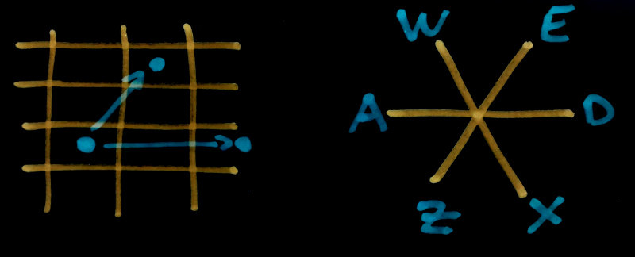

*Progress has been very slow as I've picked up a new contract
which does tend to cut into my 6502 assembly writing time.*

PREVIOUSLY: In [Writing an Apple 2 game in 2021 Part 1](/art/writing-an-apple-2-game-in-2021-1/)
I give a bit of an introduction to the Apple 2 platform and discuss how I'm hoping
to proceed and what I'm trying to write.  In [Writing an Apple 2 game in 2021 Part 2](/art/writing-an-apple-2-game-in-2021-2/) I talk a bit about the 6502 and how to draw stuff
on the Lo-Res screen.

In this article, I'm going to get multiple sprites working and introduce the
[open source project](https://github.com/nickzoic/lores-goose-game) and explain
how to run the software.

# Keyboard Controls & Movement

[Previously](/art/writing-an-apple-2-game-in-2021-2/#reading-the-keyboard) I
mentioned that there's no way to detect a key being held down, and there's no 
key autorepeat.  So we'll have to remember which way the goose is going, and
keep going until it hits something or the user presses a stop key.

On top of that, there's just no way to draw the goose heading straight up the 
screen. Not in these few pixels anyway. Left and up a bit, right and up a bit, no
problem, but not straight up.

So I'm going to abandon the traditional WASD keyboard layout for WEASDZX layout.

 

`S` in the center is for stop.

Normally a diagonal move is a tricky 1.4 times as long as a orthogonal one, but
in this case our chonky 3:2 pixels and our two pixel high rows combine to give us a 
diagonal move 5/6ths as long as a double horizontal one. Close enough.

There have to be a couple of other keys on the right as well, for grabbing and
carrying things. probably `L` and `P`.

<iframe src="apple2js-mini.html#fnord" width="100%" height="420px" frameborder="0"></iframe>
<a href="demo-mouse-canvas-splines.html">source</a>

# Multiple Sprites

# COMING SOON: PART 4 

For updates either [follow the RSS](https://nick.zoic.org/feed.rss) or [follow me on Twitter](https://twitter.com/nickzoic/)
