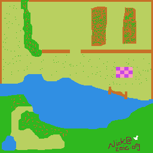
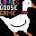

It's 2022, just over a year since the last update of this series,
and, well, life has continued to get in the way of my plans `:-)`

Previously:
* [Part 1](/art/writing-an-apple-2-game-in-2021-1/): About the Apple2 and what to write?
* [Part 2](/art/writing-an-apple-2-game-in-2021-2/): More about 6502 and LoRes.
* [Part 3](/art/writing-an-apple-2-game-in-2021-3/): Controls & Movement

This article is just a random grab-bag of progress I've made and thoughts I've
had about where to go next.

# On Background

Currently the background is also just a bunch of random dots.  Let's fire up 
[mtpaint](http://mtpaint.sourceforge.net/), give it an Apple2 palette file
and draw something terrible.



Okay so I'm no artist, which may prove to be a problem as this project continues, but 
at least this gives me some idea of what it's like for our goose to navigate through
a map.

I wrote a little utility `img2acme.py` which loads the image using Python Image Library,
shuffles bytes into the order expected by my code and writes it out in 'acme' format
for inclusion into the project's source code.

The acme code includes the binary pixel data, but also symbols for the width and height of the image.

This particular map is 256 × 256 pixels, which encodes into an array of 128 rows of
256 bytes (each byte is a stacked pair of pixels, remember?).  That's 32kB, a pretty big
map for a machine with a total of 48kB of RAM!

One thing which is really obvious from the [part 3](/art/writing-an-apple-2-game-in-2021-3/)
simulation is that there's no boundary to the screen.  Our goose wanders where it will, with
no respect for memory layout.  It makes sense to add in some code which checks if the goose
is at the edge of the map, and if so cancel its
movement if it has reached the edge.  As a bonus, we could change the scroll behaviour so that
as the goose reaches the 'edge of the world', it moves from the center of the screen.
This would provide a very clear signal that there's no more map over there.

## Make A Splash

The old loading screen just looked sort of sad too, so I used the same technique to make a splash
screen



This gives the computer something to display while the code is loading.  It's a bit of a
waste of space, but once we're ready to play the memory this screen takes up can just get thrown away ...

I display this screen in "mixed" mode where there's 20 rows of pixels and straight
after including the image I include 4 rows of text:

```
!source "splash.acme"
!convtab "apple2.convtab"
!text "LO-RES GOOSE GAME  -  AN APPLE ][ DEMAKE"
!text "OF 'UNTITLED GOOSE GAME'  BY HOUSE HOUSE"
!text "SUCH A GOOD GAME GO AND BUY IT SERIOUSLY"
!text "HTTPS://NICK.ZOIC.ORG/HONK/     1-------"

```

As map tracks get read in it adds more digits in the bottom right as a kind of
progress indicator.

## DEMO

<iframe src="/apple2js-mini#goose2" width="612px" height="460px" frameborder="0" onmouseover="this.focus()" onmouseout="this.blur()"></iframe>

# Let There Be Sprite

We can use the same tools to create sprites.  We'll need a bunch of them.
Some of them will be static (eg: vegetables) some of them will need multiple 
frames (eg: people).  As discussed previously, we can use color index 10 as 
a transparent pixel, to export the sprites from `mtpaint` this way we just
tell it to use index 10 as transparency when exporting.

Example sprite converted to `acme` format:


```
pumpkin_width = 12
pumpkin_height = 10
pumpkin_data
    !h aaaaaaaaaca4ccaaaaaaaaaa
    !h aa9ad9d999999c99d9d99aaa
    !h 999d99dd99dd99dd99dddd99
    !h a999dd9d99dd99ddd9999da9
    !h aaaaa9999d9d999d9da9aaaa
```

# Levels

One of the really cool things about the original
[Untitled Goose Game](https://goose.game/) is the way the map is contiguous and 
loops back around on itself, so that you can get to the very end of the game and 
retrace your steps and carry items right back to the very start.

*BUT* that's really not something I can be bothered dealing with here. 
The Apple2 is very limited and the disk is very slow and the whole CPU has to wait
for it ... there's no way to load more map in while the disk is reading.

What the hell, Portal had levels. I can have levels.  For each level, it'll load
only as much map as will fit into memory, and also the code which runs the items
on that map. When the goose gets to the exit of the map, we go back to the loader,
which grabs the next few tracks. You can't carry items between levels, you can't
retrace your steps, whatever, deal with it ya goose.

The goose is shared between levels, but I think it's likely that the specific sprites
and behaviour code used for each level will be stored along with that level's map.

## Disk Layout

A disk has 35 tracks, each of 16 sectors × 256 bytes so 4kB each.
Our 32kB maps therefore take 8 tracks each, and so we could have 3 "shared" tracks
plus 4 levels with 8 tracks each on a floppy.  In memory that would look like:

| From  | To    | Purpose | Origin |
|-------|-------|---------|--------|
| $0400 | $0BFF | LORES Screens | |
| $0800 | $37FF | Shared Code / Sprites | Tracks 0, 1, 2 |
| $4000 | $BFFF | Level 1 Map / Code / Sprites | Tracks 3 - 10 |
| $4000 | $BFFF | Level 2 Map / Code / Sprites | Tracks 11 - 18 |
| $4000 | $BFFF | Level 3 Map / Code / Sprites | Tracks 19 - 26 |
| $4000 | $BFFF | Level 4 Map / Code / Sprites | Tracks 27 - 34 |

Note that the initial track load starts from $0800 which overlaps with 
LORES 2.  We need the loader to load later levels, but the overwritten part
could just be the splash screen and/or we could copy that content out to
otherwise unused parts of memory ($0200 - $02FF, $3800 - $3FFF)

8 tracks per level is only enough space for a 256 × 256 map and not the 
associated sprites & logic.  So I think each map will probably be something
like 200 x 200 pixels (40kB), leaving ~24kB for that stuff.

Or we could have fewer, larger maps with more tracks each, or use 
something like
[run length encoding](https://en.wikipedia.org/wiki/Run-length_encoding)
to encode each level's map on disk, reducing the space it takes up and 
speeding up loading considerably.  Maps will still be uncompressed in memory
though: the problem is, where do we load them to while they are being
decompressed?  

# Gameplay

What we've got so far is just a single sprite and a background.
That's not much of a game.  We need to support multiple sprites, more natural
movement and much much more ...

## Internal Walls

The goose game maps have lots of barriers in the scenery —
fences, walls, shrubs — and finding your way through these is an important part of the game.
The movement routines need to be told about these somehow.  One possibility here is to encode
the "impassibilty" of a part of the map into the pixel values of the map. A byte value of 
`$Ax` or `$xA` (Colour `$A` is that "Grey #2" we're using for sprite transparency)
might be used to indicate that a location is impassible, for example, so scattering a handful
of grey pixels into the scenery would be
sufficient to enforce these barriers.  Grey parts which are *not* impassible, like gravel
paths, could just use the identical "Grey #1", encoded as `$5`.

Alternatively, we could encode barriers as a separate bitmask, or as simple exclusion rules stored
alongside the map, for example for each row keep a list of columns which are forbidden. We can 
make the map just slightly narrower to give us space for this stuff at the end of every row.

## Sprite Rendering

Sprites need to be rendered from back to front so that they occlude each other correctly.
The easiest way is probably to render them in ascending order of bottom row.  Some of them
move around though: this could either be done by maintaining a sorted list of sprites, or
by scanning through the list of sprites 24 times.

## Sprite Collisions

There's also *moving barriers*, gates and the like.  We have to handle sprite collisions
for things like people too, because they block and/or shoo the goose, so we can probably just treat
[inanimate objects like NPCs](https://www.ign.com/articles/2015/07/22/fallout-3-broken-steel-train-is-actually-just-a-giant-npc-hat)
who happen to have very boring behaviours.

We'll leave that to next time.

## On-water Matters

Our goose, and various other sprites, are also rendered differently when in the water … the 
lower couple of rows go missing.  This could be done by map pixel color keying on two blue
pixels, encoded as `$66`, or by encoding wet areas similar to the exclusion rules mentioned above:
for each row, a range of pixels can be declared "under water" and this is then easy to check against.

## Behaviours

The stuff about sprites brings up an interesting point: while there's a bunch of 'vegetables' in the game,
objects which don't really do anything but you can carry them around, there's also a bunch of objects which
have actions. Gates open and close, humans give chase, sprinklers, umm, sprinkle, that kind of thing.

I think the way I want to do this is to have the "action" in the loop just update the status of the object.
Then the code in the "logic" part of the program can detect the actions from the states and update their state,
sprite and position accordingly.

# UPDATES COMING SOON(ER THAN THE LAST UPDATE, HOPEFULLY)

For updates either [follow the RSS](https://nick.zoic.org/feed.rss) or [follow me on Twitter](https://twitter.com/nickzoic/)

