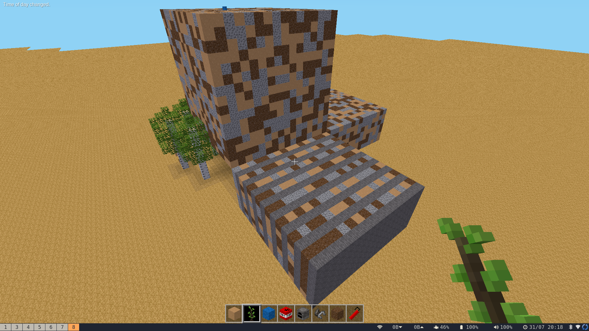
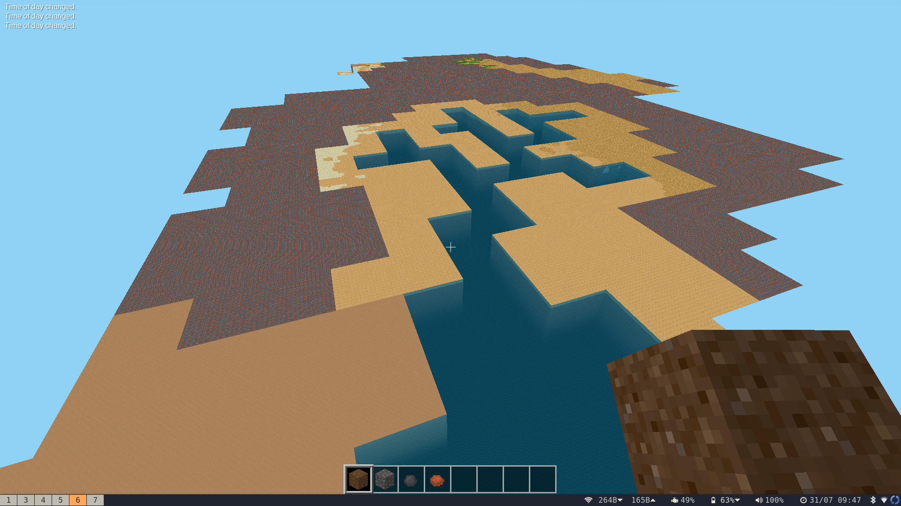
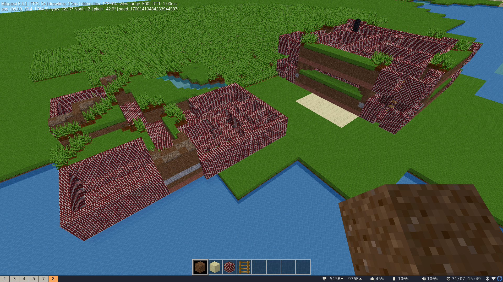

I've been a bit [obsessed with Ultima IV](../ultima-iv-reflections)
for [a while now](../journey-onward-apple-2-and-me/) and when 
[MineCraft](https://minecraft.net/) first came out in, ummm, 2012 or so,
I got nostalgia something bad.

Blocky graphics!
Getting lost in the trees!
Attacked by goddamn skeletons!
[The children yearn for the mines](https://knowyourmeme.com/memes/the-children-yearn-for-the-mines).

Almost immediately I thought: I wonder if it'd be possible to 
bring Ultima IV's beautifully designed continent into 3D life.

I did get as far as messing with Minecraft's maps, but the file
formats changed a few times and many other things kept me busy,
and I never really got anywhere with this idea, until ...

## Luanti (fka Minetest)

[Luanti](https://luanti.org/), formerly known as Minetest, is a 
pretty close knockoff of Minecraft, although written in a more 
modular and customizable way.

It's also open source and fairly well documented and not written
in Java, all of which make my attempts to understand it quite a lot
easier.

So, I started [this project](https://github.com/nickzoic/yearn/)
to understand a little bit more about the challenges

First task was to work out if I could write to a Luanti map.
The [map is stored zstd compressed in an sqlite table](https://github.com/luanti-org/luanti/blob/master/doc/world_format.md#mapsqlite-1)
which seems a little perverse but let's leave that aside for the moment.
At least it is documented.

I wrote some very nasty code to stash the correct bytes in the table, 
handed it a bunch of random tiles and found to my delight that there
was now a big cube of nonsense at (0, 0, 0).  After a few rounds of 
failures and debug messages anyway.

*a big cube of nonsense*

## Reading the World

The next challenge was to read the Ultima IV world map.  I happened
to have the map from the PC edition laying around from earlier
[Ultima IV adventures](https://code.zoic.org/ultima/) and so that 
wasn't too difficult to dredge up.

Looping over the world and writing each tile as a big 16x16x16 block
went okay, got me to the point of having something which looked a
tiny bit like a map ...

*behold, a familiar river*

... and then it was just a matter of finding the right
[Luanti materials](https://wiki.minetest.org/Games/Minetest_Game/Nodes)
to correspond to what I wanted.

## Scaling

Initially I was mapping easy Ultima IV tile to a 16x16x16 map block, 
because that was the easiest way.

But I knew I wanted to include the towns in the map.  Each town is 
represented by a single tile in the world map, and entering the town
opens a separate 32x32 town map.  So it seemed like the obvious thing
was to make each world map tile into a 32x32 area, so the towns would
fit neatly.

But even a scaling each tile to 16x16 seemed a bit ... big?
The rivers were vast, crossing forests took an enormous time,
flying high enough to spot landmarks put you up in the clouds.

Also, 16 was a very convenient scale for the file transformation
process but it felt like a mistake to be muddling up a game-play
requirement (how big is the world) with a technical requirement
(how to read and write files).

So, I split the code into two sections: reading and writing, and joined
the two with an intermediate representation.  The representation I 
settled on is a collection of 4096-element bytearrays, each of which 
maps into a Luanti 16x16x16 block.  That collection gets populated by
looping over the Ultima IV world map, scaling it up by an arbitrary
`SCALE` factor.  Trying different values, I've come to think that 
something around 12 or 14 might be appropriate.

With a `SCALE` of less than 32 the towns hang over the edges of their
tiles into adjoining tiles but there's some extra space so it doesn't 
matter too much.

*Britain and Britannia*

## Transformation

There's a lot of flexibility in the Luanti map format which I don't want
to deal with so this is strictly a *write only* format for me.

So the steps are:

* Read the world and scale it into the buffer.
* Read each town and offset it into the buffer.
* For each block in the buffer, write it into the Luanti database.

# Further Work

## Landscaping

At the moment the landscape is pretty boring ... 
flat ... because it is.
The continent is hilly as anything.

So I suspect what it needs is some kind of elevation map,
letting the landscape "fall up" from the coast to
the mountains.

It also needs trees!
I can generate saplings, I'm not sure whether they'll
sprout on their own.

## Shrines and Dungeons

At the moment there's no mapping for shrines and
dungeons.
Or either end of Britannia, which is supposed to look
like a little castle with towers at each end.

## Roofs and Letters

Giant letter blocks are a big feature in the maps.
There's some
[packages of letters](https://content.luanti.org/packages/?q=letters)
available to install ... there's a big advantage
of Open Source!

Roofs in the towns are trickier, as there's maybe
not a clear way to tell from the map if an area is
indoors or outdoors.
Worth looking at anyway.

I'm happy if this mapping process can get 90% of the
way.
I'm happy if it gets any of the way, really.
There's going to be stuff to finish off manually,
but without the map conversion getting this
finished would be *impossible*.

Stay tuned ...
