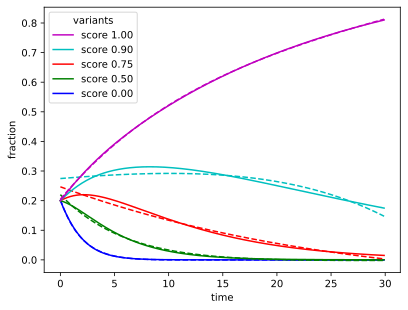

## Background: The Experiment

In my [PyConAU 2025 talk](/art/pycon-pyconau-2025-melbourne/) I talk a little bit
about testing modified versions of the human *G6PD* gene in yeast[^1].

In that study we just used a simple linear interpolation of growth rates and it worked
out fine but this discussion is an attempt to tackle the interesting mathematics of yeast growth.

[^1]: Functional evidence for G6PD variant classification from mutational scanning
    Renee C. Geck, Melinda K. Wheelock, Rachel L. Powell, Ziyu R. Wang, Daniel L. Holmes, Shawn Fayer, Gabriel E. Boyle, Allyssa J. Vandi, Abby V. McGee, Clara J. Amorosi, Nick Moore, Alan F. Rubin, Douglas M. Fowler, Maitreya J. Dunham
    [bioRxiv 2025.08.11.669723](https://www.biorxiv.org/content/10.1101/2025.08.11.669723v2);
    doi: [10.1101/2025.08.11.669723](https://doi.org/10.1101/2025.08.11.669723)

**I should emphasize at this point that I had nothing to do with the experimental
design or the "wet lab" side of 
things, all that hard work was done by other people, and the closest I get to working
with actual yeasts is having a beer while thinking about the numbers which come out
of these experiments!**

### Many Variants

*G6PD* is a gene for an [antioxidant enzyme also called G6PD](https://en.wikipedia.org/wiki/Glucose-6-phosphate_dehydrogenase), and
[pathogenic variants of *G6PD*](https://en.wikipedia.org/wiki/Glucose-6-phosphate_dehydrogenase_deficiency)
can lead to
[haemolysis](https://en.wikipedia.org/wiki/Hemolysis)
(the destruction of red blood cells) and thus
[Haemolytic anemia](https://en.wikipedia.org/wiki/Hemolytic_anemia).

The aim is to test thousands of variants of *G6PD* against each other, and to score
the different variants from bad (0) to good (1).
This should give us some additional insight into the structure and behaviour of the G6PD
protein, as well as some clinical insights into patients with unknown variants, eg:
if a patient has *this* variant, is that likely to be a problem for them?

This experiment is done in brewer's yeast
([*Saccharomyces cerevisiae*](https://en.wikipedia.org/wiki/Saccharomyces_cerevisiae))
because they reproduce very quickly and no-one minds you killing a billion of
them before lunch.

The experiment is done by knocking out the yeast's own [*ZWF1*](https://www.alliancegenome.org/gene/SGD:S000005185) gene 
and inserting variants of [human *G6PD*](https://www.alliancegenome.org/gene/SGD:S000005185) using plasmids.  The variants used are a library
of all possible single base substitutions.

### Turbidostat

Once that's done, the yeasts are cultured and then placed under oxidative stress
by adding some bleach.
This is done in a *turbidostat* which keeps the yeast suspension at a set
[turbidity](https://en.wikipedia.org/wiki/Turbidity).
This is measured as a quantity [OD600](https://en.wikipedia.org/wiki/OD600)
which is the [optical density](https://en.wikipedia.org/wiki/Absorbance)
of 600nm ([orange](https://en.wikipedia.org/wiki/Orange_(colour)))
light on a 1cm path through the yeast suspension.

*experimental setup*

The turbidostat uses a pump to add nutrients and remove excess yeasts to keep the 
turbidity the same, much like a [thermostat](https://en.wikipedia.org/wiki/Thermostat) 
controls temperature by turning a heater on and off.

This means there's always plenty of nutrients for the yeasts, it is as if they are
growing in an unlimited environment where they can multiply indefinitely, doubling
in population every 90 minutes or so.

Under these conditions, the yeasts are [haploid](https://en.wikipedia.org/wiki/Haploid) and
reproduce asexually.
Because of this the "daughter cells" will have exactly the same genome as the parent, and
thus our population of variants is preserved.

However, more successful variants will reproduce more rapidly than less successful
variants, and come to dominate the population.

### Yeast Population

In this experiment the turbidity setpoint is OD600 = 0.5.
Getting from OD600 to cell concentration is complicated[^2]
but using an approximation of 1 × 10^7 cells per mL per OD600,
there's about a billion (1 × 10^9) cells in each 200mL turbidostat.

[^2]: Fukuda, N.
    Apparent diameter and cell density of yeast strains with different ploidy.
    [Sci Rep 13, 1513 (2023)](https://www.nature.com/articles/s41598-023-28800-z).
    doi: [10.1038/s41598-023-28800-z](https://doi.org/10.1038/s41598-023-28800-z)

### Measurements

Samples were taken at ten timepoints, for each of the four replicates.
I'm only really interested in the two "stress" replicates at this point, so
I'm ignoring the two "control" replicates.

Samples were taken at every four hours at first, backing off to every 12 hours.
The intention of this was to get some more subtlety in scoring, rather than just
a score of survived or didn't.

> more samples were taken within the first 24 hours intending to capture
variants with very low activity that were rapidly lost from the population

At the same time, the number of "volume replacements" made by the turbidostat
was recorded, based on the run time of the turbidostat's pump which
indicates how much growth medium was added.

| Nominal Time | Volume Replacements (stress 3) | Volume Replacements (stress 4) |
|---|---|---|
| 0 | 0 | 0 |
| 4 | 0.52 | 0.45 |
| 8 | 2.11 | 2.06 |
| 12 | 3.71 | 3.68 | 
| 16 | 5.23 | 5.19 |
| 24 | 8.78 | 8.82 |
| 36 | 13.92 | 19.95 |
| 48 | 19.31 | 19.31 |
| 60 | 24.63 | 24.65 |
| 72 | 30.57 | 30.32 |

For each sample, sequencing was performed to see what proportion
of the yeasts were of what varieties.

The number of sequences captured at each time point varied quite
a lot, the smallest sample being 1.4 Mseq and the largest
6.6 Mseq!

| Nominal Time | Experiment | Number of Sequences |
|---|---|---|
| 0 | library | 9465789 |
| 4 | stress 3 | 2194742 |
| 8 | stress 3 | 1601970 |
| 12 | stress 3 | 2377144 |
| 16 | stress 3 | 2529157 |
| 24 | stress 3 | 1259293 |
| 36 | stress 3 | 2829533 |
| 48 | stress 3 | 1616839 |
| 60 | stress 3 | 4933458 |
| 72 | stress 3 | 4457441 |
| 4 | stress 4 | 1408777 |
| 8 | stress 4 | 2892289 |
| 12 | stress 4 | 3877352 |
| 16 | stress 4 | 4711909 |
| 24 | stress 4 | 2751762 |
| 36 | stress 4 | 2264457 |
| 48 | stress 4 | 2469222 |
| 60 | stress 4 | 6577424 |
| 72 | stress 4 | 1639330 |

For the paper, we just did a linear least-squares fit of 
population fraction to volume replacements, and that was 
adequate to get some nice results for score distribution
with good correlation between replicates, and the distribution of 
nonsense and synonymous variants was as expected:

*good correlation between replicates and good distribution of nonsense and synonymous variants (unpublished preliminary data)*

## Selected Variants

*selected variants (unpublished preliminary data)*

This graph shows several selected variants from the experimental data, and how 
their population changes with time.

| Variant | Classification | Score |
|---|---|---|
| p.= | wild type | ~ 1 |
| p.Ala109Ter | nonsense | ~ 0 |
| p.Ala300Met | missense | high |
| p.Asp282Gln | missense | high |
| p.Gln195Leu | missense | medium |
| p.Phe237Ser | missense | medium | 
| p.Phe241Pro | missense | low |

## Math!

Let's consider a simplified situation with five variants of varying score:
we'll use scores 0, 0.5, 0.75, 0.9 and 1.0 to give us something to compare.
We'll also ignore the physical limitations of the actual experiment and imagine
the variants starting at the same frequency and growing without limit.
At a maximum score of 1.0 the population will double every time unit,
and a the minimum score of 0.0 the population won't increase at all.

### Scores, populations and frequencies

For each variant `$v$` with score `$k_{v}$`, the population `$p$` at time `$t$` is given by:

`$ p_{v,t} = (1+k_{v})^{t} $`

We don't actually have a way to directly measure the population of a variant though,
we're measuring the frequency as a fraction of the total population.

The total population `$P$` at time `$t$` is given by:

`$ P_t = \displaystyle\sum_{v}p_{v,t} $`

So the fraction `$f$` of each variant `$v$` at time `$t$` is given by:

`$ f_{v,t} = p_{v_,t} / P_t $`

Here's the fraction for our five variants, evolving over 30 doublings:

*five variants under exponential growth*

This looks very much like our experimental data above!

### Thriving and diminishing

> Have you ever noticed that anybody driving slower than you is an idiot,
> and anyone going faster than you is a maniac?
>
> -- George Carlin

The variant with score = 1 rapidly comes to dominate the population.
The variant with score = 0 falls away very quickly as the total population increases
and it doesn't.

Intermediate scores fall less quickly, even seem to rally a little bit
as lower scored variants diminish quicker, but inevitably they fall as well.

Like in the George Carlin quote above: from the point of view of any variant, 
there are variants less fit than you, which you out-compete,
and variants fitter than you, which out-compete you.

This is maybe clearer when plotted as a stack:

*five variants under exponential growth (stacked)*

### Extracting Score from Frequencies

Looking at this data, it seems like we could just
rank the variants by using the fraction at a selected time point
(eg: in this example, t=5).

However:

* In the actual experiment there are thousands of variants mixed together.
* Not all variants start off with the same fraction of the population.
* In particular, unmodified "wild type" sequences are overrepresented,
  and have a score ≈ 1
* There are quite a lot of synonymous variants, also with score ≈ 1 
* There are quite a lot of nonsense variants, with expected score ≈ 0
* There is also a great deal of random sampling noise.
* Scores are not normally distributed.

Sampling noise is particularly interesting as some time points have
many more sampled sequences than others just due to experimental variability.
We can still get an estimate of variant fraction at those time points
but the uncertainty is much higher.

Because of these factors, it's not enough to just pick a single time
at which to rank variants, for each variant we want to fit *all* the
frequencies to a curve, and then use the parameters of that curve to
extract a score.

We have a formula for frequency in terms of score but it also includes the total of frequencies which makes it hard to use.  Perhaps we can approximate our curve with a simpler formula:

`$ f_{v,t} = a_v ( b_v - e^(c_{v}t)) / e^(d_{v}t) $`

*fit*

<!-- footnotes should appear here! -->
