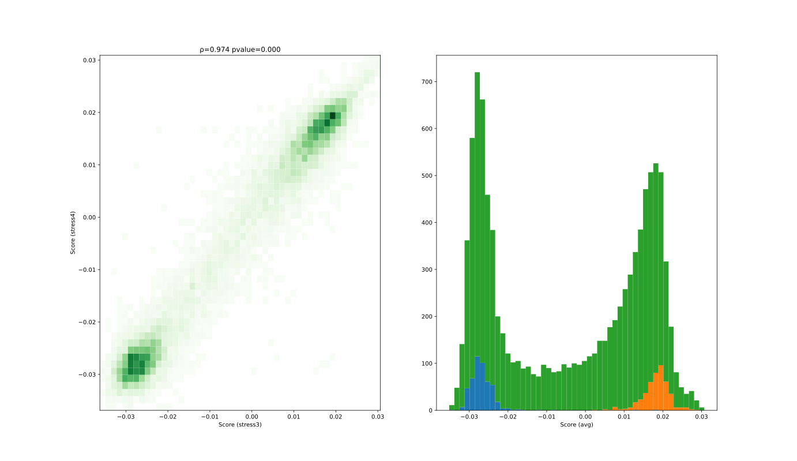
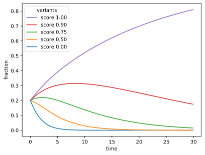
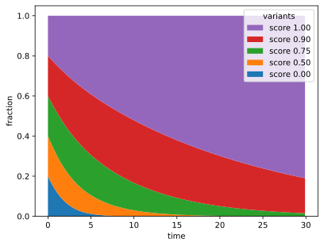
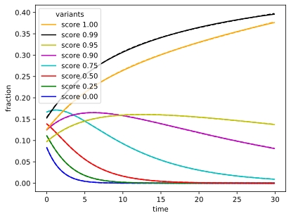
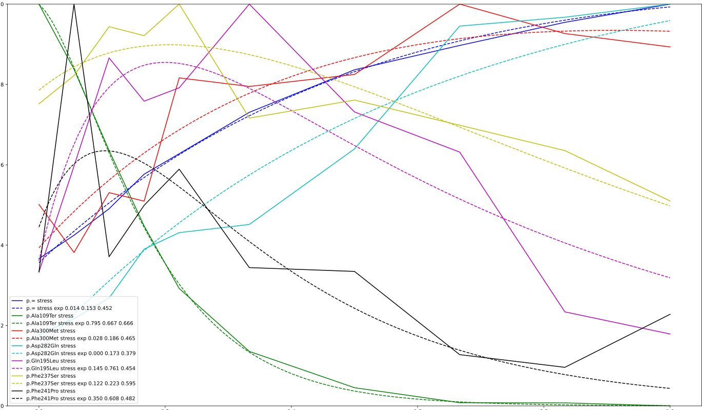

## Background: The Experiment

In my [PyConAU 2025 talk](/art/pycon-pyconau-2025-melbourne/) I talk a little bit
about testing modified versions of the human *G6PD* gene in yeast[^geck].

In that study we just used a simple linear interpolation of growth rates and it worked
out fine but this discussion is an attempt to tackle the interesting mathematics of yeast growth.

[^geck]: Functional evidence for G6PD variant classification from mutational scanning
    Renee C. Geck, Melinda K. Wheelock, Rachel L. Powell, Ziyu R. Wang, Daniel L. Holmes, Shawn Fayer, Gabriel E. Boyle, Allyssa J. Vandi, Abby V. McGee, Clara J. Amorosi, Nick Moore, Alan F. Rubin, Douglas M. Fowler, Maitreya J. Dunham
    [bioRxiv 2025.08.11.669723](https://www.biorxiv.org/content/10.1101/2025.08.11.669723v2);
    doi: [10.1101/2025.08.11.669723](https://doi.org/10.1101/2025.08.11.669723)

**I should emphasize at this point that I had nothing to do with the experimental
design or the "wet lab" side of 
things, all that hard work was done by other people, and the closest I get to working
with actual yeasts is having a beer while thinking about the numbers which come out
of these experiments!**

### Many Variants

*G6PD* is a gene for an [antioxidant enzyme also called G6PD](https://en.wikipedia.org/wiki/Glucose-6-phosphate_dehydrogenase), and
[pathogenic variants of *G6PD*](https://en.wikipedia.org/wiki/Glucose-6-phosphate_dehydrogenase_deficiency)
can lead to
[haemolysis](https://en.wikipedia.org/wiki/Hemolysis)
(the destruction of red blood cells) and thus
[Haemolytic anemia](https://en.wikipedia.org/wiki/Hemolytic_anemia).

The aim is to test thousands of variants of *G6PD* against each other, and to score
the different variants from bad (0) to good (1).
This should give us some additional insight into the structure and behaviour of the G6PD
protein, as well as some clinical insights into patients with unknown variants, eg:
if a patient has *this* variant, is that likely to be a problem for them?

This experiment is done in brewer's yeast
([*Saccharomyces cerevisiae*](https://en.wikipedia.org/wiki/Saccharomyces_cerevisiae))
because they reproduce very quickly and no-one minds you killing a billion of
them before lunch.

The experiment is done by knocking out the yeast's own [*ZWF1*](https://www.alliancegenome.org/gene/SGD:S000005185) gene 
and inserting variants of [human *G6PD*](https://www.alliancegenome.org/gene/SGD:S000005185) using plasmids.  The variants used are a library
of all possible single base substitutions.

### Turbidostat

Once that's done, the yeasts are cultured and then placed under oxidative stress
by adding some bleach.
This is done in a *turbidostat* which keeps the yeast suspension at a set
[turbidity](https://en.wikipedia.org/wiki/Turbidity).
This is measured as a quantity [OD600](https://en.wikipedia.org/wiki/OD600)
which is the [optical density](https://en.wikipedia.org/wiki/Absorbance)
of 600nm ([orange](https://en.wikipedia.org/wiki/Orange_(colour)))
light on a 1cm path through the yeast suspension.

*experimental setup*

The turbidostat uses a pump to add nutrients and remove excess yeasts to keep the 
turbidity the same, much like a [thermostat](https://en.wikipedia.org/wiki/Thermostat) 
controls temperature by turning a heater on and off.

This means there's always plenty of nutrients for the yeasts, it is as if they are
growing in an unlimited environment where they can multiply indefinitely, doubling
in population every 90 minutes or so.

Under these conditions, the yeasts are [haploid](https://en.wikipedia.org/wiki/Haploid) and
reproduce asexually.
Because of this the "daughter cells" will have exactly the same genome as the parent, and
thus our population of variants is preserved.

However, more successful variants will reproduce more rapidly than less successful
variants, and come to dominate the population.

### Yeast Population

In this experiment the turbidity setpoint is OD600 = 0.5.
Getting from OD600 to cell concentration is complicated[^fukuda]
but using an approximation of 1 × 10^7 cells per mL per OD600,
there's about a billion (1 × 10^9) cells in each 200mL turbidostat.

[^fukuda]: Fukuda, N.
    Apparent diameter and cell density of yeast strains with different ploidy.
    [Sci Rep 13, 1513 (2023)](https://www.nature.com/articles/s41598-023-28800-z).
    doi: [10.1038/s41598-023-28800-z](https://doi.org/10.1038/s41598-023-28800-z)

### Measurements

Samples were taken at ten timepoints, for each of the four replicates.
I'm only really interested in the two "stress" replicates at this point, so
I'm ignoring the two "control" replicates.

Samples were taken at every four hours at first, backing off to every 12 hours.
The intention of this was to get some more subtlety in scoring, rather than just
a score of survived or didn't.  Number of volume replacements was also recorded
at each time point.

> more samples were taken within the first 24 hours intending to capture
variants with very low activity that were rapidly lost from the population

For each sample, DNA sequencing was performed to see what proportion
of the yeasts were of what varieties.
The number of sequences captured at each time point varied quite
a lot, the library having 9.5 Mseq, and then the smallest sample
being 1.4 Mseq and the largest sample 6.6 Mseq.

### Scoring

For the paper, we just did a linear least-squares fit of 
population fraction to volume replacements, and that was 
adequate to get some nice variant score results
with good correlation between replicates, and the distribution of 
nonsense and synonymous variants was as expected:

*good correlation between replicates and good distribution of nonsense and synonymous variants (unpublished preliminary data)*

## Let's Do Math!

Let's consider a simplified situation with five variants.
We'll also ignore the physical limitations of the actual experiment and imagine
the variants starting at the same frequency and growing without limit: this
is the situation simulated by the turbidostat.

Our unmodified, wild-type yeast 
At a maximum score of 1.0 the population will double every time unit,
and at the minimum score of 0.0 the population won't increase at all.

### Scores, populations and frequencies

For each variant `$v$` with score `$k_{v}$`, the population `$p$` at time `$t$` is given by:

Our unmodified "Wild Type" gene we'll assume grows exponentially from it's initial population `$p_{WT,0}$`
at a rate `$a$`.

`$ p_{WT,t} = p_{WT,0} a^t $`

Modified variants we give a 'score' `$k_v$` from 0 to 1 based on how much the variant has 
affected them.  A score of 1 means the variant is just as effective as the wild type, a score
of 0 means that it does not reproduce at all:

`$ p_{v,t} = p_{v,0} a^{k_{v}t}, 0 <= k_v <= 1 $`

We don't actually have a way to directly measure the population of a variant though,
we're measuring the frequency as a fraction of the total population.

The total population `$P$` at time `$t$` is given by:

`$ P_t = \displaystyle\sum_{v}p_{v,t} $`

The fraction `$f$` of each variant `$v$` at time `$t$` is given by:

`$ f_{v,t} = p_{v,t} / P_t $`

We'll use scores 0, 0.5, 0.75, 0.9 and 1.0 to give us something to compare.
Here's the fraction for our five variants, evolving over 30 doublings:

*five variants under exponential growth [python source code](src/exp-lines.py)*

This looks very much like our experimental data above!

### Thriving and Diminishing

> Have you ever noticed that anybody driving slower than you is an idiot,
> and anyone going faster than you is a maniac?
>
> -- George Carlin

The variant with score = 1 rapidly comes to dominate the population.
The variant with score = 0 falls away very quickly as the total population increases
and it doesn't.

Intermediate scores fall less quickly, even seem to rally a little bit
as lower scored variants diminish quicker, but inevitably they fall as well.

Like in the George Carlin quote above: from the point of view of any variant, 
there are variants less fit than you, which you out-compete,
and variants fitter than you, which out-compete you.

This is maybe clearer when plotted as a stack:

*five variants under exponential growth (stacked) [python source code](src/exp-stack.py)*

### Majority Rules

The library consists of a thousands of variants, but because of the way it is
created the "wild type" (unchanged) variant is present in large numbers too.
These unchanged genes are expected to perform well.

Additionally, many variants are "synonymous", they have nucelotide change(s) but
because of redundancy in the codon table they produce the same protein as the unmodified gene.
There are many of these, and they are also expected to perform well.

In time, wild types and synonymous variants will out-compete all other variants, and population
will then grow at the full rate:

`$ \displaystyle\lim_{t \to \infty} P_t = P_{W,0} a^t $`

... where `$P_{W,0}$` is the total population of score=1 variants at time 0.

This means that we can estimate the frequency of any variant compared to this majority:

`$ \displaystyle\lim_{t \to \infty} f_{v,t} \quad \approx \quad p_{v,0} a^{k_{v}t} / P_{W,0} a^t \quad \propto \quad a^{k_{v}-1}, \quad 0 <= k_v <= 1 $`

`$ 
    \begin{split} \displaystyle\lim_{t \to \infty} f_{v,t} &\propto a^{k_{v}t} / a^t \\
      &\propto a^{(k_{v}-1)t} \\
\end{split}
$`

`$ \displaystyle\lim_{t \to \infty} f_{v,t} = \left\{
    \begin{array}{ c l }
      p_{v,0} / P_{W,0} & \quad \textrm{if } k_v = 1 \\
      0                 & \quad \textrm{if } k_v < 1
    \end{array}
  \right.$`

### Extracting Score from Frequencies

Looking at this data, it seems like we could just
rank the variants by using the fraction at a selected time point
(eg: in this example, t=5).

However:

* In the actual experiment there are thousands of variants mixed together.
* Not all variants start off with the same fraction of the population.
* In particular, unmodified "wild type" sequences are overrepresented,
  and have a score ≈ 1
* There are quite a lot of synonymous variants, also with score ≈ 1 
* There are quite a lot of nonsense variants, with expected score ≈ 0
* There is also a great deal of random sampling noise.
* Scores are not normally distributed.

Sampling noise is particularly interesting as some time points have
many more sampled sequences than others just due to experimental variability.
We can still get an estimate of variant fraction at those time points
but the uncertainty is much higher.

Because of these factors, it's not enough to just pick a single time
at which to rank variants, for each variant we want to fit *all* the
frequencies to a curve, and then use the parameters of that curve to
extract a score.

Fitting the actual shape of the frequency curves is slightly tricky.
Variants with score ≈ 0 decay exponentially towards zero frequency,
something like:

`$ f_t = a / (d+1)^t $`

Variants with score ≈ 1 increase asymptotically towards a final frequency, something like:

`$ f_t = a - b / (c+1)^t $`

Intermediate scores combine these behaviours, increasing and then falling away.
Combining the two equations is ugly but
[not unprecedented](https://en.wikipedia.org/wiki/Planck%27s_law#Finding_the_empirical_law):

`$ f_t = (a - b / (c+1)^t) / (d+1)^t $`

... and fits the simulated data rather well:

*fitted curves 2 [python source code](src/exp-fit2.py)*

The variable `$d$` is a measure of how much less well this variant is performing
compared to the most fit variants, therefore if we assume those have score = 1 
we can work out a score for our variant of `$score_{v} = 1-d$`

## Back to Real Data

Let's see how well this curve fitting works with real data.

### Statistical treatment of frequencies

For a given variant `$v$` at timepoint `$t$`, the frequency `$f_{v,t}$` 
is found from the count as a fraction of the total count `$C$` at that timepoint.

`$f_{v,t} = c_{v,t} / C_t$`

This frequency is an *estimate* of the actual frequency of the variant. 
The sample files contain millions of sequences, but these are just 
a random sample of the billions of yeasts in the turbidostat.
The larger the sample, the more certain we can be about the 

It's therefore also useful to calculate a standard deviation of the frequency using the 
[variance](https://en.wikipedia.org/wiki/Binomial_distribution#Estimation_of_parameters)

`$\sigma_{v,t} = \sqrt{\frac{f_{v,t}(1-f_{v,t})}{C_t}}$`

This expresses the probably obvious intuition that the larger a sample file the
more certain we can be about the estimates we get from it.  This is useful because
when we fit the curves we can use the standard deviation at each point to control
how tightly that point needs to be fitted.

| count | total | estimate | estimate - σ | estimate + σ |
|---|---|---|---|---|
| 10 | 1000000 | 10ppm | 6.8ppm | 13.2ppm |
| 20 | 2000000 | 10ppm | 7.8ppm | 12.2ppm |
| 50 | 5000000 | 10ppm | 8.6ppm | 11.4ppm |
| 100 | 10000000 | 10ppm | 9ppm | 11ppm |

XXX special case for zeros.

`$\sigma_{v,t} = 1 / C_t \text{where} c_{v,t} = 0$`

XXX graph of real data with errorbars representing stddev.

## Selected Variants

*selected variants (unpublished preliminary data)*

This graph shows several selected variants from the experimental data, and how 
their population changes with time.

| Variant | Classification | Score |
|---|---|---|
| p.= | wild type | ~ 1 |
| p.Ala109Ter | nonsense | ~ 0 |
| p.Ala300Met | missense | high |
| p.Asp282Gln | missense | high |
| p.Gln195Leu | missense | medium |
| p.Phe237Ser | missense | medium | 
| p.Phe241Pro | missense | low |

<!-- footnotes should appear below here! -->
