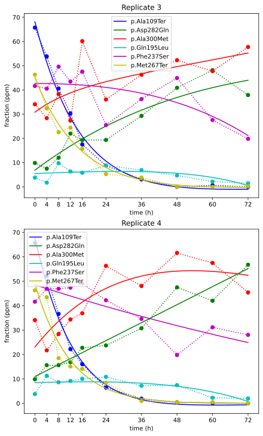

## Background: The Experiment

In my [PyConAU 2025 talk](/art/pycon-pyconau-2025-melbourne/) I talk a little bit
about testing modified versions of the human *G6PD* gene in yeast[^geck].

In that study we just used a simple linear interpolation of growth rates and it worked
out fine, but this discussion is an attempt to tackle the interesting mathematics of yeast growth.

[^geck]: Functional evidence for G6PD variant classification from mutational scanning
    Renee C. Geck, Melinda K. Wheelock, Rachel L. Powell, Ziyu R. Wang, Daniel L. Holmes,
    Shawn Fayer, Gabriel E. Boyle, Allyssa J. Vandi, Abby V. McGee, Clara J. Amorosi,
    Nick Moore, Alan F. Rubin, Douglas M. Fowler, Maitreya J. Dunham
    [bioRxiv 2025.08.11.669723](https://www.biorxiv.org/content/10.1101/2025.08.11.669723v2);
    doi: [10.1101/2025.08.11.669723](https://doi.org/10.1101/2025.08.11.669723)

**I should emphasize at this point that I had nothing to do with the experimental
design or the "wet lab" side of 
things, all that hard work was done by other people, and the closest I get to working
with actual yeasts is having a beer while thinking about numbers!**

This section is just a loose summary to give some background,
for proper details see the paper referenced above.
My involvement was just with wrangling the numbers for the multiple timepoint assay,
using [CountESS](https://countess-project.github.io/).

### Many Variants

*G6PD* is a gene for an [antioxidant enzyme also called G6PD](https://en.wikipedia.org/wiki/Glucose-6-phosphate_dehydrogenase), and
[pathogenic variants of *G6PD*](https://en.wikipedia.org/wiki/Glucose-6-phosphate_dehydrogenase_deficiency)
can lead to
[haemolysis](https://en.wikipedia.org/wiki/Hemolysis)
(the destruction of red blood cells) and thus
[Haemolytic anemia](https://en.wikipedia.org/wiki/Hemolytic_anemia).

The aim is to test thousands of variants of *G6PD* against each other, and to score
the different variants from bad (0) to good (1).
This should give us some additional insight into the structure and behaviour of the G6PD
protein, as well as some clinical insights into patients with unknown variants, eg:
if a patient has *this* variant, is that likely to be what's causing their problems?

This experiment is done in brewer's yeast
([*Saccharomyces cerevisiae*](https://en.wikipedia.org/wiki/Saccharomyces_cerevisiae)).
Yeasts are great
because they reproduce very quickly and no-one minds you killing a billion of
them before lunch.

The experiment is done by knocking out the [yeast *ZWF1*](https://www.alliancegenome.org/gene/SGD:S000005185) gene 
and inserting variants of [human *G6PD*](https://www.alliancegenome.org/gene/SGD:S000005185).

It might be surprising to you (it certainly was to me!) that this is a thing you can do,
but both humans (a big complicated animal with bones and a brain and everything)
and yeasts (a single celled fungus which just floats around eating sugar) are
[Eukaryotes](https://en.wikipedia.org/wiki/Eukaryote)
and we share a lot of inner cellular structures and workings.

The variants used are a library of all possible single base substitutions within *G6PD*,
although there are also a lot of unaltered *G6PD* in there and there ends up being
a lot of other stuff in there like variants with multiple changes.  

### Turbidostat

The modified yeasts are cultured and then placed under oxidative stress
(by adding some bleach).
This is done in a *turbidostat* which keeps the yeast suspension at a set
[turbidity](https://en.wikipedia.org/wiki/Turbidity).
This is measured as a quantity [OD600](https://en.wikipedia.org/wiki/OD600)
which is the [optical density](https://en.wikipedia.org/wiki/Absorbance)
of 600nm ([orange](https://en.wikipedia.org/wiki/Orange_(colour)))
light on a 1cm path through the yeast suspension.

*experimental setup (from my PyConAU talk)*

The turbidostat uses a pump to add nutrients and remove excess yeasts to keep the 
turbidity the same, much like a [thermostat](https://en.wikipedia.org/wiki/Thermostat) 
controls temperature by turning a heater on and off.

This means there's always plenty of nutrients for the yeasts, it is as if they are
growing in an unlimited environment where they can multiply indefinitely, doubling
in population every 90 minutes or so.

Under these conditions, the yeasts are [haploid](https://en.wikipedia.org/wiki/Haploid) and
[reproduce asexually](https://en.wikipedia.org/wiki/Asexual_reproduction).
Because of this the "daughter cells" will have exactly the same genome as the parent, and
thus our population of variants is preserved.

However, more successful variants will reproduce more rapidly than less successful
variants, and come to dominate the population.

### Yeast Population

In this experiment the turbidity setpoint is OD600 = 0.5.
Getting from OD600 to cell concentration is complicated[^fukuda]
but using an approximation of 1 × 107 cells per mL per OD600,
there's about a billion (1 × 109) cells in each 200mL turbidostat.

[^fukuda]: Fukuda, N.
    Apparent diameter and cell density of yeast strains with different ploidy.
    [Sci Rep 13, 1513 (2023)](https://www.nature.com/articles/s41598-023-28800-z).
    doi: [10.1038/s41598-023-28800-z](https://doi.org/10.1038/s41598-023-28800-z)

### Measurements

Samples were taken at ten timepoints, for each of the four replicates.
I'm only really interested in the two "stress" replicates at this point, so
I'm ignoring the two "control" replicates.

Samples were taken at every four hours at first, backing off to every 12 hours,
to get some more subtlety in scoring, as described here by Renee Geck
(in email correspondence):

> Ten samples were taken over 72 hours (0, 4, 8, 12, 16, 24, 36, 48, 60, 72);
> this sampling strategy was determined based on results of a pilot assay [...]
> [W]e chose to do many early timepoints to capture initial changes, and then
> 12 hour intervals to differentiate low, moderate, and normal activity variants.
> We did not run the turbidistats past 72 hours because yeast began to flocculate,
> disrupting the system, before 84 hours.

I'm hoping to do some more work on this myself based on our experience and
other published work on multi timepoint assays[^matus].

[^matus]: Matuszewski S, Hildebrandt ME, Ghenu AH, Jensen JD, Bank C.
    A Statistical Guide to the Design of Deep Mutational Scanning Experiments.
    Genetics. 2016 Sep;204(1):77-87.
    doi: [10.1534/genetics.116.190462](https://doi.org/10.1534/genetics.116.190462).
    Epub 2016 Jul 13. Erratum in: Genetics. 2025 Mar 17;229(3):iyaf002.
    doi: [10.1093/genetics/iyaf002](https://doi.org/10.1093/genetics/iyaf002).
    PMID: 27412710; PMCID: [PMC5012406](https://pmc.ncbi.nlm.nih.gov/articles/PMC5012406/).

For each sample, DNA sequencing was performed to see what proportion
of the yeasts were of what varieties.
The number of sequences captured at each time point varied quite
a lot, the library having 9.5 Mseq, and then the smallest sample
being 1.4 Mseq and the largest sample 6.6 Mseq.

### Scoring

For the paper, we just did a linear least-squares fit of 
population fraction to volume replacements, and that was 
adequate to get some nice variant score results
with good correlation between replicates.

*These graphs are preliminary data before score normalization,
so the score range is -0.03 to 0.03 instead of 0 to 1, but you
get the idea.*

*good correlation between replicates* **unpublished preliminary data**

We also identied "nonsense" variants, which have an early Stop codon,
and don't produce a complete protein, and "synonymous" variants which
have nucleotide change(s) but produce the same protein as the original.
The distribution of nonsense and synonymous variants was as expected,
with nonsense variants clutered around score 0 and synonymous variants
clustered around score 1.

*good distribution of nonsense and synonymous variants* **unpublished preliminary data**

## Let's Do Math!

Let's consider a simplified situation with five variants.
We'll also ignore the physical limitations of the actual experiment and imagine
the variants starting at the same frequency and growing without limit: this
is the situation simulated by the turbidostat.

### Scores, populations and frequencies

Each of our variants `$v$` grow exponentially from their initial population `$p_{v,0}$`
with a growth rate `$a$`.

`$$ p_{v,t} = p_{v,0} a^{k_{v}t} $$`
`$$ 0 \leq k_v \leq 1 $$`

Variants have a score `$k_v$` which varies from 0 (doesn't reproduce at all)
to 1 (reproduces at the maximum rate).

We don't actually have a way to directly measure the population of a variant though,
we measure sequences in a sample, so we're measuring the frequency as a fraction
of the total population.

The total population `$P$` at time `$t$` is given by:

`$$ P_t = \displaystyle\sum_{v}p_{v,t} $$`

The fraction `$f$` of each variant `$v$` at time `$t$` is given by:

`$$ f_{v,t} = p_{v,t} / P_t $$`

### Comparing Variants

> Have you ever noticed that anybody driving slower than you is an idiot,
> and anyone going faster than you is a maniac?
>
> -- George Carlin

We'll use scores 0, 0.5, 0.75, 0.9 and 1.0 to give us something to compare.
Here's the fraction for our five variants, evolving over 30 doublings:

*five variants under exponential growth*
*[python source code](src/exp-lines.py)*

This looks very much like our experimental data above!

* The variant with score = 1 rapidly comes to dominate the population.
* The variant with score = 0 falls away very quickly as the total population increases
  and it doesn't.
* Intermediate scores fall less quickly, even seem to rally a little bit
  as lower scored variants diminish quicker, but inevitably they fall as well.

Like in the George Carlin quote above: from the point of view of any variant, 
there are variants less fit than you, which you out-compete,
and variants fitter than you, which out-compete you.

This is maybe clearer when plotted as a stack:

*five variants under exponential growth (stacked)*
*[python source code](src/exp-stack.py)*

### Extracting Score from Frequencies

Looking at this data, it seems like we could just
rank the variants by using the fraction at a selected time point
(eg: in this example, t=5).

However:

* In the actual experiment there are thousands of variants mixed together.
* Not all variants start off with the same fraction of the population.
* In particular, unmodified "wild type" sequences are overrepresented,
  and have a score ≈ 1
* There are quite a lot of synonymous variants, also with score ≈ 1 
* There are quite a lot of nonsense variants, with expected score ≈ 0
* There is also a great deal of random sampling noise.
* Scores are not normally distributed.

Sampling noise is particularly interesting as some time points have
many more sampled sequences than others just due to experimental variability.
We can still get an estimate of variant fraction at those time points
but the uncertainty is much higher.

Because of these factors, it's not enough to just pick a single time
at which to rank variants, for each variant we want to fit *all* the
frequencies to a curve, and then use the parameters of that curve to
extract a score.

### Majority Rules

The library consists of a thousands of variants, but because of the way it is
created the "wild type" (unchanged) variant is present in large numbers too.
These unchanged genes are expected to perform well.

Additionally, many variants are "synonymous", they have nucelotide change(s) but
because of redundancy in the codon table they produce the same protein as the
unmodified gene.  There are many of these, and they are also expected to perform well.

In time, wild types and synonymous variants will out-compete all other variants,
and population will then grow at the full rate:

`$$ \displaystyle\lim_{t \to \infty} P_t \propto a^t $$`

As this population grows the frequencies of the variants which 
*aren't* competitive rapidly diminish:

`$$ 
    \begin{split} \displaystyle\lim_{t \to \infty} f_{v,t} &\propto a^{k_{v}t} / a^t \\
      &\propto a^{(k_{v}-1)t} \\
\end{split}
$$`

#### Even Better Than The Real Thing

It's possible that a variant with `$k_v > 1$` might arise, because even though
evolution has done a very good job of optimizing genes for their original
roles, it's possible we might stumble upon a change which makes yeasts perform better in
*this* artificial experimental environment.
Gains tend to be pretty marginal though so it's safe enough for now to assume `$0 \leq k_v \leq 1$`.

### Fitting Curves

Fitting the actual shape of the frequency curves is slightly tricky.
Variants with score ≈ 0 decay exponentially towards zero frequency,
something like:

`$$ f_t = 1 / 2^{dt} $$`

Variants with score ≈ 1 increase asymptotically towards a final frequency, something like:

`$$ f_t = a - b / 2^{ct} $$`

Intermediate scores combine these behaviours, increasing and then falling away.
Combining the two equations is ugly but
[not unprecedented](https://en.wikipedia.org/wiki/Planck%27s_law#Finding_the_empirical_law):

`$$ f_t = \frac{a - b/2^{ct}}{2^{dt}} $$`

... and fits the simulated data rather well:

*fitting curves to the data*
*[python source code](src/exp-fit.py)*

(the lines of best fit are dashed ... you may need to zoom in)

The variable `$d$` is a measure of how much less well this variant is performing
compared to the most fit variants, therefore if we assume those have score = 1 
we can work out a score for our variant of `$score_{v} = 1-d$`

## Back to Real Data

Let's see how well this curve fitting works with real data.

*variants*
*[python source code](src/variants.py)*

### Statistical treatment of frequencies

For a given variant `$v$` at timepoint `$t$`, the frequency estimate `$\hat{f}_{v,t}$` 
is found from the count as a fraction of the total count `$C$` at that timepoint.

`$$ \hat{f}_{v,t} = c_{v,t} / C_t $$`

`$ \hat{f}_{v,t} $` is an *estimate* of the actual frequency of the variant. 
The sample files contain millions of samples, but these are just 
a random sample of the *billions* of yeasts growing in the turbidostat.
The larger the sample, the more certain we can be about the frequencies of
variants in the population, but the size of sample files vary.

It's therefore also useful to calculate a standard deviation of the frequency estimate
using the [variance](https://en.wikipedia.org/wiki/Binomial_distribution#Estimation_of_parameters).
A zero count would normally have zero standard deviation, but we can add a special case
to allow for the possibility that some cells exist even if they haven't shown up
in the sample:

`$$ \sigma_{v,t} = \left\{
\begin{array}{ c l } 
\sqrt{\frac{\hat{f}_{v,t}(1-\hat{f}_{v,t})}{C_t}} \approx \sqrt{c_{v,t}} / C_t & \quad \textrm{if } c_{v,t} > 0 \\
1 / C_t & \quad \textrm{if } c_{v,t} = 0 \\
\end{array}\right. $$`

In other words, the larger a sample file the more certain we can be about the estimates we get from it.
This is useful because when we fit a curve through the data points, we can use the standard deviation at
each point to control how tightly that point needs to be fitted.

| count | total | estimate (ppm) | σ (ppm) | estimate - σ (ppm) | estimate + σ (ppm) |
|---:|---:|---|---|---|---|
| 10 | 1000000 | 10.0 | 3.2 | 6.8 | 13.2 |
| 20 | 2000000 | 10.0 | 2.2 | 7.8 | 12.2 |
| 50 | 5000000 | 10.0 | 1.4 | 8.6 | 11.4 |
| 100 | 10000000 | 10.0 | 1.0 | 9.0 | 11.0 |

I mentioned before that in the actual experiment each timed sample
has a different size and thus a different level of certainty.
A sample which is a little on the small side will have a larger standard
deviation and therefore the curve fit will be a little looser on that point.

We're sampling from a population of about a billion yeasts so it
seems like our sampling should be "clean" but the number of 
sequences per sample vary considerably, from about 1.1 Mseq to 4.6 Mseq.
With thousands of variants of interest the counts per sample size can be small.

By using the count size and total size we can feed standard deviation information
into our curve fitting algorithm, increasing its accuracy.  In the following plots,
the error bars indicate `$\hat{f}\pm\sigma$`, note that the height of the errorbars
depends both on the fraction and the sample size at that time point.

*variants with stdev*
*[python source code](src/variants-stdev.py)*

## Further Work

With all these nice equations floating about it might seem like we've forgotten what the point
of the exercise is, which is to estimate scores for variants, and hopefully to show that 
the scores we get from this process are a better estimate of gene functional score than our
previous, much simpler score estimation method.

To that end, my next step is to run our *G6PD* experimental data through these calculations.

**Stay tuned!**
