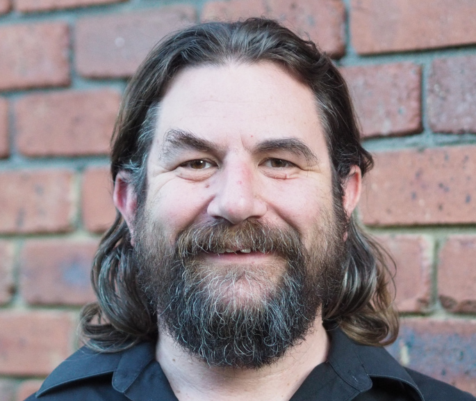

*Me!  photo: Charlotte Moore*

I’m a [freelance](https://en.wikipedia.org/wiki/Freelancer#Etymology)
Software Consultant, generally working through my company 
[Mnemote Pty Ltd](https://mnemote.com/).

I've worked in a lot of fields including telecommunications, health
and logistics.  My current work is in [bioinformatics](/tag/bioinformatics/)
where I'm working on [CountESS](https://countess-project.github.io/CountESS/)
and [MaveDB](https://www.mavedb.org/).

I mostly work with Open Source technologies, programming mostly in
Python but also C, JavaScript, SQL and various others.
One of my proudest career moments was
getting [RFC 4429](https://tools.ietf.org/html/rfc4429) to [Proposed
Standard](https://en.wikipedia.org/wiki/Internet_Standard#Proposed_Standard).
I'm also very interested in [Mesh Networking](https://mesh.zoic.org/),
[MicroPython](/tag/micropython) and [programming language design](/tag/languages)
especially in [education](/tag/education).

I've been on "the Internet" since
[1990](https://en.wikipedia.org/wiki/Flood_%28They_Might_Be_Giants_album%29)
when Melbourne University helpfully provided me with
[Usenet](https://en.wikipedia.org/wiki/Usenet) access, a room full of warm
[VT320s](https://vt100.net/docs/vt320-uu/chapter2.html) and, eventually,
a degree in Computer Science. Somewhere along the way I learnt a fair
bit about Unix, Free Software and IP networking, which have pretty much
defined my career ever since.

I live in the suburbs of Melbourne, Australia with my family, including
a very enthusiastic [dog](img/dog.jpg) and a very vocal [cat](img/cat.jpg).
I enjoy [cycling](/tag/cycling/) and [music](/tag/music/) and I'm learning a bit of ukulele.

Contact
-------

-   Email: <nick@zoic.org>
-   Phone: (+61) 409 656 267
-   Post: PO Box 247, Watsonia VIC 3087, AUSTRALIA

The best way to contact me directly is email.

Other Sites
-----------

These are all, in some way or another, me:

-   <a rel="me" href="https://aus.social/@nickzoic">Mastodon: @nickzoic@aus.social</a>
-   [GitHub: nickzoic](https://github.com/nickzoic)
-   [ORCID: 0000-0001-7511-0990](https://orcid.org/0000-0001-7511-0990)
-   [LinkedIn: nickzoic](https://www.linkedin.com/in/nickzoic)
-   [Youtube: nickzoic](https://www.youtube.com/channel/UCRl22LCzA_8_vevzT9TJVeg)
-   [Bluesky: @nickzoic.bsky.social](https://bsky.app/profile/nickzoic.bsky.social)
-   [PixelFed: @nickzoic@pixelfed.au](https://pixelfed.au/i/portfolio/nickzoic)
-   [Signal](https://signal.org/): @nickzoic.99 or look me up via my phone number +61409656267.

I was previously very active on [Twitter](https://twitter.com/nickzoic/)
but given the [state of the place](https://www.wheresyoured.at/free-bird/)
I'm not longer using it and will probably delete the account soon.

I'm not active on any of the other social media services at this time
and haven't bothered to sign up to every one of them just to reserve my usual
name, so if you see me there, it ain't me.  Feel free to drop me
an email if you think someone is impersonating me on one of those sites.
